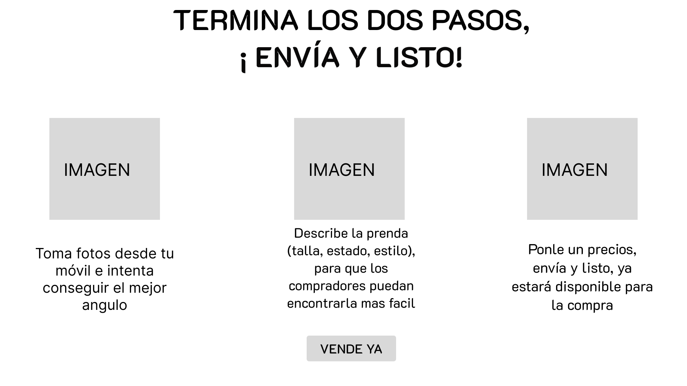
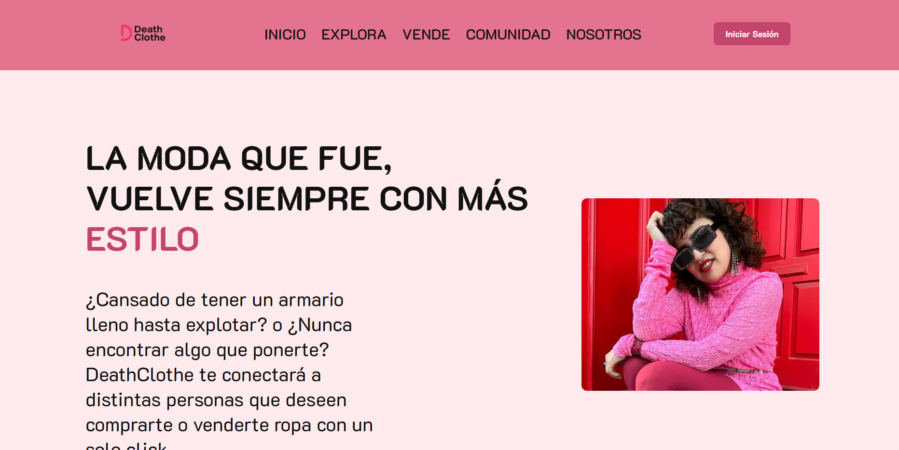

## Universidad Peruana de Ciencias Aplicadas

#### Nombre del curso: Aplicaciones Web
##### Carrera: Ingeniería de Software
##### Nombre del profesor: Hugo Allan Mori Paiva
##### NRC: 4376

#### "Informe de Trabajo Final"
##### Nombre de la Startup: ReWear
##### Nombre del Producto: DeathClothe

#### Integrantes

Bejarano Martínez Alvaro Leandro U202311640 
Cabanillas Meza Jose Mateo U202311458 
Luquillas Asto Omar U20211G641 
Santur Tello Andrea Elizabeth U202310988 
Sarmiento Medina Loreley U202310005 

# *Abril de 2025*

## Registro de Versiones del Informe

<table>
  <thead>
    <tr>
      <th>Versión</th>
      <th>Fecha</th>
      <th>Autor</th>
      <th>Descripción de modificación</th>
    </tr>
  </thead>
  <tbody>
    <tr>
      <td>TB1</td>
      <td></td>
      <td></td>
      <td></td>
    </tr>
    <tr>
      <td>TP</td>
      <td></td>
      <td></td>
      <td></td>
    </tr>
    <tr>
      <td>TB2</td>
      <td></td>
      <td></td>
      <td></td>
    </tr>
    <tr>
      <td>TF</td>
      <td></td>
      <td></td>
      <td></td>
    </tr>
  </tbody>
</table>

## Contents

- [Student Outcome](#student-outcome)
- [Project Report Collaboration Insights](#project-report-collaboration-insights)

- [Capítulo I: Introducción](#capítulo-i-introducción)
  - [1.1. Startup Profile](#11-startup-profile)
    - [1.1.1. Descripción de la Startup](#111-descripción-de-la-startup)
    - [1.1.2. Perfiles de integrantes del equipo](#112-perfiles-de-integrantes-del-equipo)
  - [1.2. Solution Profile](#12-solution-profile)
    - [1.2.1. Antecedentes y problemática](#121-antecedentes-y-problemática)
    - [1.2.2. Lean UX Process](#122-lean-ux-process)
      - [1.2.2.1. Lean UX Problem Statements](#1221-lean-ux-problem-statements)
      - [1.2.2.2. Lean UX Assumptions](#1222-lean-ux-assumptions)
      - [1.2.2.3. Lean UX Hypothesis Statements](#1223-lean-ux-hypothesis-statements)
      - [1.2.2.4. Lean UX Canvas](#1224-lean-ux-canvas)
  - [1.3. Segmentos objetivos](#13-segmentos-objetivos)

- [Capítulo II: Requirements Elicitation & Analysis](#capítulo-ii-requirements-elicitation--analysis)
  - [2.1. Competidores](#21-competidores)
    - [2.1.1. Análisis competitivo](#211-análisis-competitivo)
    - [2.1.2. Estrategias y tácticas frente a competidores](#212-estrategias-y-tácticas-frente-a-competidores)
  - [2.2. Entrevistas](#22-entrevistas)
    - [2.2.1. Diseño de entrevistas](#221-diseño-de-entrevistas)
    - [2.2.2. Registro de entrevistas](#222-registro-de-entrevistas)
    - [2.2.3. Análisis de entrevistas](#223-análisis-de-entrevistas)
  - [2.3. Needfinding](#23-needfinding)
    - [2.3.1. User Personas](#231-user-personas)
    - [2.3.2. User Task Matrix](#232-user-task-matrix)
    - [2.3.3. User Journey Mapping](#233-user-journey-mapping)
    - [2.3.4. Empathy Mapping](#234-empathy-mapping)
    - [2.3.5. As-is Scenario Mapping](#235-as-is-scenario-mapping)
  - [2.4. Ubiquitous Language](#24-ubiquitous-language)

- [Capítulo III: Requirements Specification](#capítulo-iii-requirements-specification)
  - [3.1. To-Be Scenario Mapping](#31-to-be-scenario-mapping)
  - [3.2. User Stories](#32-user-stories)
  - [3.3. Impact Mapping](#33-impact-mapping)
  - [3.4. Product Backlog](#34-product-backlog)

- [Capítulo IV: Product Design](#capítulo-iv-product-design)
  - [4.1. Style Guidelines](#41-style-guidelines)
    - [4.1.1. General Style Guidelines](#411-general-style-guidelines)
    - [4.1.2. Web Style Guidelines](#412-web-style-guidelines)
  - [4.2. Information Architecture](#42-information-architecture)
    - [4.2.1. Organization Systems](#421-organization-systems)
    - [4.2.2. Labeling Systems](#422-labeling-systems)
    - [4.2.3. SEO Tags and Meta Tags](#423-seo-tags-and-meta-tags)
    - [4.2.4. Searching Systems](#424-searching-systems)
    - [4.2.5. Navigation Systems](#425-navigation-systems)
  - [4.3. Landing Page UI Design](#43-landing-page-ui-design)
    - [4.3.1. Landing Page Wireframe](#431-landing-page-wireframe)
    - [4.3.2. Landing Page Mock-up](#432-landing-page-mock-up)
  - [4.4. Web Applications UX/UI Design](#44-web-applications-uxui-design)
    - [4.4.1. Web Applications Wireframes](#441-web-applications-wireframes)
    - [4.4.2. Web Applications Wireflow Diagrams](#442-web-applications-wireflow-diagrams)
    - [4.4.3. Web Applications Mock-ups](#443-web-applications-mock-ups)
    - [4.4.4. Web Applications User Flow Diagrams](#444-web-applications-user-flow-diagrams)
  - [4.5. Web Applications Prototyping](#45-web-applications-prototyping)
  - [4.6. Domain-Driven Software Architecture](#46-domain-driven-software-architecture)
    - [4.6.1. Software Architecture Context Diagram](#461-software-architecture-context-diagram)
    - [4.6.2. Software Architecture Container Diagrams](#462-software-architecture-container-diagrams)
    - [4.6.3. Software Architecture Components Diagrams](#463-software-architecture-components-diagrams)
  - [4.7. Software Object-Oriented Design](#47-software-object-oriented-design)
    - [4.7.1. Class Diagrams](#471-class-diagrams)
    - [4.7.2. Class Dictionary](#472-class-dictionary)
  - [4.8. Database Design](#48-database-design)
    - [4.8.1. Database Diagram](#481-database-diagram)

- [Capítulo V: Product Implementation, Validation & Deployment](#capítulo-v-product-implementation-validation--deployment)
  - [5.1. Software Configuration Management](#51-software-configuration-management)
    - [5.1.1. Software Development Environment Configuration](#511-software-development-environment-configuration)
    - [5.1.2. Source Code Management](#512-source-code-management)
    - [5.1.3. Source Code Style Guide & Conventions](#513-source-code-style-guide--conventions)
    - [5.1.4. Software Deployment Configuration](#514-software-deployment-configuration)
  - [5.2. Landing Page, Services & Applications Implementation](#52-landing-page-services--applications-implementation)
    - [5.2.1. Sprint 1](#521-sprint-1)
- [Conclusiones](#conclusiones)
- [Bibliografía](#bibliografía)
- [Anexos](#anexos)

# Capítulo I: Introducción
## 1.1. Startup Profile
### 1.1.1. Descripción de la Startup
ReWear es una startup enfocada en transformar la manera en que las personas consumen, comparten y viven la moda. Creemos que cada prenda tiene una historia y que el estilo no debería depender de la producción masiva ni del consumo desechable. En ReWear, conectamos a usuarios apasionados por la autenticidad, la sostenibilidad y la expresión personal, a través de un mercado digital de ropa de segunda mano que combina tecnología, diseño y comunidad.
Nuestro primer producto, DeathClothe, es una plataforma web que permite a los usuarios subir, comprar, vender y descubrir prendas únicas, mientras reciben recomendaciones personalizadas basadas en su armario virtual. Más que una app, es una experiencia viva, donde la moda circula, evoluciona y encuentra nuevas almas.

Misión: Nuestra misión es ofrecer una nueva oportunidad a la ropa que ya no es deseada, brindando una segunda vida a las prendas y conectando a personas con gustos auténticos. A través de nuestra plataforma, buscamos que cada usuario pueda encontrar piezas únicas que se alineen con su estilo personal, sin tener que recurrir a la moda rápida. Fomentamos un consumo responsable, permitiendo que cada compra y venta de ropa sea un paso hacia un estilo más consciente, auténtico y sostenible.

Visión: Nos visualizamos como una empresa líder en el renacimiento de la moda circular, construyendo una comunidad global que redefine el estilo desde la autenticidad, el cuidado del planeta y la tecnología. Aspiramos a convertirnos en el referente para quienes ven en su ropa una extensión de su identidad, y que eligen transformar el mundo desde su armario.

### 1.1.2. Perfiles de integrantes del equipo
<table border="1" cellspacing="0" cellpadding="10">
  <tr>
    <th>Integrantes</th>
    <th>Perfil de Integrante</th>
  </tr>
  <tr>
    <td></td>
    <td>Ingeniería de Software-u202311640 
 
Como estudiante de quinto ciclo de 
Ingeniería de Software, me destaco por mi 
perseverancia, organización y capacidad 
para trabajar en equipo. Me esfuerzo por 
mantener un ambiente estructurado dentro 
del grupo, donde cada miembro se sienta 
valorado y sus ideas sean escuchadas y 
respetadas. Mi compromiso es fomentar la 
colaboración efectiva, asegurando que cada 
contribución se integre de manera ordenada 
y alineada con los objetivos comunes del 
equipo. </td>
  </tr>
  <tr>
    <td></td>
    <td>Jose Mateo Cabanillas Meza - Ingeniería de Software-u202311458
Mi nombre es Mateo Cabanillas y en la actualidad estoy cursando el quinto ciclo de la carrera de ingeniería de software con una mente creativa y una actitud colaborativa. Mi amor por la programación y la resolución de problemas me impulsa a explorar nuevas soluciones y aportar ideas frescas a los proyectos. Como compañero de equipo, soy amable, atento y siempre estoy dispuesto a ayudar. Creo firmemente en la importancia de la comunicación efectiva y la colaboración para lograr resultados excepcionales.</td>
  </tr>
  <tr>
    <td></td>
    <td>Soy Omar Luquillas Asto con código de estudiante U20211G641, estudiante de la carrera de Ingeniería de Software. Elegí esta carrera porque me apasiona la tecnología, el desarrollo de software y la programación. Tengo conocimientos en lenguajes de programación como C++, Python y Java. Me considero una persona investigadora, ya que me gusta aprender cosas nuevas y siempre estoy en busca de soluciones creativas e innovadoras que generen un impacto positivo en la vida de las personas. Además, valoro el trabajo en equipo, soy responsable y me comprometo a cumplir con mis tareas de manera eficiente.</td>
  </tr>
  <tr>
    <td></td>
    <td></td>
  </tr>
  <tr>
    <td></td>
    <td>Soy Loreley Sarmiento Medina con codigo de estudiante U202310005 y estudio la carrera de Ingeniería de Software y me especializo en aportar soluciones tecnológicas integrales dentro de equipos multidisciplinarios. Cuento con sólidos conocimientos en el modelado de wireframes y mockups utilizando Figma, lo que me permite contribuir eficazmente en la etapa de diseño de interfaces centradas en el usuario. Además, tengo experiencia en el modelado de bases de datos, facilitando la organización y estructura lógica de la información. Poseo conocimientos intermedios en HTML y CSS, lo cual me permite colaborar en el desarrollo de interfaces web funcionales y visualmente atractivas. También tengo una base sólida en lenguajes de programación, lo que me permite comprender e implementar soluciones tanto en el frontend como en el backend, aportando al desarrollo integral del producto</td>
  </tr>
 
</table>

## 1.2. Solution Profile
DeathClothe es una plataforma web que transforma la manera de consumir moda al permitir a los usuarios comprar, vender y descubrir ropa de segunda mano con recomendaciones personalizadas según su armario virtual. A través de una experiencia intuitiva, conecta a personas que buscan autenticidad, estilo y sostenibilidad, facilitando la circulación de prendas únicas y dándoles una nueva vida. Con un enfoque en la moda circular, la personalización y la comunidad, DeathClothe no solo es un mercado digital, sino un espacio donde el estilo evoluciona con propósito.
### 1.2.1. Antecedentes y problemática

**What**

DeathClothe es una plataforma digital centrada en la moda circular, que permite a los usuarios subir, comprar, vender y descubrir ropa de segunda mano. A través de un armario virtual y un sistema de recomendaciones inteligentes, la aplicación crea una experiencia personalizada para cada usuario, ayudándolo a encontrar prendas que se alineen con su estilo e identidad. Más que una simple tienda online, DeathClothe funciona como una comunidad donde cada prenda tiene una historia y cada intercambio fomenta un consumo más consciente, auténtico y sostenible.

**When**

DeathClothe se usa en cualquier momento en el que una persona quiera renovar su estilo, encontrar una prenda única, darle una segunda vida a ropa que ya no usa, o simplemente explorar tendencias sin recurrir a la moda rápida. Es útil tanto para quienes buscan una alternativa económica y ecológica para vestir, como para quienes desean liberar espacio en su armario sin desperdiciar. También se convierte en una herramienta ideal para quienes disfrutan curando su propio estilo a partir de piezas con historia.

**Where**

La plataforma está diseñada para ser utilizada desde cualquier lugar con acceso a internet, ya sea desde el hogar, durante trayectos diarios, en una cafetería o mientras se compara ropa en una tienda física. Su diseño web responsivo y amigable permite una experiencia fluida tanto en computadoras como en dispositivos móviles. Esto la convierte en una opción accesible y cómoda para todos aquellos que quieren vivir la moda de una manera más conectada, auténtica y sustentable.

**Who**

Usuarios eco‑conscientes y fashionistas que demandan alternativas sostenibles al fast fashion, buscando piezas únicas y auténticas sin contribuir al modelo de consumo desechable.
Personas con prendas en desuso que desean monetizar o dar nueva vida a su vestuario; en 2023, el 52 % de los consumidores adquirió ropa de segunda mano, destinando casi la mitad de su presupuesto de vestuario a este segmento.
Generación Z y Millennials digitales, atraídos por la combinación de sostenibilidad y estilo: un 64 % compra second‑hand para ahorrar dinero y un 36 % por conciencia medioambiental.

**Why**

El modelo de fast fashion genera 92 millones de toneladas de residuos textiles al año, el equivalente a un camión de basura lleno de ropa vertido en vertederos cada segundo, con un fuerte impacto ambiental.
En Estados Unidos, se descartan más de 34 000 millones de libras de textiles usados anualmente (más de 100 libras per cápita), evidenciando la incapacidad de los sistemas tradicionales para gestionar el ciclo de vida de la ropa.
Solo el 20 % de los textiles descartados se recolecta para reciclaje o reutilización; el resto acaba en vertederos o incinerado, lo que subraya la urgencia de modelos de negocio circulares que fomenten la reutilización.

**How**

Los usuarios interactúan con la plataforma DeathClothe mediante navegadores web y dispositivos móviles, explorando un catálogo curado que ofrece filtros inteligentes, alertas de nuevos artículos y recomendaciones basadas en su armario virtual.
Prefieren descubrir nuevas prendas a través de redes sociales e influencers, ya que las campañas digitales en Instagram y TikTok potencian la visibilidad y el alcance de mercados de segunda mano.
La adopción de algoritmos de personalización y técnicas de curation algorithm permite que cada usuario encuentre piezas acordes a su estilo individual, solucionando uno de los desafíos de los marketplaces más genéricos.
Sin embargo, la amplia variedad de inventario en recommerce crea obstáculos de descubrimiento; por ello, es crucial implementar estrategias de curación y filtrado avanzado para mejorar la experiencia de usuario y fomentar la retención.

**How Much**

La magnitud del problema es crítica. Según la Ellen MacArthur Foundation (2017), cada año se desechan 92 millones de toneladas de ropa, de las cuales menos del 1% se recicla. Esta situación se agrava porque, como señala McKinsey (2016), los consumidores compran un 60% más de prendas que hace dos décadas pero las conservan la mitad de tiempo. Aunque el 62% de los jóvenes prefiere opciones sostenibles (ThredUp, 2023), el mercado de segunda mano sigue siendo subutilizado, demostrando la urgente necesidad de soluciones innovadoras como ReWear para cerrar esta brecha entre intención y acción en el consumo responsable.

### 1.2.2. Lean UX Process

El Lean UX process es un enfoque ágil para diseño de productos que prioriza la experimentación rápida y el feedback real sobre documentación extensa. Se basa en crear prototipos simples, validar hipótesis con usuarios e iterar constantemente, optimizando tiempo y recursos.

#### 1.2.2.1. Lean UX Problem Statements

Hoy en día, muchas personas quieren comprar ropa de segunda mano para ser más sostenibles, pero se encuentran con varios problemas. Por un lado, los compradores tienen dificultades para encontrar prendas que realmente les gusten y que estén en buen estado. Las plataformas actuales no siempre muestran opciones atractivas o no permiten buscar fácilmente por estilo o talla, lo que hace que muchos prefieran seguir comprando ropa nueva por comodidad.

Por otro lado, quienes quieren vender su ropa usada se topan con procesos complicados o poco transparentes. Subir fotos, escribir descripciones y manejar envíos resulta tedioso, y a veces no vale la pena por los precios bajos que ofrecen. Esto hace que mucha ropa en buen estado termine guardada en el armario o en la basura.

En resumen, existe un círculo vicioso, como hay poca oferta atractiva de ropa usada, menos gente compra; y como cuesta vender, menos gente participa. DeathClothe busca solucionar esto haciendo más fácil tanto comprar como vender ropa de segunda mano, para que realmente sea una alternativa práctica a la ropa nueva y así reducir el impacto ambiental de la moda.

#### 1.2.2.2. Lean UX Assumptions

**Interés en la segunda mano**

Los usuarios están dispuestos a comprar y vender ropa de segunda mano si la plataforma les ofrece prendas únicas, de buena calidad y fácil acceso. Valoran la originalidad, el buen estado de las piezas y la posibilidad de consumir moda de forma más consciente y sostenible.

**Facilidad de uso en la carga de inventario**

Si el proceso para subir prendas es simple y rápido los usuarios se sentirán más motivados a ofrecer más artículos en la plataforma. Al reducir las barreras técnicas y el tiempo requerido para publicar, se facilita la participación activa de los vendedores, quienes podrán gestionar su inventario de manera más práctica y constante. Esta facilidad fomenta una mayor rotación de productos, enriqueciendo la variedad del catálogo disponible y mejorando la experiencia general de compra para toda la comunidad.

**Sensibilidad al precio y sostenibilidad**

Quienes compran ropa de segunda mano suelen priorizar precios accesibles, sin embargo, también valoran profundamente el trasfondo de cada prenda. Están dispuestos a pagar un poco más cuando sienten que están adquiriendo una pieza con historia, carácter y autenticidad comprobada. Esta disposición se fortalece si la plataforma brinda confianza a través de mecanismos que verifiquen el origen, el estado y la originalidad del artículo. En ese contexto, la prenda deja de ser solo un producto y se convierte en una experiencia única, algo que conecta emocionalmente con el comprador y justifica una inversión ligeramente mayor.

#### 1.2.2.3. Lean UX Hypothesis Statements

**Carga de Prendas**

Creemos que si simplificamos el proceso de publicación de prendas a solo tres pasos clave (tomar una foto, completar los atributos esenciales y definir el precio) los usuarios se sentirán más motivados a listar sus artículos. Esta experiencia intuitiva y rápida facilitará que al menos el 80 % de los vendedores completen con éxito el proceso de alta, lo cual mediremos a través de la tasa de finalización de publicaciones dentro de la plataforma.

**Confianza mediante Valoraciones**

Creemos que si destacamos calificaciones de vendedores y compradores en cada perfil, la tasa de conversión de vista de objeto a compra mejorará en un 12 %, medido por unidades vendidas respecto a productos vistos.

**Historias de Prendas**

Creemos que si incorporamos un espacio donde se muestre la historia de cada prenda (incluyendo detalles como su origen, anécdotas o el estilo de su anterior dueño) los usuarios sentirán una mayor conexión emocional con los artículos. Esta narrativa añadida no solo reforzará el valor percibido de cada pieza, sino que también incentivará la curiosidad y el deseo de exploración. Esperamos que esta función aumente la tasa de clics en “Me interesa” en un 15 %, medido a través del ratio de interacciones por prenda visualizada.

#### 1.2.2.4. Lean Ux Canvas

## 1.3. Segmentos Objetivos

Compradores:Personas entre 18 y 35 años interesadas en la moda, pero que buscan alternativas más económicas, sostenibles y auténticas a la moda rápida. Este segmento valora la originalidad, el consumo responsable y la posibilidad de acceder a prendas únicas a través de una experiencia fácil, visualmente atractiva y confiable. Su motivación principal es ahorrar dinero sin sacrificar estilo, descubrir ropa con personalidad y contribuir al cuidado del planeta.

Vendedores:Personas desde los 18 hasta los 50 años o más que desean vender ropa en buen estado que ya no usan, ya sea para generar ingresos extra, liberar espacio en su armario o apoyar un modelo de consumo más circular. Este grupo incluye tanto usuarios casuales como pequeños emprendedores o diseñadores independientes, motivados por la posibilidad de conectar con compradores que valoren sus prendas y por contribuir activamente a una moda más consciente y sostenible. 

# Capítulo II: Requirements Elicitation & Analysis
## 2.1. Competidores

**Marketplace de Facebook:** Es la opción más usada para comprar y vender ropa usada en Perú. Es gratuito, tiene gran alcance, pero no está especializado en moda y carece de filtros adecuados.

**Instagram:** Muchas tiendas independientes venden ropa vintage o de segunda mano a través de Instagram, con una estética cuidada y fuerte conexión con su audiencia.

### 2.1.1. Análisis competitivo

 
</a>

 
</a>

### 2.1.2. Estrategias y tácticas frente a competidores

**Diferenciación con Narrativa y Personalización**

Estrategia: Ofrecer historias de cada prenda (origen, uso, estilo previo) para añadir valor emocional y autenticidad.

Táctica: Implementar fichas de producto enriquecidas con inputs del vendedor (anécdotas, looks anteriores, inspiración), y recomendaciones personalizadas usando el “armario virtual”.

**Tecnología para la experiencia del usuario**

Estrategia: Convertir la app en una experiencia interactiva y visual que no sea solo un marketplace, sino una comunidad viva.

Táctica: Diseño UX moderno con navegación tipo red social, sistema de seguimiento entre usuarios, outfits sugeridos y gamificación.

**Confianza y autenticidad como pilares**

Estrategia: Construir una comunidad basada en la confianza, destacando calidad y procedencia de las prendas.

Táctica: Sistema de calificaciones, verificación de usuarios/vendedores, etiquetas de “pieza destacada”, y filtros visuales para el estado de las prendas.

**Facilidad de uso para vendedores**

Estrategia: Incentivar la participación constante de usuarios que suben ropa.

Táctica: Subida de prendas en 3 pasos, tips de fotografía, herramientas de edición automática y precios sugeridos según categoría y estado.

**Alianzas y comunidad local**

Estrategia: Posicionarse como la plataforma "de la gente para la gente" en Perú.

Táctica: Colaboraciones con creadores de contenido de moda sostenible, tiendas vintage locales, ferias presenciales y campañas con influencers que promuevan la moda circular.

**Integración logística**

Estrategia: Superar al Facebook Marketplace con soluciones reales de entrega.

Táctica: Alianzas con apps de delivery locales (como Urbaner, Olva o Rappi), ofreciendo opciones rápidas y seguras para envíos entre usuarios.

## 2.2. Entrevistas

### 2.2.1. Diseño de entrevistas

 La elaboración de las entrevista se basó en los objetivos del proyecto y en los perfiles específicos de compradores y vendedores. Se formularon preguntas personalizadas para entender hábitos, motivaciones y necesidades. En compradores, se exploraron sus preferencias por alternativas sostenibles, incluyendo a los compradores impulsivos para identificar qué los motiva. En vendedores, se abordaron razones para vender y expectativas hacia una plataforma que promueva el consumo responsable. 

#### 1. Preguntas para Comprador
##### 1.1 Información Demográfica
<table border="1" cellpadding="8" cellspacing="0">
  <thead>
    <tr>
      <th>Categoría Demográfica</th>
      <th>Pregunta de la entrevista</th>
    </tr>
  </thead>
  <tbody>
    <tr>
      <td><strong>Identificación personal</strong></td>
      <td>¿Podrías darme tu nombre?</td>
    </tr>
    <tr>
      <td><strong>Edad</strong></td>
      <td>¿Cuántos años tienes?</td>
    </tr>
    <tr>
      <td><strong>Ciudad</strong></td>
      <td>¿En qué ciudad vives actualmente?</td>
    </tr>
    <tr>
      <td><strong>Ocupación</strong></td>
      <td>¿Cuál es tu ocupación o en qué trabajas actualmente?</td>
    </tr>
    <tr>
      <td><strong>Uso digital</strong></td>
      <td>¿Con qué frecuencia usas internet para compras o redes sociales?</td>
    </tr>
  </tbody>
</table>

##### 1.2 Atributos Personales y Gustos
<table border="1" cellspacing="0" cellpadding="8">
  <thead>
    <tr>
      <th>Categoría</th>
      <th>Pregunta</th>
    </tr>
  </thead>
  <tbody>
    <tr>
      <td>Ocupación</td>
      <td>¿Cuál es tu ocupación o en qué trabajas actualmente?</td>
    </tr>
    <tr>
      <td>Uso digital</td>
      <td>¿Con qué frecuencia usas internet para compras o redes sociales?</td>
    </tr>
    <tr>
      <td>Explorador de estilo</td>
      <td>¿Cuéntame sobre la última vez que buscaste ropa de segunda mano en línea? ¿Qué pasos seguiste?</td>
    </tr>
    <tr>
      <td>Explorador de estilo</td>
      <td>¿Qué te impulsa más a comprar ropa usada en línea: precio, sostenibilidad o estilo único? ¿Por qué?</td>
    </tr>
    <tr>
      <td>Armario virtual</td>
      <td>Si tuvieras un ‘armario virtual’ en la plataforma web, ¿cómo organizarías tus prendas y qué filtros usarías para encontrar ropa que encaje con tu personalidad?</td>
    </tr>
    <tr>
      <td>Confianza y experiencia</td>
      <td>¿Qué te frustra de las plataformas de segunda mano actuales y qué funcionalidad te haría confiar en DeathClothe?</td>
    </tr>
    <tr>
      <td>Confianza y experiencia</td>
      <td>¿Qué información necesitarías ver en la plataforma web para comprar ropa usada para tus hijos sin preocupaciones?</td>
    </tr>
    <tr>
      <td>Confianza y experiencia</td>
      <td>¿Cómo verificas la autenticidad de una prenda vintage y qué sistema integrado en la plataforma web te haría usarla?</td>
    </tr>
    <tr>
      <td>Cierre de compra</td>
      <td>¿Qué funcionalidades de cierre de compra te motivarían a comprar más rápido en DeathClothe?</td>
    </tr>
    <tr>
      <td>Recomendaciones</td>
      <td>¿Te interesaría recibir recomendaciones de prendas en la plataforma web basadas en tu armario virtual y estilo? ¿Qué tipo de sugerencias valorarías?</td>
    </tr>
    <tr>
      <td>Organización del hogar</td>
      <td>¿Cómo te gustaría que DeathClothe te ayudara a ‘ganar espacio’ en casa?</td>
    </tr>
    <tr>
      <td>Funcionalidades ideales</td>
      <td>Imagina la plataforma web perfecta de segunda mano. ¿Qué tres funcionalidades serían imprescindibles para ti?</td>
    </tr>
  </tbody>
</table>

#### 2. Preguntas para Vendedor
##### 2.2 Información Demográfica

<table border="1" cellpadding="8" cellspacing="0">
  <thead>
    <tr>
      <th>Categoría Demográfica</th>
      <th>Pregunta de la entrevista</th>
    </tr>
  </thead>
  <tbody>
    <tr>
      <td><strong>Identificación personal</strong></td>
      <td>¿Podrías darme tu nombre?</td>
    </tr>
    <tr>
      <td><strong>Edad</strong></td>
      <td>¿Cuántos años tienes?</td>
    </tr>
    <tr>
      <td><strong>Ciudad</strong></td>
      <td>¿En qué ciudad vives actualmente?</td>
    </tr>
    <tr>
      <td><strong>Ocupación/Trabajo</strong></td>
      <td>¿Cuál es tu ocupación o en qué trabajas actualmente?</td>
    </tr>
    <tr>
      <td><strong>Uso digital</strong></td>
      <td>¿Con qué frecuencia usas internet para compras o redes sociales?</td>
    </tr>
  </tbody>
</table>

##### 2.2 Atributos Personales y Gustos
<table border="1" cellspacing="0" cellpadding="8">
  <thead>
    <tr>
      <th>Categoría</th>
      <th>Pregunta</th>
    </tr>
  </thead>
  <tbody>
    <tr>
      <td>Motivación para vender</td>
      <td>¿Qué te anima a vender una prenda en línea en lugar de regalarla o desecharla?</td>
    </tr>
    <tr>
      <td>Selección de prendas</td>
      <td>¿Cómo decides qué ropa poner en venta? ¿Te guías por estilo, estado, marca, algo más?</td>
    </tr>
    <tr>
      <td>Publicación de productos</td>
      <td>¿Qué pasos sigues antes de subir una prenda a la plataforma?</td>
    </tr>
    <tr>
      <td>Subida de contenido</td>
      <td>¿Prefieres subir las prendas desde tu celular o computadora? ¿Por qué?</td>
    </tr>
    <tr>
      <td>Armario virtual</td>
      <td>¿Cómo te gustaría que funcione tu armario virtual? ¿Qué debería mostrar o permitirte hacer?</td>
    </tr>
    <tr>
      <td>Dificultades técnicas</td>
      <td>¿Alguna vez has sufrido fallos a la hora de publicar una prenda, como demora de carga y demás?</td>
    </tr>
    <tr>
      <td>Precio y comparación</td>
      <td>¿Cómo decides el precio? ¿Te gustaría ver sugerencias basadas en ventas similares?</td>
    </tr>
    <tr>
      <td>Comunicación con compradores</td>
      <td>¿Qué esperas de la comunicación con posibles compradores dentro de la plataforma?</td>
    </tr>
    <tr>
      <td>Entregas y logística</td>
      <td>¿Qué tipo de opciones de entrega preferirías ofrecer o usar?</td>
    </tr>
    <tr>
      <td>Incentivos</td>
      <td>¿Qué te motivaría a seguir subiendo ropa a la web?</td>
    </tr>
  </tbody>
</table>

### 2.2.2. Registro de entrevistas
#### Segmento :Comprador
**Entrevista #1 – Datos del Entrevistado**
<table border="1" cellspacing="0" cellpadding="8">
  <thead>
    <tr>
      <th><strong>Dato</strong></th>
      <th><strong>Información</strong></th>
    </tr>
  </thead>
  <tbody>
    <tr>
      <td>Nombre completo</td>
      <td>Daniela Alessandra Cigueñas Tarrillo</td>
    </tr>
    <tr>
      <td>Edad</td>
      <td>19 años</td>
    </tr>
    <tr>
      <td>Ciudad - Distrito</td>
      <td>Lima - Los Olivos</td>
    </tr>
    <tr>
      <td>Ocupación/Trabajo</td>
      <td>Estudiante Universitario (Medios digitales y publicidad)</td>
    </tr>
    <tr>
      <td>Frecuencia de uso de Internet</td>
      <td>Compra en línea con frecuencia, sobre todo por redes sociales. Le encanta adquirir ropa, accesorios y todo lo que le llame la atención en internet.</td>
    </tr>
    <tr>
      <td>Inicio de la entrevista</td>
      <td>00:00</td>
    </tr>
    <tr>
      <td>Duración de la entrevista</td>
      <td>08:26</td>
    </tr>
  </tbody>
</table>

**Detalles de la entrevista:**  

</a> 
[URL de la entrevista](https://upcedupe-my.sharepoint.com/:v:/g/personal/u202310988_upc_edu_pe/ERvZBKft-85KrhKzuNsLSksBjRZLjjNUp_idUI23rsUl0Q?e=14taym&nav=eyJyZWZlcnJhbEluZm8iOnsicmVmZXJyYWxBcHAiOiJTdHJlYW1XZWJBcHAiLCJyZWZlcnJhbFZpZXciOiJTaGFyZURpYWxvZy1MaW5rIiwicmVmZXJyYWxBcHBQbGF0Zm9ybSI6IldlYiIsInJlZmVycmFsTW9kZSI6InZpZXcifX0%3D)

**Resumen de la entrevista:**  
Daniela, estudiante de 19 años de Lima, mencionó que utiliza con frecuencia internet para realizar compras. Hace pocos días adquirió ropa de segunda mano, motivada por el precio accesible y los estilos únicos. Comentó que organizaría su armario virtual por estilo, color, temporada y precio, y señaló como frustración principal la falta de precisión en tallas y descripciones. Además, resaltó la importancia de contar con fotos desde varios ángulos, descripciones claras y reseñas de otros usuarios. Considera esencial agilizar el proceso de pago con métodos como Yape, le interesan las recomendaciones basadas en su armario virtual y valoraría una función para vender automáticamente prendas no usadas. Finalmente, destacó que su plataforma ideal incluiría un sistema de tallas preciso, una experiencia personalizada y sugerencias adaptadas a su estilo. 

**Entrevista #2 - Datos del Entrevistado** 
<table border="1" cellspacing="0" cellpadding="8">
  <thead>
    <tr>
      <th><strong>Dato</strong></th>
      <th><strong>Información</strong></th>
    </tr>
  </thead>
  <tbody>
    <tr>
      <td>Nombre completo</td>
      <td>William Agustín Ventura Saldaña</td>
    </tr>
    <tr>
      <td>Edad</td>
      <td>27 años</td>
    </tr>
    <tr>
      <td>Distrito</td>
      <td>Lima - Surco</td>
    </tr>
    <tr>
      <td>Ocupación/Trabajo</td>
      <td>Estudiante Universitario (Ingeniería de sistemas) - Friendlands de diseño gráfico</td>
    </tr>
    <tr>
      <td>Frecuencia de uso de Internet</td>
      <td>Usualmente suele usarlo dos o tres veces por semana, principalmente para comprar comida y herramientas gráficas para su empleo.</td>
    </tr>
    <tr>
      <td>Inicio de la entrevista</td>
      <td>08:26</td>
    </tr>
    <tr>
      <td>Duración de la entrevista</td>
      <td>07:26</td>
    </tr>
  </tbody>
</table>

**Detalles de la entrevista:**  

</a> 
[URL de la entrevista](https://upcedupe-my.sharepoint.com/:v:/g/personal/u202310988_upc_edu_pe/ERvZBKft-85KrhKzuNsLSksBjRZLjjNUp_idUI23rsUl0Q?e=14taym&nav=eyJyZWZlcnJhbEluZm8iOnsicmVmZXJyYWxBcHAiOiJTdHJlYW1XZWJBcHAiLCJyZWZlcnJhbFZpZXciOiJTaGFyZURpYWxvZy1MaW5rIiwicmVmZXJyYWxBcHBQbGF0Zm9ybSI6IldlYiIsInJlZmVycmFsTW9kZSI6InZpZXcifX0%3D)

Agustín Ventura, de 27 años y residente en Lima, compró ropa de segunda mano hace un mes tras buscar tiendas vintage en Instagram, revisar comentarios y tallas grandes, y completar el pago con Yape. Valora el estilo único y la sostenibilidad, por lo que organizaría su armario virtual por estilo, temporada, color y talla, con filtros de combinaciones personalizadas. Sin embargo, se frustra con descripciones imprecisas y fotos poco claras, de modo que confiaría en DeathClothe si incluyera verificación de calidad, medidas exactas y reseñas de expertos. Además, considera clave un proceso de pago ágil con cupones y alertas de oferta, recomendaciones tanto similares como contrastantes, clasificación automática de prendas para liberar espacio y un informe del impacto ambiental de sus compras. 

**Entrevista #3 - Datos del Entrevistado**
<table border="1" cellspacing="0" cellpadding="8">
  <thead>
    <tr>
      <th><strong>Dato</strong></th>
      <th><strong>Información</strong></th>
    </tr>
  </thead>
  <tbody>
    <tr>
      <td>Nombre completo</td>
      <td>Anyelo Bill Alejos Jesus</td>
    </tr>
    <tr>
      <td>Edad</td>
      <td>20 años</td>
    </tr>
    <tr>
      <td>Distrito</td>
      <td>Lima - Comas</td>
    </tr>
    <tr>
      <td>Ocupación/Trabajo</td>
      <td>Estudiante Universitario (Ingeniería de software)</td>
    </tr>
    <tr>
      <td>Frecuencia de uso de Internet</td>
      <td>Casi siempre lo usa para compras en línea, especialmente en Marketplace y AliExpress.</td>
    </tr>
    <tr>
      <td>Inicio de la entrevista</td>
      <td>15:54</td>
    </tr>
    <tr>
      <td>Duración de la entrevista</td>
      <td>06:53</td>
    </tr>
  </tbody>
</table>

**Detalles de la entrevista:**  

</a> 
[URL de la entrevista](https://upcedupe-my.sharepoint.com/:v:/g/personal/u202310988_upc_edu_pe/ERvZBKft-85KrhKzuNsLSksBjRZLjjNUp_idUI23rsUl0Q?e=14taym&nav=eyJyZWZlcnJhbEluZm8iOnsicmVmZXJyYWxBcHAiOiJTdHJlYW1XZWJBcHAiLCJyZWZlcnJhbFZpZXciOiJTaGFyZURpYWxvZy1MaW5rIiwicmVmZXJyYWxBcHBQbGF0Zm9ybSI6IldlYiIsInJlZmVycmFsTW9kZSI6InZpZXcifX0%3D)

**Resumen de la entrevista:**  
Anyelo , estudiante de Ingeniería de Software de 20 años, buscó ropa de segunda mano atraído por modelos agotados y precios bajos.Organizaría su armario virtual por temporada y color, aunque lamenta la falta de fiabilidad de algunos vendedores y la llegada de prendas robadas o en mal estado, por lo cual considera esencial contar con descripciones claras, tallas exactas y fotos detalladas. Asimismo, verificaría la autenticidad comparando modelos en línea y valora un proceso de pago seguro con opciones de descuento. Asi mismo, le interesaría recibir recomendaciones basadas en su armario virtual y automatizar la venta o donación de prendas no usadas. Finalmente, identifica como funciones imprescindibles un sistema de tallas preciso, métodos de pago confiables y una organización clara de su armario virtual. 

#### Segmento :Vendedor
**Entrevista #4 – Datos del Entrevistado
<table border="1" cellspacing="0" cellpadding="8">
  <thead>
    <tr>
      <th><strong>Dato</strong></th>
      <th><strong>Información</strong></th>
    </tr>
  </thead>
  <tbody>
    <tr>
      <td>Nombre completo</td>
      <td>David Manuel Torres Meneses</td>
    </tr>
    <tr>
      <td>Edad y Género</td>
      <td>20 años</td>
    </tr>
    <tr>
      <td>Distrito</td>
      <td>Los Olivos</td>
    </tr>
    <tr>
      <td>Ocupación/Trabajo</td>
      <td>Vendedor de tienda de ropa</td>
    </tr>
    <tr>
      <td>Frecuencia de uso de Internet</td>
      <td>Usualmente lo uso muy rara vez, solo en emergencias y cuando veo algo realmente interesante, como prendas de buena calidad o diseños únicos</td>
    </tr>
    <tr>
      <td>Inicio de la entrevista</td>
      <td>22:48</td>
    </tr>
    <tr>
      <td>Duración de la entrevista</td>
      <td>14:55</td>
    </tr>
  </tbody>
</table>

**Detalles de la entrevista:**  

</a> 
[URL de la entrevista](https://upcedupe-my.sharepoint.com/:v:/g/personal/u202310988_upc_edu_pe/ERvZBKft-85KrhKzuNsLSksBjRZLjjNUp_idUI23rsUl0Q?e=14taym&nav=eyJyZWZlcnJhbEluZm8iOnsicmVmZXJyYWxBcHAiOiJTdHJlYW1XZWJBcHAiLCJyZWZlcnJhbFZpZXciOiJTaGFyZURpYWxvZy1MaW5rIiwicmVmZXJyYWxBcHBQbGF0Zm9ybSI6IldlYiIsInJlZmVycmFsTW9kZSI6InZpZXcifX0%3D)

**Resumen de la entrevista:**  
David Manuel Torres Méndez, de 20 años y residente en Lima, elige qué artículos poner en venta basándose en marca, estilo, color y talla, y los prepara con fotografías (incluso vistas 360°), descripciones detalladas y precios ajustados según la rareza o urgencia. Prefiere publicar desde la computadora porque es más estable que el celular, ya que en el móvil la carga de imágenes y la publicación suelen fallar; sin embargo, sueña con un armario virtual que agrupe prendas por demanda, temporada y exclusividad. Además, valoraría sugerencias automáticas de precios basadas en ventas similares, un chat integrado para resolver dudas rápidamente y múltiples opciones de envío, tanto nacionales como internacionales, y asegura que le motivaría ver que sus ofertas satisfacen las necesidades de los compradores.

**Entrevista #5 – Datos del Entrevistado
<table border="1" cellspacing="0" cellpadding="8">
  <thead>
    <tr>
      <th><strong>Dato</strong></th>
      <th><strong>Información</strong></th>
    </tr>
  </thead>
  <tbody>
    <tr>
      <td>Nombre completo</td>
      <td>Valesska Sanchez</td>
    </tr>
    <tr>
      <td>Edad y Género</td>
      <td>20 años</td>
    </tr>
    <tr>
      <td>Distrito</td>
      <td>San Martin de Porres</td>
    </tr>
    <tr>
      <td>Ocupación/Trabajo</td>
      <td>Vendedora de ropa en línea</td>
    </tr>
    <tr>
      <td>Frecuencia de uso de Internet</td>
      <td>Usa mucho las redes sociales, especialmente Marketplace</td>
    </tr>
    <tr>
      <td>Inicio de la entrevista</td>
      <td>37:42</td>
    </tr>
    <tr>
      <td>Duración de la entrevista</td>
      <td>03:19</td>
    </tr>
  </tbody>
</table>

**Detalles de la entrevista:**  

</a> 
[URL de la entrevista](https://upcedupe-my.sharepoint.com/:v:/g/personal/u202310988_upc_edu_pe/ERvZBKft-85KrhKzuNsLSksBjRZLjjNUp_idUI23rsUl0Q?e=14taym&nav=eyJyZWZlcnJhbEluZm8iOnsicmVmZXJyYWxBcHAiOiJTdHJlYW1XZWJBcHAiLCJyZWZlcnJhbFZpZXciOiJTaGFyZURpYWxvZy1MaW5rIiwicmVmZXJyYWxBcHBQbGF0Zm9ybSI6IldlYiIsInJlZmVycmFsTW9kZSI6InZpZXcifX0%3D)

**Resumen de la entrevista:**  
Valesska Sánchez, de 20 años y residente en Lima, comenta que usualmente elige la ropa que pondrá en venta basándose en la marca. Para ello, se asegura de prepararla con buenas fotografías y descripciones detalladas que incluyan el estado de la prenda y su precio. Además, le gustaría poder ver principalmente los comentarios de los posibles compradores sobre los productos que ofrece, y suele guiarse por sugerencias de precios basadas en ventas similares. Finalmente, valora la posibilidad de tener una comunicación directa con sus clientes y opciones de envío como la contra entrega. La motiva especialmente la idea de generar ingresos vendiendo ropa de segunda mano.

**Entrevista #6 – Datos del Entrevistado
<table border="1" cellspacing="0" cellpadding="8">
  <thead>
    <tr>
      <th><strong>Dato</strong></th>
      <th><strong>Información</strong></th>
    </tr>
  </thead>
  <tbody>
    <tr>
      <td>Nombre completo</td>
      <td>Jhon Alexander Chuchon</td>
    </tr>
    <tr>
      <td>Edad y Género</td>
      <td>19 años</td>
    </tr>
    <tr>
      <td>Distrito</td>
      <td>San Martin de Porres</td>
    </tr>
    <tr>
      <td>Ocupación/Trabajo</td>
      <td>Vendedor de ropa en línea</td>
    </tr>
    <tr>
      <td>Frecuencia de uso de Internet</td>
      <td>Usa diariamente las redes sociales, especialmente Instagram y Tiktok</td>
    </tr>
    <tr>
      <td>Inicio de la entrevista</td>
      <td>41:02</td>
    </tr>
    <tr>
      <td>Duración de la entrevista</td>
      <td>06:10</td>
    </tr>
  </tbody>
</table>

**Detalles de la entrevista:**  

</a> 
[URL de la entrevista](https://upcedupe-my.sharepoint.com/:v:/g/personal/u202310988_upc_edu_pe/ERvZBKft-85KrhKzuNsLSksBjRZLjjNUp_idUI23rsUl0Q?e=14taym&nav=eyJyZWZlcnJhbEluZm8iOnsicmVmZXJyYWxBcHAiOiJTdHJlYW1XZWJBcHAiLCJyZWZlcnJhbFZpZXciOiJTaGFyZURpYWxvZy1MaW5rIiwicmVmZXJyYWxBcHBQbGF0Zm9ybSI6IldlYiIsInJlZmVycmFsTW9kZSI6InZpZXcifX0%3D)

**Resumen de la entrevista:**  
Jhon Alexander Chuchón, de 19 años y residente en Lima, comenta que usualmente elige qué artículos poner en venta basándose en el estado y la marca de las prendas. Para ello, se asegura de preparar buenas fotografías que muestren la prenda en su totalidad, acompañadas de descripciones detalladas sobre la talla y el estado. Le gustaría que su armario virtual permitiera ordenar las prendas por tipo, por temporada o por las más vistas o favoritas. Menciona que, en varias ocasiones, ha tenido inconvenientes como demoras al cargar imágenes o problemas al subir las descripciones, lo que lo obliga a reescribir la información. También valoraría contar con sugerencias de precios basadas en productos similares, ya que usualmente se guía por referencias de otras plataformas. Considera importante que la aplicación cuente con un chat directo, que sea seguro y fácil de usar. Finalmente, aprecia contar con diversas opciones de envío, y le motiva especialmente que sus prendas se vendan y reciban buenos comentarios o puntuaciones.

### 2.2.3. Análisis de entrevistas

**Segmento Objetivo 1: Compradores**

Los compradores entrevistados muestran un interés marcado por una experiencia de compra digital que combine estilo, confianza y sostenibilidad. El 100% de los entrevistados coincidió en la importancia de contar con descripciones claras, tallas precisas y fotos detalladas, elementos que consideran esenciales para confiar en una plataforma de ropa de segunda mano. Asimismo, el 66% mencionó como imprescindible un sistema de recomendaciones personalizadas basado en su armario virtual, lo cual refleja una alta demanda por experiencias de compra individualizadas. Además, todos los participantes valoran métodos de pago rápidos y seguros, como Yape, mientras que el 66% expresó interés en funciones automatizadas para vender o donar prendas no utilizadas. En conjunto, este segmento prioriza no solo el ahorro y la autenticidad, sino también una navegación fluida, confiable y adaptada a sus gustos personales.

**Segmento Objetivo 2: Vendedores**

En el caso de los vendedores, las entrevistas revelan que todos seleccionan sus prendas en función de criterios como marca, estado, estilo y temporada, mostrando una preocupación clara por ofrecer productos atractivos y bien presentados. Todos los entrevistados también destacaron la importancia de subir fotos de buena calidad y descripciones completas, aunque el 66% reportó dificultades técnicas al momento de publicar, lo cual resalta la necesidad de una plataforma estable y funcional. El 100% valoraría recibir sugerencias automáticas de precios basadas en ventas similares, mientras que un 66% manifestó que la comunicación directa con los compradores a través de un chat integrado es fundamental. Asimismo, todos consideran importante ofrecer múltiples métodos de envío, incluyendo contra entrega. En resumen, este grupo busca herramientas que no solo simplifiquen el proceso de venta, sino que también les permitan conectar con compradores interesados y generar ingresos dentro de un entorno seguro y funcional.

## 2.3. Needfinding

### 2.3.1. User Personas

A continuación, se presentan las User Personas que representan a nuestros dos segmentos principales.

**Segmento 1: Compradores**

**Segmento 2: Vendedores**

#### 2.3.2. User Task Matrix

**Compradores:**

<table>
  <thead>
    <tr>
      <th>Actividades</th>
      <th colspan="2">Valeria Gomez</th>
    </tr>
    <tr>
      <th></th>
      <th>Frecuencia</th>
      <th>Importancia</th>
    </tr>
  </thead>
  <tbody>
    <tr>
      <td>Explorar el catálogo de ropa de segunda mano</td>
      <td>Diario/Semanal</td>
      <td>Alta</td>
    </tr>
    <tr>
      <td>Utilizar filtros inteligentes (talla, estilo, color, precio)</td>
      <td>Por cada búsqueda</td>
      <td>Alta</td>
    </tr>
    <tr>
      <td>Ver recomendaciones personalizadas basadas en su historial</td>
      <td>Diario/Semana</td>
      <td>Alta</td>
    </tr>
    <tr>
      <td>Leer historias/origen de las prendas (anécdotas, dueño anterior)</td>
      <td>Por artículo visto</td>
      <td>Media</td>
    </tr>
    <tr>
      <td>Interactuar con la función "Me interesa" o guardar favoritos</td>
      <td>Diario/Semanal</td>
      <td>Alta</td>
    </tr>
    <tr>
      <td>Realizar compras (selección, pago seguro, confirmación)</td>
      <td>Según necesidad</td>
      <td>Alta</td>
    </tr>
    <tr>
      <td>Calificar a vendedores y dejar reseñas post-compra</td>
      <td>Tras cada compra</td>
      <td>Media</td>
    </tr>
    <tr>
      <td>Gestionar armario virtual (agregar/eliminar prendas)</td>
      <td>Semanal/Mensual</td>
      <td>Media</td>
    </tr>
    <tr>
      <td>Recibir alertas de nuevos artículos según preferencias</td>
      <td>Diario/Semanal</td>
      <td>Alta</td>
    </tr>
    <tr>
      <td>Adaptación a Condiciones Climáticas</td>
      <td>Según necesidad</td>
      <td>Media</td>
    </tr>
  </tbody>
</table>

**Vendedores:**

<table>
  <thead>
    <tr>
      <th>Actividades</th>
      <th colspan="2">Calor Méndez</th>
    </tr>
    <tr>
      <th></th>
      <th>Frecuencia</th>
      <th>Importancia</th>
    </tr>
  </thead>
  <tbody>
    <tr>
      <td>Subir prendas al catálogo (fotos, atributos, precio)</td>
      <td>Semanal/Mensual</td>
      <td>Alta</td>
    </tr>
    <tr>
      <td>Gestionar publicaciones (editar, pausar, eliminar)</td>
      <td>Semanal/Mensual</td>
      <td>Alta</td>
    </tr>
    <tr>
      <td>Responder consultas de compradores (mensajes directos)</td>
      <td>Diario/Semanal</td>
      <td>Media</td>
    </tr>
    <tr>
      <td>Revisar y aceptar ofertas de compra</td>
      <td>Diario/Semanal</td>
      <td>Alta</td>
    </tr>
    <tr>
      <td>Gestionar envíos y logística (etiquetas, seguimiento)</td>
      <td>Tras cada venta</td>
      <td>Media</td>
    </tr>
    <tr>
      <td>Actualizar inventario (agregar nuevas prendas, marcar como vendidas)</td>
      <td>Semanal</td>
      <td>Alta</td>
    </tr>
    <tr>
      <td>Revisar calificaciones y reseñas de compradores</td>
      <td>Diario/Semanal</td>
      <td>Baja</td>
    </tr>
    <tr>
      <td>Recibir y retirar pagos (gestión de saldos, retiros)</td>
      <td>Según necesidad</td>
      <td>Alta</td>
    </tr>
  </tbody>
</table>

#### 2.3.3. User Journey Mapping

**Compradores**

 
</a>

**Vendedores**

 
</a>

#### 2.3.4. Empathy Mapping

**COmpradores**
<table border="1">
  <tr>
    <td colspan="3"><strong>¿Qué piensa y siente?</strong> 
      Valeria busca completar sus outfits con prendas únicas que expresen su estilo personal, pero necesita opciones económicas que se ajusten a su presupuesto limitado como estudiante.
    </td>
  </tr>
  <tr>
    <td><strong>¿Qué oye?</strong> 
      <a href="#">Escucha</a> comentarios en redes sociales sobre lo caro que es vestir a la moda.
    </td>
    <td style="text-align: center;"><strong>Comprador (Valeria Gomez)</strong></td>
    <td><strong>¿Qué ve?</strong> 
      Ofertas en plataformas de moda, pero con precios altos.
    </td>
  </tr>
  <tr>
    <td colspan="3"><strong>¿Qué dice y hace?</strong> 
      Valeria busca ropa única, pero que no pueda pagar precios altos por adquirirlas.
    </td>
  </tr>
  <tr>
    <td><strong>¿Qué le duele?</strong> 
      No encontrar prendas que reflejen su estilo a precios accesibles. 
      <u>Desconfiar</u> de las fotos y descripciones en tiendas online. 
      Sentirse excluida de tendencias por su presupuesto limitado.
    </td>
    <td colspan="2"><strong>¿A qué aspira?</strong> 
      Completar sus outfits con piezas únicas y económicas. 
      Tener un armario sostenible y lleno de personalidad. 
      Sentirse segura y auténtica con su estilo, sin gastar de más.
    </td>
  </tr>
</table>

**Vendedores**

<table>
  <tr>
    <th colspan="3">¿Qué piensa y siente?</th>
  </tr>
  <tr>
    <td colspan="3">Méndez desea vender su ropa de segunda mano donde encuentre compradores que aprecien su estilo y paguen un precio justo.</td>
  </tr>
  <tr>
    <th>¿Qué oye?</th>
    <th>Vendedor (Calor Méndez)</th>
    <th>¿Qué ve?</th>
  </tr>
  <tr>
    <td>Escucha recomendaciones de influencers sobre apps para vender ropa usada.</td>
    <td></td>
    <td>Su armario lleno de ropa de calidad que ya no usa.</td>
  </tr>
  <tr>
    <th colspan="3">¿Qué dice y hace?</th>
  </tr>
  <tr>
    <td colspan="3">Méndez busca una app que le permita vender de manera sencilla y prefiere vender por Instagram, aunque le falta alcance.</td>
  </tr>
  <tr>
    <th>¿Qué le duele?</th>
    <th colspan="1"></th>
    <th>¿A qué aspira?</th>
  </tr>
  <tr>
    <td>
      Perder tiempo en plataformas que no generan ventas. 
      Ver cómo sus prendas pierden valor por malas fotos o presentación.
    </td>
    <td></td>
    <td>
      Vender rápido y sin complicaciones. 
      Liberar espacio en su armario con ganancias justas. 
      Convertir su closet en una fuente estable de ingresos extras.
    </td>
  </tr>
</table>

#### 2.3.5. As-is Scenario Mapping

**Compradores**

<table border="1">
    <tr>
        <th>Phases</th>
        <th>Búsqueda de Prendas</th>
        <th>Evaluación de Productos</th>
        <th>Proceso de Compra</th>
        <th>Post-Compra</th>
    </tr>
    <tr>
        <td><strong>Doing</strong></td>
        <td>Navega en múltiples plataformas sin filtros precisos.</td>
        <td>Compara fotos y descripciones poco detalladas.</td>
        <td>Abandona el carrito por procesos largos o inseguros.</td>
        <td>Espera sin tracking claro o se arrepiente por falta de garantías.</td>
    </tr>
    <tr>
        <td><strong>Thinking</strong></td>
        <td>Me pregunto donde puedo encontrar algo que realmente me guste.</td>
        <td>Me pregunto si realmente será la talla correcta, ya que las fotos no ayudan</td>
        <td>Me pregunto si será seguro pagar aquí</td>
        <td>Espero que no me arrepienta de la compra que he realizado</td>
    </tr>
    <tr>
        <td><strong>Feeling</strong></td>
        <td>Me siento frustrado por opciones genéricas</td>
        <td>Me siento ansioso por falta de transparencia</td>
        <td>Me siento preocupada y con miedo por pagar, siento que no es del todo seguro</td>
        <td>Me siento inseguro y con ansias por la decisión que ha tomado</td>
    </tr>
</table>

**Vendedores**

<table border="1">
    <tr>
        <th>Phases</th>
        <th>Publicación del Producto</th>
        <th>Gestión de Ventas</th>
        <th>Proceso de Envío</th>
        <th>Comunicación con el Comprador</th>
        <th>Post-Venta</th>
    </tr>
    <tr>
        <td><strong>Doing</strong></td>
        <td>Suben fotos manualmente sin editar, usando apps externas.</td>
        <td>Llevan registro manual de ventas en hojas de cálculo o notas.</td>
        <td>Empacan productos y gestionan envíos con servicios externos sin integración.</td>
        <td>Responden mensajes uno a uno para actualizar compradores.</td>
        <td>Esperan reseñas sin incentivos claros.</td>
    </tr>
    <tr>
        <td><strong>Thinking</strong></td>
        <td>Me pregunto si mis fotos son lo suficientemente claras.</td>
        <td>Me pregunto cuántas ventas tendré, es difícil llevar la cuenta.</td>
        <td>Me pregunto si el comprador recibirá su pedido sin problemas.</td>
        <td>Pienso que los compradores se impacientan si no respondo rápido.</td>
        <td>¿Valdrá la pena vender aquí si no recibo reconocimiento?</td>
    </tr>
    <tr>
        <td><strong>Feeling</strong></td>
        <td>Me siento frustrado e inseguro por la presentación.</td>
        <td>Me siento agobiado y confundido por la gestión manual</td>
        <td>Me siento preocupado por si el producto era lo que buscaba el comprador.</td>
        <td>Me siento sobrecargado por responder consultas repetidas.</td>
        <td>Desmotivación por falta de retroalimentación.</td>
    </tr>
</table>

## 2.4. Ubiquitous Language

# Capítulo III: Requirements Specification
## 3.1. To-Be Scenario Mapping
### Compradores 
<table border="1" cellpadding="8" cellspacing="0">
  <thead>
    <tr>
      <th>Phases</th>
      <th>Doing</th>
      <th>Thinking</th>
      <th>Feeling</th>
    </tr>
  </thead>
  <tbody>
    <tr>
      <td>Búsqueda de Prendas</td>
      <td>Utiliza filtros avanzados por talla, estilo, color y estado de la prenda.</td>
      <td>“Por fin puedo buscar justo lo que necesito sin perder tiempo.”</td>
      <td>Motivado y en control.</td>
    </tr>
    <tr>
      <td>Evaluación de Productos</td>
      <td>Ve fotos claras y editadas automáticamente, con descripciones estandarizadas y guía de tallas.</td>
      <td>“Se ve tal como lo quiero, y la talla está bien explicada.”</td>
      <td>Seguro y entusiasmado.</td>
    </tr>
    <tr>
      <td>Proceso de Compra</td>
      <td>Compra con un clic, con métodos de pago seguros y protección al comprador.</td>
      <td>“Puedo confiar, todo se ve profesional y protegido.”</td>
      <td>Tranquilo y confiado.</td>
    </tr>
    <tr>
      <td>Post-Compra</td>
      <td>Recibe seguimiento automático con tracking integrado y opciones de devolución.</td>
      <td>“Sé dónde está mi pedido y tengo respaldo si algo va mal.”</td>
      <td>Satisfecho y valorado.</td>
    </tr>
  </tbody>
</table>

### Vendedores 
<table border="1" cellpadding="8" cellspacing="0">
  <thead>
    <tr>
      <th>Phases</th>
      <th>Doing</th>
      <th>Thinking</th>
      <th>Feeling</th>
    </tr>
  </thead>
  <tbody>
    <tr>
      <td>Publicación del Producto</td>
      <td>Sube fotos con editor integrado y recomendaciones automáticas para descripciones.</td>
      <td>“Ahora sé cómo mostrar mejor mis prendas.”</td>
      <td>Seguro y orgulloso.</td>
    </tr>
    <tr>
      <td>Gestión de Ventas</td>
      <td>Usa un panel con estadísticas de ventas, stock y métricas clave.</td>
      <td>“Ya no me pierdo entre hojas, puedo prever y organizar mejor.”</td>
      <td>Aliviado y empoderado.</td>
    </tr>
    <tr>
      <td>Proceso de Envío</td>
      <td>Imprime etiquetas desde la plataforma y accede a servicios de envío integrados.</td>
      <td>“Puedo enviar sin salir de casa y todo está conectado.”</td>
      <td>Relajado y eficiente.</td>
    </tr>
    <tr>
      <td>Comunicación con el Comprador</td>
      <td>Tiene mensajes automáticos para actualizaciones y respuestas frecuentes.</td>
      <td>“Puedo enfocarme en vender sin responder lo mismo 10 veces.”</td>
      <td>Ligero y más disponible.</td>
    </tr>
    <tr>
      <td>Post-Venta</td>
      <td>Recibe feedback automático con badges y recompensas por buenas valoraciones.</td>
      <td>“Mi esfuerzo es reconocido y me ayuda a vender más.”</td>
      <td>Motivado y comprometido.</td>
    </tr>
  </tbody>
</table>

## 3.2. User Stories

### Epics

<table>
  <thead>
    <tr>
      <th>Epic ID</th>
      <th>Título</th>
      <th>Descripción</th>
    </tr>
  </thead>
 <tbody>
  <tr>
    <td>EPIC-1</td>
    <td>Gestión de Publicaciones</td>
    <td>Como usuario, quiero publicar, editar y eliminar prendas de forma eficiente, para mantener mi catálogo actualizado y atractivo.</td>
  </tr>
  <tr>
    <td>EPIC-2</td>
    <td>Búsqueda y Filtrado Avanzado</td>
    <td>Como comprador, quiero buscar y filtrar prendas de manera precisa, para encontrar rápidamente lo que necesito o deseo.</td>
  </tr>
  <tr>
    <td>EPIC-3</td>
    <td>Recomendaciones Personalizadas	</td>
    <td>Como usuario, quiero recibir sugerencias basadas en mi estilo y comportamiento, para descubrir prendas relevantes sin esfuerzo.</td>
  </tr>
  <tr>
    <td>EPIC-4</td>
    <td>Gestión de Transacciones</td>
    <td>Como vendedor, quiero gestionar ventas, estadísticas y notificaciones, para optimizar mi actividad en la plataforma.</td>
  </tr>
  <tr>
    <td>EPIC-5</td>
    <td>Armario Virtual	</td>
    <td>Como usuario, quiero crear y administrar un armario virtual, para organizar mis prendas y mejorar mis recomendaciones.</td>
  </tr>
  <tr>
    <td>EPIC-6</td>
    <td>Sistema de Confianza	</td>
    <td>Como usuario, quiero evaluar y reportar perfiles o prendas, para contribuir a una comunidad segura y transparente.</td>
  </tr>
  <tr>
    <td>EPIC-7</td>
    <td>Interacción Social	</td>
    <td>Como usuario, quiero compartir y guardar prendas, para interactuar con la comunidad y construir mi estilo de manera colaborativa.</td>
  </tr>
  <tr>
    <td>EPIC-8</td>
    <td>Gestión de Favoritos	</td>
    <td>Como comprador, quiero guardar y organizar prendas de interés, para facilitar decisiones futuras de compra.</td>
  </tr>
</tbody>
</table>

## User Stories

<table>
    <tr>
        <th>Historia de Usuario ID</th>
        <th>Título</th>
        <th>Descripción</th>
        <th>Criterios de Aceptación</th>
        <th>Relacionado con (Epic ID)</th>
    </tr>
    <tbody>
        <tr>
            <td>US-01</td>
            <td>Explorar prendas recomendadas</td>
            <td>Como comprador, quiero ver recomendaciones personalizadas de ropa según mi estilo y mi armario virtual, para encontrar prendas que realmente me gusten sin tener que buscar demasiado.

</td>
            <td>
Escenario 1: Recomendaciones automáticas
Dado que el usuario tiene prendas en su armario virtual,
Cuando accede a la sección "Descubre tu estilo",
Entonces ve una selección de prendas recomendadas con base en sus preferencias y artículos guardados.

Escenario 2: Filtros inteligentes
Dado que el usuario quiere afinar su búsqueda,
Cuando utiliza filtros como talla, color, estilo o estado,
Entonces las recomendaciones se ajustan dinámicamente a sus elecciones.
            </td>
            <td>EP03</td>
        </tr>
        <tr>
            <td>US-02</td>
            <td>
                Publicar una prenda en venta
            </td>
            <td>
                Como vendedor, quiero subir una prenda en solo tres pasos, para que sea fácil y rápido listar productos y empezar a vender.
            </td>
            <td>
Escenario 1: Proceso simplificado de publicación
Dado que el usuario quiere vender una prenda,
Cuando accede al botón “Publicar prenda” y completa los tres pasos (foto, descripción básica, precio),
Entonces la prenda queda publicada en la plataforma.

Escenario 2: Previsualización
Dado que el usuario completó los pasos,
Cuando visualiza el resumen de su prenda,
Entonces puede editarla antes de confirmar la publicación.
            </td>
            <td>EP01</td>
        </tr>
        <tr>
            <td>US-03</td>
            <td>Ver calificaciones del vendedor</td>
            <td>Como comprador, quiero ver las valoraciones del vendedor antes de comprar, para asegurarme de que es confiable.</td>
            <td>
Escenario 1: Visualización de calificaciones
Dado que el comprador visualiza una prenda,
Cuando entra al perfil del vendedor,
Entonces puede ver las calificaciones y comentarios dejados por otros usuarios.

Escenario 2: Calificación promedio
Dado que el usuario está en la ficha del producto,
Cuando observa el nombre del vendedor,
Entonces puede ver la calificación promedio sin salir de esa vista.
            </td>
            <td>EP06</td>
        </tr>
        <tr>
            <td>US-04</td>
            <td> Buscar prendas por palabra clave</td>
            <td>Como comprador, quiero poder buscar prendas usando palabras clave, para encontrar más rápido lo que tengo en mente.</td>
            <td>
Escenario 1: Búsqueda por texto simple
Dado que el usuario ingresa una palabra clave en la barra de búsqueda,
Cuando presiona "Enter",
Entonces se muestran resultados que contienen ese término en el título o descripción.

Escenario 2: Resultados con sugerencias
Dado que el usuario empieza a escribir,
Cuando hay coincidencias con palabras clave populares,
Entonces se muestran sugerencias automáticas en un menú desplegable.

Escenario 3: Sin resultados
Dado que el usuario realiza una búsqueda sin coincidencias,
Cuando no hay prendas disponibles,
Entonces se muestra un mensaje con alternativas similares o recomendaciones.
            </td>
            <td>EP02</td>
        </tr>
        <tr>
            <td>US-05</td>
            <td>Guardar prendas favoritas</td>
            <td>Como comprador, quiero guardar prendas que me gusten, para volver a verlas más tarde.</td>
            <td>
Escenario 1: Agregar a favoritos
Dado que el usuario ve una prenda,
Cuando hace clic en el icono de “corazón”,
Entonces la prenda se guarda en su lista de favoritos.

Escenario 2: Acceso a lista de favoritos
Dado que el usuario está en su perfil,
Cuando selecciona la pestaña “Favoritos”,
Entonces puede ver todas las prendas que ha guardado.

Escenario 3: Eliminar de favoritos
Dado que una prenda ya está en favoritos,
Cuando el usuario vuelve a hacer clic en el icono de “corazón”,
Entonces la prenda se elimina de la lista.
            </td>
            <td>EP08</td>
        </tr>
        <tr>
            <td>US-06</td>
            <td>Ver últimas prendas publicadas</td>
            <td>Como comprador, quiero ver las prendas recién agregadas, para no perderme novedades.</td>
            <td>
Escenario 1: Vista por fecha de publicación
Dado que el usuario accede a la sección “Novedades”,
Cuando navega el feed,
Entonces ve primero las prendas publicadas más recientemente.

Escenario 2: Etiqueta de “Nuevo”
Dado que una prenda fue publicada hace menos de 24h,
Cuando aparece en el catálogo,
Entonces se muestra una etiqueta de “Nuevo”.

Escenario 3: Notificación de nuevas prendas
Dado que el usuario activó notificaciones,
Cuando se publica una prenda en su categoría favorita,
Entonces recibe una alerta o notificación en la plataforma.
            </td>
            <td>EP02</td>
        </tr>
        <tr>
            <td>US-07</td>
            <td>Filtrar por categoría</td>
            <td>Como comprador, quiero aplicar filtros por tipo de prenda (camisas, pantalones, etc.), para encontrar lo que necesito más fácilmente.</td>
            <td>
Escenario 1: Selección de categoría
Dado que el usuario accede al catálogo,
Cuando hace clic en un filtro de tipo de prenda,
Entonces solo se muestran las prendas correspondientes.

Escenario 2: Combinación de filtros
Dado que el usuario desea filtrar aún más,
Cuando selecciona varios filtros (categoría + talla),
Entonces los resultados se ajustan a esa combinación.

Escenario 3: Limpiar filtros
Dado que el usuario desea ver el catálogo completo nuevamente,
Cuando presiona el botón “Limpiar filtros”,
Entonces se eliminan todos los filtros aplicados.
            </td>
            <td>EP02</td>
        </tr>
        <tr>
            <td>US-08</td>
            <td>
                Recibir recomendaciones personalizadas
            </td>
            <td>
               Como comprador frecuente, quiero ver recomendaciones basadas en mi estilo y gustos, para descubrir prendas que realmente me interesen.
            </td>
            <td>
Escenario 1: Recomendaciones según historial de navegación
Dado que el usuario ha navegado por varias prendas,
Cuando accede a la sección “Recomendaciones para ti”,
Entonces ve prendas similares a las que ha visitado.

Escenario 2: Recomendaciones por armario virtual
Dado que el usuario ha cargado su armario virtual,
Cuando ingresa a su perfil,
Entonces ve sugerencias compatibles con las prendas que ya posee.

Escenario 3: Recomendaciones tras compra
Dado que el usuario realizó una compra,
Cuando vuelve a la plataforma,
Entonces ve prendas que complementan su compra reciente.
            </td>
            <td>EP03</td>
        <tr>
            <td>US-09</td>
            <td>Editar o eliminar una prenda publicada</td>
            <td>Como vendedor, quiero editar o eliminar prendas que ya publiqué, para mantener actualizado mi catálogo. ​</td>
            <td>
            Escenario 1: Edición de información
Dado que el usuario accede a su perfil,
Cuando selecciona una prenda publicada,
Entonces puede modificar descripción, precio o imágenes.

Escenario 2: Eliminación de prenda
Dado que ya no desea venderla,
Cuando presiona “Eliminar”,
Entonces la prenda se elimina de la plataforma.
</td>
            <td>EP01</td>
        </tr>
        <tr>
            <td>US-10</td>
            <td>Ver estadísticas de mis ventas</td>
            <td>Como vendedor, quiero ver las estadísticas de mis ventas, para saber qué prendas se venden más y mejorar mi oferta.</td>
            <td>Escenario 1: Acceso al panel de ventas
Dado que el usuario es vendedor activo,
Cuando entra a su perfil,
Entonces puede ver un resumen de sus ventas totales, visitas y artículos vendidos.

Escenario 2: Visualización por período
Dado que el usuario desea analizar sus ventas,
Cuando selecciona un período (última semana, mes, etc.),
Entonces el panel muestra los datos filtrados por esa fecha.
</td>
            <td>EP04</td>
        </tr>
        <tr>
            <td>US-11</td>
            <td>Recibir notificaciones de interés en mis prendas</td>
            <td>Como vendedor, quiero recibir notificaciones cuando alguien marque mi prenda como favorita o pregunte por ella, para saber cuáles generan más interés.​</td>
            <td>
              Escenario 1: Notificación de favoritos
Dado que otro usuario marca la prenda como favorita,
Cuando esto ocurre,
Entonces el vendedor recibe una notificación.

Escenario 2: Notificación de preguntas
Dado que un comprador deja una pregunta en la publicación,
Cuando se registra la pregunta,
Entonces el vendedor recibe una notificación para responder.
</td>
            <td>EP04</td>
        </tr>
        <tr>
            <td>US-12</td>
            <td>Marcar una prenda como vendida</td>
            <td>Como vendedor, quiero poder marcar una prenda como vendida, para evitar que otros la sigan viendo como disponible.​</td>
            <td>Escenario 1: Cambio de estado manual
Dado que la prenda fue vendida fuera de la plataforma,
Cuando el usuario la marca como “vendida”,
Entonces desaparece del catálogo público.

Escenario 2: Cambio automático tras compra en plataforma
Dado que la prenda fue comprada en DeathClothe,
Cuando se confirma el pago,
Entonces el estado se actualiza automáticamente a “vendida”.
</td>
            <td>EP04</td>
        </tr>
        <tr>
            <td>US-13</td>
            <td>Agregar una prenda a favoritos</td>
            <td>Como comprador, quiero poder marcar prendas como favoritas para guardarlas y considerarlas después.​</td>
            <td>Escenario 1: Marcar como favorito
Dado que el usuario está navegando por el catálogo,
Cuando pulsa el ícono de “corazón”,
Entonces la prenda se agrega a su lista de favoritos.

Escenario 2: Visualizar lista de favoritos
Dado que el usuario quiere ver sus favoritos,
Cuando accede a “Mi lista de favoritos” desde su perfil,
Entonces puede ver todas las prendas guardadas.
</td>
          <td>EP08</td>
        <tr>
            <td>US-14</td>
            <td>Crear un armario virtual</td>
            <td>Como usuario, quiero crear un armario virtual con mis prendas favoritas o compradas, para tener una guía de mi estilo y recibir sugerencias.</td>
            <td>Escenario 1: Agregar prenda al armario
Dado que la prenda ha sido comprada,
Cuando se marca como “Agregar a mi armario”,
Entonces pasa a formar parte del armario virtual del usuario.

Escenario 2: Visualizar y editar armario
Dado que el usuario accede a su armario,
Cuando elige una prenda,
Entonces puede ver detalles, eliminarla o editar atributos (ej. color, estilo).
</td>
            <td>EP05</td>
        <tr>
            <td>US-15</td>
            <td>Calificar a un comprador o vendedor</td>
            <td>Como usuario, quiero calificar a la otra parte tras una transacción, para ayudar a la comunidad a confiar en los perfiles.</td>
            <td>Escenario 1: Solicitud de calificación después de una compra
Dado que una transacción se ha completado,
Cuando el sistema lo detecta,
Entonces solicita a ambas partes que califiquen la experiencia.

Escenario 2: Visualización de calificaciones en perfiles
Dado que el usuario visita el perfil de otro,
Cuando hay calificaciones disponibles,
Entonces puede ver un resumen y comentarios de otros usuarios.
</td>
            <td>EP06</td>
        </tr>
        <tr>
            <td>US-16</td>
            <td>Reportar una prenda o usuario</td>
            <td>Como usuario, quiero reportar prendas inadecuadas o perfiles sospechosos, para mantener la comunidad segura y confiable.</td>
            <td>Escenario 1: Reporte desde la prenda
Dado que el usuario encuentra una prenda inapropiada,
Cuando pulsa “Reportar”,
Entonces se abre un formulario para indicar el motivo del reporte.

Escenario 2: Notificación al equipo de moderación
Dado que se ha enviado un reporte,
Cuando el equipo recibe la notificación,
Entonces se inicia una revisión del contenido reportado.
            <td>EP06</td>
        </tr>
        <tr>
    <td>US-17</td>
    <td>Ver información de la landing page</td>
    <td>
        Como usuario visitante, quiero ver la propuesta de valor y las principales funcionalidades en la landing page,  
        para entender rápidamente los beneficios de la plataforma.
    </td>
    <td> Escenario 1: Propuesta de valor  
        Dado que el usuario accede al sitio principal,  
        Cuando se carga la página,  
        Entonces ve un banner con eslogan y descripción breve.  
        Escenario 2: Destacar funcionalidades  
        Dado que el usuario hace scroll en la landing page,  
        Cuando llega a la sección de características,  
        Entonces ve iconos, descripciones y llamadas a la acción de cada funcionalidad. </td>
    <td>EP07</td>
</tr>
<tr>
    <td>US-18</td>
    <td>Registrar/Iniciar sesión desde landing page</td>
    <td>
        Como usuario nuevo o recurrente, quiero poder registrarme o iniciar sesión directamente desde la landing page,  
        para empezar a usar la plataforma sin navegar a otras secciones.
    </td>
    
 <td>Escenario 1: Propuesta de valor  
        Dado que el usuario accede al sitio principal,  
        Cuando se carga la página,  
        Entonces ve un banner con eslogan y descripción breve.
        Escenario 2: Destacar funcionalidades  
        Dado que el usuario hace scroll en la landing page,  
        Cuando llega a la sección de características,  
        Entonces ve iconos, descripciones y llamadas a la acción de cada funcionalidad.
        </td>
        </td>
    <td>EP07</td>
</tr>

**Technical Stories**

<table>
    <tr>
        <th>Historia de Usuario ID</th>
        <th>Título</th>
        <th>Descripción</th>
        <th>Criterios de Aceptación</th>
        <th>Relacionado con (Epic ID)</th>
    </tr>
    <tbody>
        <tr>
            <td>TS-01</td>
            <td>Diseño y creación de base de datos relacional para DeathClothe	</td>
            <td>Como desarrollador backend, necesito diseñar e implementar un esquema de base de datos MySQL que almacene usuarios, prendas, calificaciones y transacciones, para garantizar consistencia y escalabilidad del sistema.	</td>
            <td>
             Escenario 1:
             Dado que se definió la estructura de datos del sistema,
Cuando se crean las tablas en MySQL,
Entonces estas deben incluir claves primarias, foráneas y estar normalizadas hasta 3FN.

Escenario 2:
Dado que se tiene el modelo E-R aprobado,
Cuando se ejecuta el script de migración,
Entonces las tablas se crean sin errores y permiten la inserción de datos de prueba.

Escenario 3:
Dado que se desea mantener integridad referencial,
Cuando se relacionan las tablas con claves foráneas,
Entonces la eliminación o actualización en cascada debe funcionar según lo esperado.
</td>
<td>EP08</td>
</tr>
<tr>
<td>TS-02</td>
<td>Implementación de consultas optimizadas para filtros avanzados</td>
<td>Como desarrollador, necesito implementar consultas SQL eficientes que permitan filtrar prendas por talla, color, estado y tipo, para mejorar la experiencia de búsqueda del usuario.</td>
<td>
 Escenario 1:
Dado que el usuario selecciona filtros en la interfaz,
Cuando se consulta la base de datos,
Entonces la búsqueda devuelve resultados correctos y optimizados.

Escenario 2:
Dado que los datos están correctamente indexados,
Cuando se realiza una búsqueda por múltiples criterios,
Entonces el tiempo de respuesta no supera los 500ms.

Escenario 3:
Dado que el usuario no encuentra coincidencias,
Cuando se aplica un filtro sin resultados,
Entonces se debe retornar un mensaje amigable sin errores.
</td>
<td>EP04</td>
</tr>
<tr>
<td>TS-03</td>
<td>Relación entre prendas y armario virtual del usuario</td>
<td>Como desarrollador, necesito establecer relaciones en MySQL entre las prendas compradas o favoritas y el armario virtual de cada usuario, para que puedan visualizar su estilo y recibir recomendaciones.</td>
<td>
Escenario 1:
Dado que el usuario guarda o compra una prenda,
Cuando esta acción se registra,
Entonces la relación se almacena en la tabla del armario virtual.

Escenario 2:
Dado que el usuario accede a su perfil,
Cuando visualiza su armario virtual,
Entonces puede ver sus prendas guardadas y compradas.

Escenario 3:
Dado que hay errores de integridad referencial,
Cuando se consulta el armario virtual,
Entonces el sistema debe manejar los errores sin comprometer la experiencia del usuario.
</td>
<td>EP02</td>
</tr>
<tr>
<td>TS-04</td>
<td>Visualización responsive del catálogo de ropa</td>
<td>Como desarrollador frontend, necesito diseñar la interfaz del catálogo para que se adapte correctamente en dispositivos móviles y de escritorio, permitiendo un scroll fluido.</td>
<td>
Escenario 1:
Dado que el usuario accede desde un dispositivo móvil,
Cuando se visualiza el catálogo,
Entonces el layout se adapta sin romper la estructura.

Escenario 2:
Dado que hay múltiples imágenes cargadas,
Cuando se navega por el catálogo,
Entonces el scroll debe ser fluido y progresivo.

Escenario 3:
Dado que se realiza una prueba de compatibilidad,
Cuando se carga el sitio en diferentes navegadores,
Entonces el diseño debe mantenerse funcional.
</td>
<td>EP08</td>
</tr>
<tr>
<td>TS-05</td>
<td>Editor de publicaciones con validación de campos</td>
<td>Como desarrollador frontend, quiero que el formulario de subida de prendas valide en tiempo real los campos obligatorios (foto, precio, categoría), para evitar errores.</td>
<td>
Escenario 1:
Dado que el usuario intenta publicar una prenda,
Cuando los campos no están completos,
Entonces el botón de publicación permanece desactivado.

Escenario 2:
Dado que se detecta un error en los datos ingresados,
Cuando el usuario enfoca un campo con errores,
Entonces se muestra un mensaje de validación.

Escanerio 3:
Dado que el usuario completa todos los campos,
Cuando hace clic en 'Publicar',
Entonces la prenda se sube correctamente y se redirige a su vista previa.
</td>
<td>EP04</td>
</tr>
<tr>
<td>US-06</td>
<td>Componente frontend de "Tendencias"</td>
<td>Como frontend developer, quiero crear un componente visual que muestre el contenido más reseñado y valorado de la semana, basado en datos reales.	</td>
<td>
Escenario 1:
Se cargan los títulos más populares desde una API.
Escenario 2:
Incluye imagen de portada, nombre, calificación y tipo.
Escenario 3:
Es visible tanto en desktop como móvil.
</td>
<td>EP04</td>
</tr>
<tr>
<td>TS-07</td>
<td>
Diseño y creación de base de datos relacional para DeathClothe
</td>
<td>
Como desarrollador backend, necesito diseñar e implementar un esquema de base de datos MySQL que almacene usuarios, prendas, calificaciones y transacciones, para garantizar consistencia y escalabilidad del sistema.
</td>
<td>
Escenario 1:
Dado que se definió la estructura de datos del sistema,
Cuando se crean las tablas en MySQL,
Entonces estas deben incluir claves primarias, foráneas y estar normalizadas hasta 3FN.

Escenario 2:
Dado que se tiene el modelo E-R aprobado,
Cuando se ejecuta el script de migración,
Entonces las tablas se crean sin errores y permiten la inserción de datos de prueba.

Escenario 3:
Dado que se desea mantener integridad referencial,
Cuando se relacionan las tablas con claves foráneas,
Entonces la eliminación o actualización en cascada debe funcionar según lo esperado.
</td>
<td>EP01</td>
<tr>
  <td>TS-8</td>
  <td>Agregar índices en campos clave de MySQL</td>
  <td>Como desarrollador, quiero agregar índices en campos consultados frecuentemente como idContenido, idUsuario, genero y titulo, para mejorar el rendimiento.</td>
  <td>
Escenario 1:
Dado que se definió la estructura de datos del sistema,
Cuando se crean las tablas en MySQL,
Entonces estas deben incluir claves primarias, foráneas y estar normalizadas hasta 3FN.

Escenario 2:
Dado que se tiene el modelo E-R aprobado,
Cuando se ejecuta el script de migración,
Entonces las tablas se crean sin errores y permiten la inserción de datos de prueba.

Escenario 3:
Dado que se desea mantener integridad referencial,
Cuando se relacionan las tablas con claves foráneas,
Entonces la eliminación o actualización en cascada debe funcionar según lo esperado.
  </td>
  <td>EPIC-8</td>
</tr>

</tr>
    </tbody>
</table>

### 3.3.3 Impact Mapping 

# Capítulo IV: Product Design

## 4.1. Style Guidelines

Esta sección establece los lineamientos visuales y de diseño que guiarán el trabajo del equipo, asegurando una presentación uniforme, coherente y profesional en todos los productos y plataformas. Aquí se centralizan los assets, fuentes, paletas de colores, íconos y otros recursos gráficos que deben ser utilizados de manera consistente.

### 4.1.1. General Style Guidelines

En DeathClothe, buscamos transmitir una experiencia visual alineada con nuestra esencia: auténtica, sostenible, juvenil y con actitud positiva. Para lograrlo, tomamos decisiones de diseño basadas en principios de accesibilidad, coherencia visual y personalidad de marca.
**-Branding:**

Utilizamos una paleta de colores que refleja vitalidad, originalidad y conciencia ambiental, en consonancia con el espíritu de la moda circular.
El color primario #C4456B es un rosa intenso que transmite energía, creatividad y conexión emocional. Se complementa con tonos secundarios como #E4738F (rosado vibrante para encabezados) y #F2829E (rosado de énfasis para resaltar acciones importantes). Para los fondos, se usan tonos suaves como #FFEBED y #FDD3DC, que aportan calidez, accesibilidad y ligereza visual. Además, el color #F5B9CB se utiliza para elementos de soporte y detalles de secciones, garantizando coherencia visual.

**-Typography:**
Se ha elegido la tipografía K2D para la comunicación principal, por su estilo contemporáneo, amigable y de fácil lectura, que proyecta frescura y autenticidad.
Como tipografía secundaria se emplea Inter, que ofrece alta legibilidad para textos complementarios, descripciones y navegación en dispositivos móviles y de escritorio.
El uso combinado de estas tipografías asegura jerarquía clara, modernidad y accesibilidad para todo tipo de usuarios, ademas del uso de diferentes pesos como medium, semi-bold y bold.

**-Icons:**
Se utilizan íconos de estilo lineal y minimalista, que permiten una comunicación inmediata y sin distracciones.
Estos íconos apoyan la navegación intuitiva, refuerzan el diseño moderno y aseguran una experiencia de usuario ágil, tanto en dispositivos móviles como en computadoras.

**-Buttons:**
Los botones están diseñados para ser visualmente atractivos, accesibles y claros en su propósito.
Los colores vivos como el rosa vibrante (#C4456B) aseguran que las acciones principales sean destacadas fácilmente, mientras que los bordes redondeados mejoran la usabilidad en pantallas táctiles y brindan una sensación amigable.

**-Spacing and Layout:**
El diseño mantiene un sistema de espaciado uniforme que favorece una navegación fluida y clara.
Los márgenes y rellenos aseguran que cada sección respire adecuadamente, facilitando la lectura y la interacción en pantallas de todos los tamaños.
Se uso :

-Espaciado mínimo de 16px entre elementos.

-Márgenes de 24px a 32px para secciones principales.

-Consistencia entre componentes para una apariencia organizada y limpia.

## 4.1.2 Web Style Guidelines

El diseño web de DeathClothe fue concebido bajo principios de claridad, accesibilidad y estética emocionalmente atractiva, con el objetivo de transmitir los valores de sostenibilidad, autenticidad y comunidad que representan a la plataforma. Se utilizó una paleta cromática basada en tonos de rosa vibrante (#e4738f) como color primario, complementado con un fondo rosa claro (#ffebed) y detalles en tonos más intensos (#c4456b y #b72551), que permiten generar una atmósfera moderna, cercana y amigable para el usuario, sin perder profesionalismo. La tipografía seleccionada, K2D en estilo sans-serif, responde a la necesidad de una lectura cómoda tanto en pantallas grandes como en dispositivos móviles, promoviendo una comunicación clara en todos los niveles de interacción. Además,  se intento mantener el mismo estilo que la landing page para que nuestros clientes se sientan a gusto y conformes con el estilo.

## 4.2 Information Architecture

La arquitectura de información implementada en DeathClothe responde a un análisis exhaustivo de los comportamientos y expectativas de los usuarios identificados en las etapas de needfinding y entrevistas. Se optó por una estructura jerárquica que organiza el contenido de lo general a lo específico, priorizando las secciones de "Inicio", "Explorar", "Armario" y "Favoritos" como nodos principales de acceso. Esta organización permite a los usuarios orientarse intuitivamente dentro del sitio, facilitando la exploración progresiva y disminuyendo la carga cognitiva. En procesos transaccionales como la venta de prendas o el registro de nuevos usuarios, se utilizó una estructura secuencial que guía al usuario paso a paso para reducir errores y aumentar la tasa de finalización de acciones críticas. Asimismo, en áreas de gestión de contenidos personales como el "Armario Virtual" o la lista de "Favoritos", se adoptó una organización matricial que favorece la comparación visual de múltiples elementos, optimizando la toma de decisiones. Esta combinación de sistemas de organización ha sido fundamental para mejorar la fluidez de la experiencia de navegación, maximizando la autonomía del usuario y fortaleciendo su conexión con la plataforma.

## 4.2.1 Organization Systems

La elección de los sistemas de organización en DeathClothe responde a la necesidad de ofrecer una estructura de contenido intuitiva, lógica y adaptable a distintos tipos de tareas y contextos de uso. Se implementó un sistema jerárquico para las principales categorías de navegación ("Inicio", "Explorar", "Vende", "Comunidad", "Nosotros"), permitiendo a los usuarios comprender rápidamente la estructura global del sitio. Dentro de las secciones operativas, como la publicación de prendas, se diseñó un flujo secuencial paso a paso, que minimiza la carga mental y aumenta la confianza del usuario durante procesos críticos. Además, en el "Armario Virtual" y "Favoritos", se utilizó una organización matricial para permitir comparaciones visuales rápidas entre prendas, favoreciendo la exploración paralela de opciones. 

## 4.2.2 Labeling Systems

El sistema de etiquetado de DeathClothe fue cuidadosamente diseñado para ofrecer la máxima claridad de sus partes con el mínimo esfuerzo de interpretación por parte del usuario. Cada etiqueta utilizada en la navegación, en los botones de acción o en los encabezados de sección, fue formulada para ser inmediata, explícita y consistente. Se evitaron tecnicismos o términos ambiguos, priorizando palabras simples como "Inicio", "Explorar", "Vende", "Favoritos", y "Armario", que reflejan con precisión la funcionalidad disponible. A nivel de productos, la información crítica como nombre de la prenda, precio y estado se muestra de manera breve y jerarquizada, permitiendo una lectura ágil incluso en dispositivos móviles. Esta estrategia de etiquetado refuerza la experiencia de usuario al disminuir la fricción cognitiva, mejorar la orientación dentro de la plataforma y aumentar la efectividad en la toma de decisiones de compra o venta.

## 4.2.3 SEO Tags and Meta Tags

Con el objetivo de maximizar la visibilidad orgánica de DeathClothe y atraer tráfico cualificado interesado en moda sostenible, se implementaron prácticas de optimización SEO desde la etapa de diseño. Cada página principal cuenta con un título único que refleja claramente su propósito, como “DeathClothe | Moda Circular con Estilo” para la landing page y “Explora prendas únicas | DeathClothe” para la sección de catálogo. Las meta descripciones fueron redactadas para enfatizar los valores diferenciales de la plataforma —sostenibilidad, autenticidad, comunidad— e incluyen llamados a la acción sutiles que invitan a explorar o registrarse. Se seleccionaron palabras clave relevantes y específicas como “ropa segunda mano”, “moda sostenible” y “comprar ropa usada”, que reflejan las búsquedas reales de los usuarios objetivo. Además, se añadió la meta tag de autoría "DeathClothe Team" para fortalecer la identidad de marca en los motores de búsqueda. Estas decisiones no solo mejoran el posicionamiento SEO, sino que también incrementan la tasa de clics al ofrecer descripciones atractivas y alineadas con las expectativas de los usuarios potenciales.

## 4.2.4 Searching Systems

El sistema de búsqueda implementado en DeathClothe es un pilar fundamental para garantizar la eficiencia en la localización de prendas, dada la amplia variedad de productos disponibles en la plataforma. Se diseñó una barra de búsqueda omnipresente, accesible en todas las vistas, que permite al usuario iniciar consultas en cualquier momento sin necesidad de regresar al inicio. Esta barra cuenta con funcionalidad de autocompletado, ofreciendo sugerencias dinámicas basadas en palabras clave frecuentes y tendencias de búsqueda interna, lo cual reduce el tiempo necesario para formular consultas completas. Además, los resultados se presentan en una disposición de tarjetas visuales que incluyen imagen, nombre y precio de cada prenda, optimizando la exploración rápida. Para búsquedas más específicas, se integraron filtros avanzados que permiten segmentar resultados por talla, color, estado, precio y tipo de prenda, ofreciendo así un control granular sobre el catálogo. Este enfoque en la búsqueda eficiente mejora la tasa de conversión y la retención de usuarios, al disminuir la frustración y aumentar las probabilidades de encontrar artículos relevantes en menos pasos.

## 4.2.5 Navigation Systems

El sistema de navegación en DeathClothe fue diseñado bajo la premisa de ofrecer un recorrido fluido, consistente y predecible a través de todas las secciones de la plataforma. Se implementó un menú principal visible y fijo que garantiza acceso constante a las áreas esenciales como “Inicio”, “Explorar”, “Vende”, “Comunidad” y “Armario”, independientemente del nivel de profundidad en el que se encuentre el usuario. En dispositivos móviles, se optó por una navegación tipo menú hamburguesa, priorizando la simplicidad y la usabilidad táctil. Cada sección cuenta con llamados a la acción estratégicamente ubicados y jerarquizados mediante diseño visual, guiando al usuario hacia las interacciones más relevantes en función de su contexto (exploración, compra, venta o gestión de prendas). Se integraron también indicadores de navegación como efectos hover, cambios de color y pequeños breadcrumbs en flujos de compra o consulta de producto, permitiendo al usuario mantener siempre un sentido claro de ubicación y posible retorno. Esta estrategia de navegación reduce la tasa de rebote, aumenta la profundidad de navegación y refuerza la percepción de una experiencia organizada y confiable.

## 4.3. Landing Page UI Design
La propuesta de diseño de la Landing Page de DeathClothe refleja nuestra visión de crear una experiencia inclusiva, moderna y alineada con los principios de moda circular. Basándonos en las decisiones tomadas en la arquitectura de información, cada sección de la interfaz busca ser clara, accesible y visualmente atractiva. Nos enfocamos en facilitar tanto la navegación como la comprensión inmediata del propósito de la plataforma: reutilizar moda con estilo y conciencia ambiental. Para ello, aplicamos principios de diseño como la jerarquía visual, consistencia en tipografías, contraste suficiente para accesibilidad, y uso de componentes amigables para navegación en desktop y mobile.

El diseño está estructurado para acompañar al usuario en un recorrido fluido: conocer la propuesta, descubrir beneficios, explorar productos y finalmente unirse a la comunidad, siguiendo los modelos mentales detectados en nuestro público objetivo.

## 4.3.1 Landing Page Wireframe

El Wireframe del Landing Page de DeathClothe refleja la estructura base de navegación y disposición de contenidos tanto para la versión Desktop como Mobile, asegurando una experiencia accesible, clara y orientada a la acción. Su propósito es guiar a los visitantes a través de un flujo natural que los conduzca desde la exploración inicial hasta su integración activa en la comunidad DeathClothe.

**Secciones principales en el Wireframe:**

- **Encabezado**: Contiene el logotipo de la marca, una barra de navegación horizontal en Desktop y un menú hamburguesa en Mobile. Incluye enlaces a Inicio, Explora, Vende, Comunidad, Nosotros y botón de acceso a Iniciar Sesión.
- **Sección Hero**: Presenta el mensaje principal de la plataforma acompañado de una imagen de impacto o gráfico llamativo, junto con un CTA destacado como "Explora Ahora" o "Vende Ya", incentivando la acción inmediata.
- **Sección de Funcionalidades Principales**: Expone las características más importantes de la plataforma como la compra, venta, uso del armario virtual y seguridad en transacciones. Se utilizan íconos visuales acompañados de breves descripciones para facilitar la comprensión.
- **Sección de Testimonios de Usuarios**: Muestra experiencias de usuarios reales que refuerzan la confianza y credibilidad de la plataforma mediante citas o pequeñas reseñas.
- **Galería de Productos Destacados**: Exhibe prendas recomendadas o recién añadidas, organizadas en una cuadrícula visual intuitiva que invita a la exploración inmediata.
- **Pie de Página**: Incluye accesos a información legal, políticas de privacidad, redes sociales y medios de contacto, fortaleciendo la transparencia y el cierre estructurado del flujo de navegación.

**Elementos de Diseño Aplicados:**

- **Organization Systems**: El flujo de secciones sigue un orden lógico: Inicio ➔ Explora ➔ Vende ➔ Comunidad ➔ Nosotros.
- **Labeling Systems**: Se emplean etiquetas claras, breves y comprensibles como "Explora", "Vende" y "Comunidad" para reducir la carga cognitiva.
- **Navigation Systems**: Navegación horizontal persistente en Desktop y menú hamburguesa en Mobile, asegurando accesibilidad constante a todas las áreas claves.
- **Diseño Inclusivo**: Se utilizaron tipografías de alta legibilidad, botones de tamaño adecuado para interacción táctil, contrastes de color pensados para personas con baja visión, y estructura semántica correcta para tecnologías asistivas.
- **Jerarquía Visual**: Uso de encabezados prominentes, espaciado amplio entre secciones para facilitar la lectura, e iconografía de apoyo a los textos, mejorando la escaneabilidad y comprensión del contenido.
- 

## 4.3.2 Landing Page Mock-up

El Mock-up del Landing Page de DeathClothe representa la integración final de la propuesta visual, combinando branding, usabilidad y estética emocional para transmitir la identidad y valores de la plataforma. Esta visualización ya incorpora elementos de color, tipografía, imágenes, iconografía y microinteracciones pensadas para la experiencia final del usuario.

**Aspectos visuales principales en el Mock-up:**

- **Encabezado y Navegación**: El logotipo de DeathClothe y la barra de navegación se diseñan respetando el branding cromático (primarios rosados con fondo claro). Los botones de acción (CTA) destacan visualmente para incentivar el registro o inicio de sesión.
- **Sección Hero**: Emplea imágenes de impacto realistas y un mensaje central emocional que introduce rápidamente el propósito de DeathClothe (moda circular, sostenibilidad y autenticidad). El CTA principal se presenta en color de alto contraste para maximizar la conversión.
- **Presentación de Beneficios y Funcionalidades**: Cada funcionalidad principal (explorar, vender, gestionar armario virtual) se comunica mediante bloques visuales con íconos amigables y textos breves, generando una narrativa de descubrimiento fluida.
- **Testimonios de Comunidad**: Se muestran opiniones breves de usuarios para construir confianza, usando retratos o avatares que humanizan la interacción.
- **Galería de Productos**: Se utilizan tarjetas de producto con fotografía optimizada, información resumida (nombre, precio, estado) y botones de acción directa ("Agregar al armario", "Ver más").
- **Pie de Página**: Enlace a redes sociales, términos legales, preguntas frecuentes y formulario de contacto rápido, reforzando la transparencia y el soporte al usuario.

**Elementos de Diseño Aplicados:**

- **Uso de la Paleta de Colores**: El fondo suave (#ffebed) ayuda a resaltar prendas y elementos interactivos, mientras que los botones y enlaces utilizan el rosa vibrante (#e4738f) para atraer la atención en acciones clave.
- **Tipografía Consistente**: K2D sans-serif utilizada de forma consistente en todos los títulos, subtítulos y cuerpos de texto para mantener coherencia visual y mejorar la legibilidad en todas las resoluciones de pantalla.
- **Adaptabilidad Responsive**: En Mobile, los elementos se apilan verticalmente, priorizando el contenido y los CTAs para navegación táctil eficiente.
- **Interacción Intuitiva**: Estados hover en botones, microtransiciones suaves entre secciones y retroalimentación visual inmediata aseguran que el usuario se sienta en control durante toda su experiencia.

## 4.4 Web Applications UX/UI Design

Esta sección presenta y explica la propuesta visual y de interacción diseñada para las aplicaciones que conforman la experiencia de usuario de DeathClothe. Se incluyen wireframes, wireflows y mock-ups que detallan cómo se estructuran, organizan y visualizan los contenidos, priorizando la usabilidad, accesibilidad y coherencia con la identidad de marca. La propuesta busca garantizar que los usuarios puedan navegar, interactuar y completar sus objetivos de manera intuitiva, fluida y satisfactoria en todos los puntos de contacto con el producto digital.

### 4.4.1. Web Applications Wireframes

La experiencia en DeathClothe inicia con la pantalla de login, donde el usuario puede ingresar sus credenciales de forma sencilla para acceder a su cuenta en la plataforma.

Si el usuario no tiene cuenta, puede registrarse fácilmente completando un formulario que solicita los datos básicos para crear un perfil.

Una vez dentro, el usuario accede a la sección de Inicio, donde se le presentan prendas destacadas, sugerencias personalizadas y novedades relevantes.

En la sección Explorar, los usuarios pueden visualizar el catálogo completo de prendas, filtrando resultados según sus preferencias como talla, color, tipo de prenda o precio.

Dentro del Armario Virtual, los usuarios pueden gestionar y visualizar todas las prendas que han subido o guardado en su perfil personal.

También pueden acceder a categorías específicas dentro de su armario, facilitando la organización y búsqueda de sus artículos.

En el área de Perfil, el usuario puede revisar su información personal, estadísticas de actividad y editar sus datos, ya sea en su versión de comprador o vendedor.

Desde el ícono de mensajería, el usuario accede a sus chats activos para gestionar la comunicación con otros usuarios interesados en sus prendas.

En la sección de Favoritos, el usuario encuentra todas las prendas que ha guardado para futuras compras.

Al seleccionar una prenda, se despliega una vista detallada donde puede revisar información completa, contactar al vendedor y decidir sobre la compra.

Finalmente, se muestra el proceso de compra, donde el usuario confirma su interés y completa la transacción dentro de la plataforma de forma segura.

### 4.4.2. Web Applications Wireflow Diagrams

### 4.4.3 Web Applications Mock-ups

Los mock-ups de DeathClothe muestran el diseño final con todos los elementos gráficos, colores, tipografías y componentes interactivos integrados, reflejando la identidad visual de la plataforma.

La pantalla de login presenta un diseño moderno, minimalista y accesible, facilitando el ingreso de usuarios habituales y nuevos registros.

En el registro, el usuario completa de manera rápida y clara la información necesaria para crear su cuenta, dentro de un entorno visualmente atractivo y amigable.

El Inicio ofrece un despliegue visual de prendas sugeridas, novedades y accesos rápidos a secciones principales, fomentando la exploración continua.

En Explorar, el catálogo de prendas se presenta organizado en cuadrículas limpias, con filtros accesibles para mejorar la experiencia de búsqueda.

El Armario Virtual muestra las prendas propias del usuario, permitiendo una gestión ordenada y visualmente agradable de su inventario personal.

La navegación dentro del armario permite acceder a categorías específicas, optimizando la visualización de artículos según tipo o características.

En la sección de Perfil, los usuarios gestionan su información y acceden a sus estadísticas de manera clara, diferenciando perfiles de compradores y vendedores.

En la mensajería, los usuarios mantienen conversaciones fluidas con otros miembros de la comunidad, dentro de una interfaz limpia y ordenada.

En la sección de Favoritos, se agrupan todas las prendas que el usuario ha guardado para futuras decisiones de compra.

La vista de detalle de una prenda permite conocer todos los aspectos relevantes, iniciar una conversación con el vendedor y avanzar en el proceso de compra.

Finalmente, el proceso de compra se lleva a cabo en un entorno seguro, visualmente atractivo y fácil de seguir, asegurando la satisfacción del usuario.

### 4.4.4. Web Applications User Flow Diagrams

## 4.5. Web Applications Prototyping
<iframe src="https://upcedupe-my.sharepoint.com/personal/u202310005_upc_edu_pe/_layouts/15/embed.aspx?UniqueId=d728e1f6-ad94-4839-ac15-dd4e832ba86f&embed=%7B%22ust%22%3Atrue%2C%22hv%22%3A%22CopyEmbedCode%22%7D&referrer=StreamWebApp&referrerScenario=EmbedDialog.Create" width="640" height="360" frameborder="0" scrolling="no" allowfullscreen title="Recording-20250427_073846.webm"></iframe>
## 4.6. Domain-Driven Software Architecture

### 4.6.1. Software Architecture Context Diagram
 

### 4.6.2. Software Architecture Container Diagrams
 

### 4.6.3. Software Architecture Components Diagrams
 

## 4.7. Software Object-Oriented Design

### 4.7.1. Class Diagrams

### 4.7.2. Class Dictionary

## 4.8. Database Design

### 4.8.1. Database Diagram

 

# Capítulo V: Product Implementation, Validation & Deployment

## 5.1. Software Configuration Management.

### 5.1.1. Software Development Environment Configuration.

En esta sección se detallan las herramientas utilizadas para la gestión del proyecto, el diseño, el desarrollo, el despliegue y la documentación de la solución.

* Project Management:

  * Trello
    Propósito: Gestión de tareas mediante tableros Kanban organizados en columnas (To Do, In Progress, Done).
    
    URL: https://trello.com

     

  * Uxpressia
    Propósito: Creación de mapas de experiencia de usuario para analizar y entender a nuestros usuarios.
    
    URL: https://uxpressia.com

     

  * Lucidchart
    Propósito: Elaboración de diagramas de flujo, wireframes y esquemas de arquitectura de sistemas.
    
    URL: https://lucidchart.com

     
    
  * Structurizr
    Propósito: Modelado de arquitectura utilizando diagramas C4 para la documentación técnica de la solución.
    
    URL: https://structurizr.com

     

* Product UX/UI Design:

  * Figma
    Propósito: Diseño de interfaces de usuario (UI), prototipado rápido y colaboración en tiempo real entre los miembros del equipo.
    
    URL: https://figma.com

    

* Software Development:

  * Visual Studio Code (VS Code)
    Propósito: Editor de código fuente principal utilizado para el desarrollo de la Landing Page (HTML, CSS, JavaScript).
    
    URL: https://code.visualstudio.com/download

    

* Deployment Configuration:

  * GitHub Pages
    Propósito: Publicación y despliegue automático de la Landing Page como sitio web estático directamente desde el repositorio.
    
    URL: https://pages.github.com

    

* Software Documentation:

  * GitHub
    Propósito: Almacenamiento de la documentación técnica dentro del repositorio del proyecto, utilizando archivos Markdown (.md).

    

  * Markdown
    Propósito: Formato de escritura utilizado para documentar de forma clara, sencilla y estructurada los detalles del proyecto.

    

### 5.1.2. Source Code Management

Nuestro equipo utiliza un flujo de trabajo basado en Git Flow para mantener un control organizado del código. Trabajamos con ramas principales y secundarias que nos permiten desarrollar funcionalidades, corregir errores y preparar versiones de manera sistemática.

**Estructura de Ramas**

El proyecto maneja las siguientes ramas:

- main: Contiene el código estable listo para producción
- dev: Rama de desarrollo donde se integran las nuevas funcionalidades
- feature/*: Ramas temporales para desarrollar características específicas
- hotfix/*: Ramas para solucionar problemas críticos en producción
- release/*: Ramas para preparar nuevas versiones estables

**Control de Versiones**

Aplicamos versionado semántico (SemVer) con el formato vX.Y.Z:

- X (Major): Cambios que rompen compatibilidad
- Y (Minor): Nuevas funcionalidades compatibles
- Z (Patch): Correcciones de errores

Las versiones preliminares usan sufijos:

- alpha: Para funcionalidades en desarrollo
- beta: Para pruebas internas
- rc: Versiones candidatas a lanzamiento

**Convención de Comits**
Seguimos un formato estricto para los mensajes de commit:

`<tipo>(ámbito): descripción breve [#issue]`

Ejemplos prácticos:

- feat(login): implementar autenticación con Google [#45]
- fix(api): resolver error en endpoint /users [#78]
- docs: actualizar guía de instalación

Los tipos de commit principales son:

- feat: Nueva funcionalidad
- fix: Corrección de errores
- docs: Cambios en documentación
- refactor: Mejoras de código sin cambiar funcionalidad
- test: Adición o modificación de pruebas

**Políticas Adicionales**

- Todo merge a main requiere al menos una revisión aprobada
- Las ramas principales están protegidas contra pushes directos
- Cada commit debe referenciar su issue/ticket correspondiente
- Las releases se etiquetan siguiendo estrictamente SemVer

### 5.1.3. Source Code Style Guide & Conventions

Para el desarrollo de la Landing Page, hemos decidido utilizar el idioma inglés en todos los nombres de variables, funciones, clases y archivos. Esto nos permitirá mantener el código más ordenado, comprensible y facilitar su crecimiento en el futuro.

**HTML / CSS**

- Se sigue principalmente el Google HTML/CSS Style Guide para mantener buenas prácticas de codificación.
- Se utilizarán etiquetas semánticas como `<header>`, `<section>`, `<article>`, `<nav>` y `<footer>` para estructurar mejor el contenido de la página.
- Los nombres de las clases en CSS se escribirán utilizando kebab-case (por ejemplo: .main-banner, .card-section).
- Los identificadores serán claros y específicos para que tanto el acceso como el mantenimiento del código sean más sencillos.
- Las etiquetas principales que se usarán en el proyecto son:

  - `
` para separar diferentes bloques o secciones del contenido.
  - `` para mostrar imágenes en distintas partes de la página.
  - `<ul>` y `<li>` para crear listas, principalmente en los menús de navegación.
  - `<a>` para establecer enlaces entre secciones o páginas.
  - `
` para párrafos de texto descriptivo.
  - `<button>` para botones que permitan al usuario realizar acciones específicas.
  - Títulos `<h1>` hasta `<h4>` para jerarquizar la información de manera lógica.

**JavaScript**

- Se adopta el Google JavaScript Style Guide para seguir un estilo uniforme en el código.
- En cuanto a la nomenclatura:
  - Las variables y funciones se nombrarán en camelCase (por ejemplo: fetchData, createUserCard).
  - Las clases se nombrarán utilizando PascalCase (por ejemplo: FormHandler, UserProfile).
  - Las constantes serán escritas en UPPER_SNAKE_CASE (por ejemplo: DEFAULT_TIMEOUT, MAX_ITEMS).
- Siempre que sea posible, se usará const y let en lugar de var para mejorar el control del ámbito de las variables.
- Se evitarán funciones anónimas cuando no sean necesarias, para que el código sea más fácil de depurar y entender.
- El enfoque será mantener el código modular, reutilizable y fácil de leer.

### 5.1.4. Software Deployment Configuration

Para el despliegue de la Landing Page, se utilizará GitHub Pages como plataforma de publicación. A continuación, se describen los pasos principales que seguimos para lograrlo:

1. Se creó un repositorio en GitHub con todo el código fuente de la página (archivos HTML, CSS y JavaScript).

2. En la rama principal (main), se subieron todos los archivos asegurando que el archivo principal se llame index.html.

3. Dentro de la configuración del repositorio, en la sección Pages, se seleccionó la rama main y la carpeta raíz (root) como fuente de publicación.

4. GitHub generó automáticamente la URL pública donde se puede acceder a la Landing Page.

5. Se realizaron pruebas para verificar que los estilos, scripts y recursos cargaran correctamente en producción.

Con esta configuración, cualquier actualización que se haga al código en el repositorio principal se reflejará de forma automática en la página publicada.

### 5.2. Landing Page, Services & Applications Implementation
#### 5.2.1. Sprint 1
Este informe documenta el progreso inicial del proyecto DeathClothe, una plataforma web de compraventa de ropa para compradores y vendedores. Durante este sprint, se trabajó en la definición de requisitos mediante historias de usuario funcionales y técnicas, la creación de artefactos esenciales.
Las entrevistas proporcionaron información útil que ayudó a definir los requisitos del proyecto. El objetivo fue desarrollar artefactos fundamentales para garantizar una comunicación efectiva entre el equipo de desarrollo y visualizar los requerimientos iniciales del proyecto.

##### 5.2.1.1. Sprint Planning 1

<table border="1" cellspacing="0" cellpadding="8">
  <thead>
    <tr>
      <th><strong>Campo</strong></th>
      <th><strong>Detalle</strong></th>
    </tr>
  </thead>
  <tbody>
    <tr>
      <td>Sprint #</td>
      <td>Sprint 1</td>
    </tr>
    <tr>
      <td>Fecha</td>
      <td>2025-04-26</td>
    </tr>
    <tr>
      <td>Hora</td>
      <td>11:00 AM</td>
    </tr>
    <tr>
      <td>Ubicación</td>
      <td>Virtual – Discord</td>
    </tr>
    <tr>
      <td>Preparado por</td>
      <td>Andrea Elizabeth Santur Tello</td>
    </tr>
    <tr>
      <td>Asistentes (a la reunión de planificación)</td>
      <td>Alvaro Bejarano, Mateo Cabanillas, Omar Luquillas, Andrea Santur, Loreley Sarmiento</td>
    </tr>
    <tr>
      <td>Sprint 1 – Resumen de revisión</td>
      <td>Se elaboraron los artefactos esenciales del producto DeathClothe, y se implementó la landing page utilizando HTML y CSS, basada en el diseño de los mockups y wireframes realizados en Figma.</td>
    </tr>
    <tr>
      <td>Sprint 1 – Resumen de retrospectiva</td>
      <td>Refinar las historias de usuario y validar temprano los diseños de interfaz.</td>
    </tr>
    <tr>
      <td>Objetivo y User Stories del Sprint 1</td>
      <td>
        <strong>Objetivo del Sprint:</strong> Construir y validar los artefactos fundamentales que guiarán el desarrollo, commo ompetidores, entrevistas, definiciones de segmentos objetivos, etc; para la creacion de una nueva mejoria en el proyecto
      </td>
    </tr>
    <tr>
      <td>Velocidad del Sprint 1</td>
      <td>10 User Stories</td>
    </tr>
    <tr>
      <td>Suma de Story Points</td>
      <td>30 Story Points atendidos</td>
    </tr>
  </tbody>
</table>

##### 5.2.1.2. Source Code Management 

##### 5.2.1.3. Sprint Backlog 1 

**Sprint 1**

Work Items - Detalle

<table border="1" cellspacing="0" cellpadding="8">
  <thead>
    <tr>
      <th>Work-Item / Task</th>
      <th>User Story ID</th>
      <th>Id</th>
      <th>Description</th>
      <th>Estimation (Hours)</th>
      <th>Assigned To</th>
      <th>Status (To-do / In-process / To Review / Done)</th>
    </tr>
  </thead>
  <tbody>
    <tr>
      <td>Publicar prenda en venta</td>
      <td>US-02</td>
      <td>T01</td>
      <td>Subir en 3 pasos y previsualizar antes de publicar</td>
      <td>10</td>
      <td>Bejarano Martínez Alvaro Leandro</td>
      <td>To-do</td>
    </tr>
    <tr>
      <td>Editar o eliminar prenda publicada</td>
      <td>US-09</td>
      <td>T02</td>
      <td>Modificar o eliminar prendas ya publicadas</td>
      <td>10</td>
      <td>Cabanillas Meza Jose Mateo</td>
      <td>To-do</td>
    </tr>
    <tr>
      <td>Explorar prendas recomendadas</td>
      <td>US-01</td>
      <td>T03</td>
      <td>Ver recomendaciones automáticas y con filtros inteligentes</td>
      <td>10</td>
      <td>Luquillas Asto Omar</td>
      <td>To-do</td>
    </tr>
    <tr>
      <td>Recibir recomendaciones personalizadas</td>
      <td>US-08</td>
      <td>T04</td>
      <td>Recomendaciones según historial y armario virtual</td>
      <td>10</td>
      <td>Santur Tello Andrea Elizabeth</td>
      <td>To-do</td>
    </tr>
    <tr>
      <td>Buscar prendas por palabra clave</td>
      <td>US-04</td>
      <td>T05</td>
      <td>Búsqueda simple, sugerencias y manejo de no resultados</td>
      <td>6</td>
      <td>Sarmiento Medina Loreley</td>
      <td>To-do</td>
    </tr>
    <tr>
      <td>Filtrar por categoría</td>
      <td>US-07</td>
      <td>T06</td>
      <td>Aplicar, combinar y limpiar filtros</td>
      <td>6</td>
      <td>Bejarano Martínez Alvaro Leandro</td>
      <td>To-do</td>
    </tr>
    <tr>
      <td>Guardar prendas favoritas</td>
      <td>US-05</td>
      <td>T07</td>
      <td>Agregar/eliminar favoritos y ver lista</td>
      <td>6</td>
      <td>Cabanillas Meza Jose Mateo</td>
      <td>To-do</td>
    </tr>
    <tr>
      <td>Ver últimas prendas publicadas</td>
      <td>US-06</td>
      <td>T08</td>
      <td>Mostrar novedades, etiqueta “Nuevo” y notificaciones</td>
      <td>6</td>
      <td>Luquillas Asto Omar</td>
      <td>To-do</td>
    </tr>
    <tr>
      <td>Ver calificaciones del vendedor</td>
      <td>US-03</td>
      <td>T09</td>
      <td>Visualizar calificaciones y promedio</td>
      <td>4</td>
      <td>Santur Tello Andrea Elizabeth</td>
      <td>To-do</td>
    </tr>
    <tr>
      <td>Ver estadísticas de mis ventas</td>
      <td>US-10</td>
      <td>T10</td>
      <td>Panel de ventas con filtros por periodo</td>
      <td>10</td>
      <td>Sarmiento Medina Loreley</td>
      <td>To-do</td>
    </tr>
    <tr>
      <td>Recibir notificaciones de interés</td>
      <td>US-11</td>
      <td>T11</td>
      <td>Notificaciones de favoritos y preguntas</td>
      <td>6</td>
      <td>Bejarano Martínez Alvaro Leandro</td>
      <td>To-do</td>
    </tr>
    <tr>
      <td>Marcar una prenda como vendida</td>
      <td>US-12</td>
      <td>T12</td>
      <td>Cambio manual o automático tras venta</td>
      <td>4</td>
      <td>Cabanillas Meza Jose Mateo</td>
      <td>To-do</td>
    </tr>
    <tr>
      <td>Agregar una prenda a favoritos</td>
      <td>US-13</td>
      <td>T13</td>
      <td>Marcar/desmarcar favorita desde catálogo</td>
      <td>4</td>
      <td>Luquillas Asto Omar</td>
      <td>To-do</td>
    </tr>
    <tr>
      <td>Crear un armario virtual</td>
      <td>US-14</td>
      <td>T14</td>
      <td>Agregar prendas compradas y editar/eliminar desde armario</td>
      <td>10</td>
      <td>Santur Tello Andrea Elizabeth</td>
      <td>To-do</td>
    </tr>
    <tr>
      <td>Calificar a un comprador o vendedor</td>
      <td>US-15</td>
      <td>T15</td>
      <td>Solicitar y mostrar calificaciones post-transacción</td>
      <td>6</td>
      <td>Sarmiento Medina Loreley</td>
      <td>To-do</td>
    </tr>
    <tr>
      <td>Reportar una prenda o usuario</td>
      <td>US-16</td>
      <td>T16</td>
      <td>Formulario de reporte y notificación al equipo</td>
      <td>4</td>
      <td>Bejarano Martínez Alvaro Leandro</td>
      <td>To-do</td>
    </tr>
    <tr>
      <td>Ver información de la landing page</td>
      <td>US-17</td>
      <td>T17</td>
      <td>Mostrar propuesta de valor y funcionalidades</td>
      <td>4</td>
      <td>Cabanillas Meza Jose Mateo</td>
      <td>To-do</td>
    </tr>
    <tr>
      <td>Registrar/Iniciar sesión desde landing</td>
      <td>US-18</td>
      <td>T18</td>
      <td>Registro y login directo desde landing page</td>
      <td>6</td>
      <td>Luquillas Asto Omar</td>
      <td>To-do</td>
    </tr>
  </tbody>
</table>

##### 5.2.1.4. Development Evidence for Sprint Review

##### 5.2.1.5. Execution Evidence for Sprint Review

Durante este sprint, conseguimos implementar correctamente la landing page de DeathClothe en un entorno funcional. Nos enfocamos en preparar la infraestructura necesaria, automatizar el despliegue y publicar el sitio asegurando su correcto funcionamiento. A continuación, detallamos las principales actividades realizadas.

**Configuración del repositorio**

1. Ingresamos a la sección Settings > Pages del repositorio en GitHub.
   
2. Activamos GitHub Pages para el proyecto.

3. Seleccionamos la rama main como fuente principal para el despliegue automático.

**Preparación para el despliegue**

1. Acomodamos la estructura de archivos siguiendo los requisitos que exige GitHub Pages.

2. Verificamos que el archivo principal (index.html) estuviera en la raíz correcta.

3. Realizamos un push de prueba para confirmar que la estructura se reconociera correctamente.

**Despliegue automático**

1. Configuramos GitHub Actions para que ejecutara el flujo predeterminado de Pages automáticamente.

2. Confirmamos que cada vez que se hiciera un push a la rama main, se activara el despliegue sin errores.

Link Landing Page: https://deathclothe.github.io/DEATHCLOTHELandingPage/

##### 5.2.1.6. Services Documentation Evidence for Sprint Review

##### 5.2.1.7. Software Deployment Evidence for Sprint Review

##### 5.2.1.8. Team Collaboration Insights during Sprint

