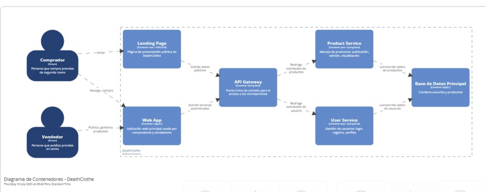
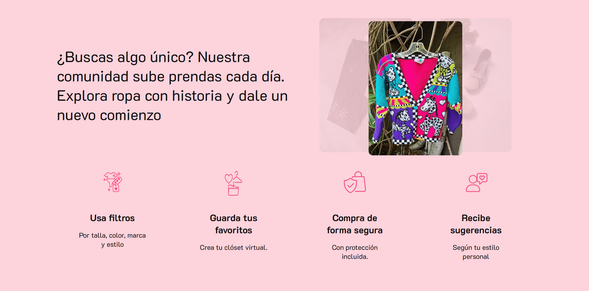

## Universidad Peruana de Ciencias Aplicadas

#### Nombre del curso: Aplicaciones Web
##### Carrera: Ingeniería de Software
##### Nombre del profesor: Hugo Allan Mori Paiva
##### NRC: 4376

#### "Informe de Trabajo Final"
##### Nombre de la Startup: ReWear
##### Nombre del Producto: DeathClothe

#### Integrantes

Bejarano Martínez Alvaro Leandro U202311640 
Cabanillas Meza Jose Mateo U202311458 
Luquillas Asto Omar U20211G641 
Santur Tello Andrea Elizabeth U202310988 
Sarmiento Medina Loreley U202310005 

# *Abril de 2025*

## Registro de Versiones del Informe

| Versión | Fecha      | Autor | Descripción de modificación |
|---------|------------|-------|------------------------------|
| TB1     | 27/04/2025 | - Bejarano Martínez, Álvaro Leandro - Cabanillas Meza, José Mateo - Luquillas Asto, Omar - Santur Tello, Andrea Elizabeth - Sarmiento Medina, Loreley | Se realizó un trabajo integral desde la investigación inicial hasta el diseño del producto DeathClothe. Incluyó entrevistas, análisis de usuarios, construcción de user personas, journey maps, mapas de empatía, Lean UX Canvas, wireframes, mockups y diagramas de arquitectura, consolidando así la base estratégica y visual del proyecto. |
| TP      | 16/05/2025 | - Bejarano Martínez, Álvaro Leandro - Cabanillas Meza, José Mateo - Luquillas Asto, Omar - Santur Tello, Andrea Elizabeth - Sarmiento Medina, Loreley | Se realizó acerca sobre la Landing Page de DeathClothe. Se incluyó la plataforma desarrollada y además, se elaboraron algunos puntos importantes que involucran al desarrollo de la plataforma DeathClothe, como la página de bienvenida, el perfil de "Comprador" y "Vendedor", las ofertas, las tendencias, los productos de temporada y demás cosas que se presentan en la plataforma. |
| TB2     | 17/06/2025 | - Bejarano Martínez, Álvaro Leandro - Cabanillas Meza, José Mateo - Luquillas Asto, Omar - Santur Tello, Andrea Elizabeth - Sarmiento Medina, Loreley | Se desarrollaron e integraron nuevas funcionalidades clave como el catálogo de favoritos, la sección personalizada “Para ti” con recomendaciones basadas en intereses del comprador, y la vista detallada de productos con chat integrado. Se actualizó el Lean UX Canvas alineándolo con los nuevos aprendizajes, se mejoró la interfaz de usuario y se fortaleció la conexión entre comprador y vendedor. Además, se realizaron validaciones con usuarios y se documentaron los hallazgos. |
| TF      | -          | -     |  |

## Project Report Collaboration Insights

|  URL del repositorio del reporte  |
| :-----------------------------------: |
| https://github.com/DeathClothe/DeathClothe-repository-report |

TB1: Durante esta entrega se trabajó principalmente en el diseño e implementación inicial de la landing page del proyecto, la cual fue desplegada correctamente. Las tareas fueron distribuidas entre los miembros del equipo y gestionadas mediante GitHub. La elaboración del informe comenzó en paralelo, con aportes individuales desde el repositorio compartido.

TP1: Para esta entrega se realizaron mejoras visuales y funcionales a la landing page, y se inició el desarrollo de la aplicación web. Las actividades se dividieron según los roles del equipo, y cada integrante contribuyó con secciones del informe, tanto en redacción como en revisión. Las evidencias de colaboración están disponibles en el historial de commits y gráficas del repositorio correspondiente.

TB2: En esta entrega se trabajaron mejoras tanto en el landing page como en la aplicación web, incorporando funcionalidades adicionales y refinando aspectos visuales. Además, se comenzó el desarrollo de los servicios web y se elaboraron los primeros videos del proyecto. La colaboración del equipo se mantuvo activa a través del repositorio del informe, con evidencias claras de participación en los commits y contribuciones distribuidas entre todos los integrantes.

**Analíticos de Colaboración:**

**Analíticos de Commits:**

## Contenido

- [Student Outcome](#student-outcome)

- [Capítulo I](#capítulo-i)
  - [1.1. Startup Profile](#11-startup-profile)
    - [1.1.1. Descripción de la Startup](#111-descripción-de-la-startup)
    - [1.1.2. Perfiles de integrantes del equipo](#112-perfiles-de-integrantes-del-equipo)
  - [1.2. Solution Profile](#12-solution-profile)
    - [1.2.1. Antecedentes y problemática](#121-antecedentes-y-problemática)
    - [1.2.2. Lean UX Process](#122-lean-ux-process)
      - [1.2.2.1. Lean UX Problem Statements](#1221-lean-ux-problem-statements)
      - [1.2.2.2. Lean UX Assumptions](#1222-lean-ux-assumptions)
      - [1.2.2.3. Lean UX Hypothesis Statements](#1223-lean-ux-hypothesis-statements)
      - [1.2.2.4. Lean UX Canvas](#1224-lean-ux-canvas)
  - [1.3. Segmentos Objetivo](#13-segmentos-objetivo)

- [Capítulo II: Requirements Elicitation & Analysis](#capítulo-ii-requirements-elicitation--analysis)
  - [2.1. Competidores](#21-competidores)
    - [2.1.1. Análisis competitivo](#211-análisis-competitivo)
    - [2.1.2. Estrategias y tácticas frente a competidores](#212-estrategias-y-tácticas-frente-a-competidores)
  - [2.2. Entrevistas](#22-entrevistas)
    - [2.2.1. Diseño de entrevistas](#221-diseño-de-entrevistas)
    - [2.2.2. Registro de entrevistas](#222-registro-de-entrevistas)
    - [2.2.3. Análisis de entrevistas](#223-análisis-de-entrevistas)
  - [2.3. Needfinding](#23-needfinding)
    - [2.3.1. User Personas](#231-user-personas)
    - [2.3.2. User Task Matrix](#232-user-task-matrix)
    - [2.3.3. User Journey Mapping](#233-user-journey-mapping)
    - [2.3.4. Empathy Mapping](#234-empathy-mapping)
    - [2.3.5. As-is Scenario Mapping](#235-as-is-scenario-mapping)
  - [2.4. Ubiquitous Language](#24-ubiquitous-language)
 
- [Capítulo III: Requirements specification](#capítulo-iii-requirements-specification)
  - [3.1. To-Be Scenario Mapping](#31-to-be-scenario-mapping)
  - [3.2. User Stories](#32-user-stories)
  - [3.3. Impact Mapping](#33-impact-mapping)
  - [3.4. Product Backlog](#34-product-backlog)
 
- [Capítulo IV: Product Design](#capítulo-iv-product-design)
  - [4.1. Style Guidelines](#41-style-guidelines)
    - [4.1.1. General Style Guidelines](#411-general-style-guidelines)
    - [4.1.2. Web Style Guidelines](#412-web-style-guidelines)
  - [4.2. Information Architecture](#42-information-architecture)
    - [4.2.1. Organization Systems](#421-organization-systems)
    - [4.2.2 Labeling Systems](#422-labeling-systems)
    - [4.2.3 SEO Tags and Meta Tags](#423-seo-tags-and-meta-tags)
    - [4.2.4. Searching Systems](#424-searching-systems)
    - [4.2.5. Navigation Systems](#425-navigation-systems)
  - [4.3. Landing Page UI Design](#43-landing-page-ui-design)
    - [4.3.1. Landing Page Wireframe](#431-landing-page-wireframe)
    - [4.3.2. Landing Page Mock-up](#432-landing-page-mock-up)
  - [4.4. Web Applications UX/UI Design](#44-web-applications-uxui-design)
    - [4.4.1. Web Applications Wireframes](#441-web-applications-wireframes)
    - [4.4.2. Web Applications Wireflow Diagrams](#442-web-applications-wireflow-diagrams)
    - [4.4.2. Web Applications Mock-ups](#442-web-applications-mock-ups)
    - [4.4.3. Web Applications User Flow Diagrams](#443-web-applications-user-flow-diagrams)
  - [4.5. Web Applications Prototyping](#45-web-applications-prototyping)
  - [4.6. Domain-Driven Software Architecture](#46-domain-driven-software-architecture)
    - [4.6.1. Software Architecture Context Diagram](#461-software-architecture-context-diagram)
    - [4.6.2. Software Architecture Container Diagrams](#462-software-architecture-container-diagrams)
    - [4.6.3. Software Architecture Components Diagrams](#463-software-architecture-components-diagrams)
  - [4.7. Software Object-Oriented Design](#47-software-object-oriented-design)
    - [4.7.1. Class Diagrams](#471-class-diagrams)
    - [4.7.2. Class Dictionary](#472-class-dictionary)
  - [4.8. Database Design](#48-database-design)
    - [4.8.1. Database Diagram](#481-database-diagram)

- [Capítulo V: Product Implementation, Validation & Deployment](#capítulo-v-product-implementation-validation--deployment)
  - [5.1. Software Configuration Management](#51-software-configuration-management)
    - [5.1.1. Software Development Environment Configuration](#511-software-development-environment-configuration)
    - [5.1.2. Source Code Management](#512-source-code-management)
    - [5.1.3. Source Code Style Guide & Conventions](#513-source-code-style-guide--conventions)
    - [5.1.4. Software Deployment Configuration](#514-software-deployment-configuration)
  - [5.2. Landing Page, Services & Applications Implementation](#52-landing-page-services--applications-implementation)
    - [5.2.1. Sprint 1](#521-sprint-1)
      - [5.2.1.1. Sprint Planning 1](#5211-sprint-planning-1)
      - [5.2.1.2. Aspect Leaders and Collaborators](#5212-aspect-leaders-and-collaborators)
      - [5.2.1.3. Sprint Backlog 1](#5213-sprint-backlog-1)
      - [5.2.1.4. Development Evidence for Sprint Review](#5214-development-evidence-for-sprint-review)
      - [5.2.1.5. Execution Evidence for Sprint Review](#5215-execution-evidence-for-sprint-review)
      - [5.2.1.6. Services Documentation Evidence for Sprint Review](#5216-services-documentation-evidence-for-sprint-review)
      - [5.2.1.7. Software Deployment Evidence for Sprint Review](#5217-software-deployment-evidence-for-sprint-review)
      - [5.2.1.8. Team Collaboration Insights during Sprint](#5218-team-collaboration-insights-during-sprint)
    - [5.2.2. Sprint 2](#522-sprint-2)
      - [5.2.2.1. Sprint Planning 2](#5221-sprint-planning-2)
      - [5.2.2.2. Sprint Backlog 2](#5222-sprint-backlog-2)
      - [5.2.2.3. Development Evidence for Sprint Review.](#5223-development-evidence-for-sprint-review)
      - [5.2.2.4. Testing Suite Evidence for Sprint Review.](#5224-testing-suite-evidence-for-sprint-review)
      - [5.2.2.5. Execution Evidence for Sprint Review.](#5225-execution-evidence-for-sprint-review)
      - [5.2.2.6. Services Documentation Evidence for Sprint Review.](#5226-services-documentation-evidence-for-sprint-review)
      - [5.2.2.7. Software Deployment Evidence for Sprint Review.](#5227-software-deployment-evidence-for-sprint-review)
      - [5.2.2.8. Team Collaboration Insights during Sprint.](#5228-team-collaboration-insights-during-sprint)
    - [5.2.3. Sprint 3](#523-sprint-3)
      - [5.2.3.1. Sprint Planning 3](#5231-sprint-planning-3)
      - [5.2.3.2. Sprint Backlog 3](#5232-sprint-backlog-3)
      - [5.2.3.3. Development Evidence for Sprint Review.](#5233-development-evidence-for-sprint-review)
      - [5.2.3.4. Testing Suite Evidence for Sprint Review.](#5234-testing-suite-evidence-for-sprint-review)
      - [5.2.3.5. Execution Evidence for Sprint Review.](#5235-execution-evidence-for-sprint-review)
      - [5.2.3.6. Services Documentation Evidence for Sprint Review.](#5236-services-documentation-evidence-for-sprint-review)
      - [5.2.3.7. Software Deployment Evidence for Sprint Review.](#5237-software-deployment-evidence-for-sprint-review)
      - [5.2.3.8. Team Collaboration Insights during Sprint.](#5238-team-collaboration-insights-during-sprint)
  - [5.3. Validation Interviews](#53-validation-interviews)
    - [5.3.1. Diseño de entrevistas](#531-diseño-de-entrevistas)
    - [5.3.2. Registro de entrevistas](#532-registro-de-entrevistas)
    - [5.3.3. Evaluaciones según heurísticas](#533-evaluaciones-según-heurísticas)
  - [5.4. Video About-the-Product](#54-video-about-the-product)

- [Conclusiones](#conclusiones)
- [Bibliografía](#bibliografía)
- [Anexos](#anexos)

## Student Outcome
 
El curso contribuye al cumplimiento del Student Outcome ABET:

**ABET – EAC – Student Outcome 5**
Criterio: *La capacidad de funcionar efectivamente en un equipo cuyos miembros juntos proporcionan liderazgo, crean un entorno de colaboración e inclusivo, establecen objetivos, planifican tareas y cumplen objetivos*

En el siguiente cuadro se describen las acciones realizadas y enunciados de conclusiones por parte del grupo, que permiten sustentar el haber alcanzado el logro del ABET – EAC – Student Outcome 5.

| Criterio específico                         | Acciones realizadas                                                                                                                                         | Conclusiones                                                                 |
|--------------------------------------------|-------------------------------------------------------------------------------------------------------------------------------------------------------------|------------------------------------------------------------------------------|
| Trabaja en equipo para proporcionar liderazgo en forma conjunta         | **Bejarano Martínez, Alvaro Leandro**  **TB1** Participó en las presentaciones semanales del avance del backlog y lideró la exposición sobre la arquitectura de software.  **TP1** Participó en el desarrollo de la Landing Page y se encargó de la programación.  **Cabanillas Meza, José Mateo**  **TB1** Expuso los hallazgos de entrevistas con usuarios compradores y presentó los mockups.  **TP1** Se encargó de elaborar acerca sobre el Frontend y Backend para que se pueda plasmar en el trabajo.  **Luquillas Asto, Omar**  **TB1** Apoyó en la socialización de ideas técnicas y expuso sobre la competencia directa e indirecta.  **TP1** Se encargó parte de la codificación del diseño elaborado después de ser bosquejado y elaborado anteriormente.  **Santur Tello, Andrea Elizabeth**  **TB1** Presentó el diseño de wireframes, guió al equipo durante la exposición de validación de requerimientos.  **TP1** Encargada del funcionamiento de otras partes fundamentales en la codificación y aportó con la elaboración del informe.  **Sarmiento Medina, Loreley**  **TB1** Moderó varias sesiones y participó activamente en la explicación del flujo de usuarios y arquitectura general.  **TP1** Se encargó del bosquejo del Frontend y Backend para que después sea codificado y plasmado.   | Las presentaciones fortalecieron nuestras habilidades de comunicación técnica y persuasiva. Se hizo un gran avance con respecto al entregable anterior, así como también, se pudo evidenciar acerca sobre el avance del funcionamiento de la plataforma. |
| Crea un entorno colaborativo e inclusivo, establece metas, planifica tareas y cumple objetivos         | **Bejarano Martínez, Alvaro Leandro**  **TB1** Participó en las presentaciones semanales del avance del backlog y lideró la exposición sobre la arquitectura de software.  **TP1** Participó en el desarrollo de la Landing Page y se encargó de la programación.  **Cabanillas Meza, José Mateo**  **TB1** Expuso los hallazgos de entrevistas con usuarios compradores y presentó los mockups.  **TP1** Se encargó de elaborar acerca sobre el Frontend y Backend para que se pueda plasmar en el trabajo.  **Luquillas Asto, Omar**  **TB1** Apoyó en la socialización de ideas técnicas y expuso sobre la competencia directa e indirecta.  **TP1** Se encargó parte de la codificación del diseño elaborado después de ser bosquejado y elaborado anteriormente.  **Santur Tello, Andrea Elizabeth**  **TB1** Presentó el diseño de wireframes, guió al equipo durante la exposición de validación de requerimientos.  **TP1** Encargada del funcionamiento de otras partes fundamentales en la codificación y aportó con la elaboración del informe.  **Sarmiento Medina, Loreley**  **TB1** Moderó varias sesiones y participó activamente en la explicación del flujo de usuarios y arquitectura general.  **TP1** Se encargó del bosquejo del Frontend y Backend para que después sea codificado y plasmado.   | Las presentaciones fortalecieron nuestras habilidades de comunicación técnica y persuasiva. Se hizo un gran avance con respecto al entregable anterior, así como también, se pudo evidenciar acerca sobre el avance del funcionamiento de la plataforma. | Trabaja en equipo para proporcionar liderazgo en forma conjunta                                | **Bejarano Martínez, Álvaro Leandro**  **TB2** Coordinó el desarrollo de funcionalidades avanzadas como la sección "Favoritos” y la lógica de recomendación personalizada en el frontend.  **Cabanillas Meza, José Mateo**  **TB2** Participó en el diseño de las nuevas vistas del producto y colaboró en el refinamiento del sistema de búsqueda con filtros.Ademas rediseño la seccion "Explora"  **Luquillas Asto, Omar**  **TB2** Encargado del del perfil del vendedor, configuración del sistema de autenticación y consolidó la documentación del informe.  **Santur Tello, Andrea Elizabeth**  **TB2** Relizo el perfil del comprador,gestión la integración del módulo de chat y consolidó la documentación del informe de TB2.  **Sarmiento Medina, Loreley**  **TB2** Apoyó en la validación funcional con usuarios, contribuyó a la reestructuración, realizo el armario virtual, con algunas modificaciones del Fronted y aportó en el diseño iterativo de la interfaz.   | En esta etapa se logró consolidar funcionalidades clave del producto, promoviendo la organización del equipo en roles técnicos y de documentación. Se evidenció un trabajo colaborativo fluido y liderazgo compartido para alcanzar los objetivos del entregable. |
| Crea un entorno colaborativo e inclusivo, establece metas, planifica tareas y cumple objetivos | **Bejarano Martínez, Álvaro Leandro**  **TB2** Colaboró con la planificación de entregables técnicos y lideró la revisión de código en equipo.  **Cabanillas Meza, José Mateo**  **TB2** Organizó reuniones de revisión de interfaz y definió flujos de navegación visualmente intuitivos.  **Luquillas Asto, Omar**  **TB2** Coordinó la documentación de endpoints y trabajó de manera sincronizada con el equipo frontend.  **Santur Tello, Andrea Elizabeth**  **TB2** Propuso mejoras al Canvas Lean UX alineándolo con la nueva visión del producto. Estableció hitos y lideró tareas vinculadas a la validación con usuarios.  **Sarmiento Medina, Loreley**  **TB2** Se encargó de estructurar el reporte del entregable y de asegurar que la narrativa visual del prototipo esté alineada con la propuesta de valor.                                                           | En TB2 el grupo demostró mayor madurez en la planificación, división de responsabilidades y ejecución eficiente. Se evidenció una evolución del trabajo en equipo hacia un enfoque más autónomo, ágil y enfocado en la mejora continua del producto.|

  

# Capítulo I: Introducción
## 1.1. Startup Profile
### 1.1.1. Descripción de la Startup
ReWear es una startup enfocada en transformar la manera en que las personas consumen, comparten y viven la moda. Creemos que cada prenda tiene una historia y que el estilo no debería depender de la producción masiva ni del consumo desechable. En ReWear, conectamos a usuarios apasionados por la autenticidad, la sostenibilidad y la expresión personal, a través de un mercado digital de ropa de segunda mano que combina tecnología, diseño y comunidad.
Nuestro primer producto, DeathClothe, es una plataforma web que permite a los usuarios subir, comprar, vender y descubrir prendas únicas, mientras reciben recomendaciones personalizadas basadas en su armario virtual. Más que una app, es una experiencia viva, donde la moda circula, evoluciona y encuentra nuevas almas.

Misión: Nuestra misión es ofrecer una nueva oportunidad a la ropa que ya no es deseada, brindando una segunda vida a las prendas y conectando a personas con gustos auténticos. A través de nuestra plataforma, buscamos que cada usuario pueda encontrar piezas únicas que se alineen con su estilo personal, sin tener que recurrir a la moda rápida. Fomentamos un consumo responsable, permitiendo que cada compra y venta de ropa sea un paso hacia un estilo más consciente, auténtico y sostenible.

Visión: Nos visualizamos como una empresa líder en el renacimiento de la moda circular, construyendo una comunidad global que redefine el estilo desde la autenticidad, el cuidado del planeta y la tecnología. Aspiramos a convertirnos en el referente para quienes ven en su ropa una extensión de su identidad, y que eligen transformar el mundo desde su armario.

### 1.1.2. Perfiles de integrantes del equipo

| Integrantes | Perfil de Integrante |
|-------------|----------------------|
|  | **Alvaro Leandro Bejarano Martínez** – Ingeniería de Software – U202311640 Mi nombre es Alvaro Leandro Bejarano Martínez, estudiante de la carrera Ingeniería de Software y me destaco por mi perseverancia, organización y capacidad para trabajar en equipo. Me esfuerzo por mantener un ambiente estructurado dentro del grupo, donde cada miembro se sienta valorado y sus ideas sean escuchadas y respetadas. Mi compromiso es fomentar la colaboración efectiva, asegurando que cada contribución se integre de manera ordenada y alineada con los objetivos comunes del equipo. |
|  | **Jose Mateo Cabanillas Meza** – Ingeniería de Software – U202311458 Mi nombre es Mateo Cabanillas y en la actualidad estoy cursando el quinto ciclo de la carrera de ingeniería de software con una mente creativa y una actitud colaborativa. Mi amor por la programación y la resolución de problemas me impulsa a explorar nuevas soluciones y aportar ideas frescas a los proyectos. Como compañero de equipo, soy amable, atento y siempre estoy dispuesto a ayudar. Creo firmemente en la importancia de la comunicación efectiva y la colaboración para lograr resultados excepcionales. |
|  | **Omar Luquillas Asto** – Ingeniería de Software – U20211G641 Soy Omar Luquillas Asto con código de estudiante U20211G641, estudiante de la carrera de Ingeniería de Software. Elegí esta carrera porque me apasiona la tecnología, el desarrollo de software y la programación. Tengo conocimientos en lenguajes de programación como C++, Python y Java. Me considero una persona investigadora, ya que me gusta aprender cosas nuevas y siempre estoy en busca de soluciones creativas e innovadoras que generen un impacto positivo en la vida de las personas. Además, valoro el trabajo en equipo, soy responsable y me comprometo a cumplir con mis tareas de manera eficiente. |
|  | **Andrea Santur** – Ingeniería de Software – U202310988 Soy Andrea Santur con código de estudiante 202310988, curso el 5to ciclo de la carrera de ingeniería de software. Me considero una persona organizada, dedicada y siempre dispuesta a aprender y a brindar apoyo a quienes lo necesiten. Tengo conocimientos en lenguajes de programación como C++, HTML y CSS, además de habilidades en Photoshop y Diseño UI. Valoro el trabajo en equipo, el aprendizaje continuo y el compromiso por presentar resultados de calidad. Espero aportar de manera efectiva al equipo y contribuir a la entrega de un proyecto excelente. |
|  | **Loreley Sarmiento Medina** – Ingeniería de Software – U202310005 Soy Loreley Sarmiento Medina con código de estudiante U202310005 y estudio la carrera de Ingeniería de Software. Me especializo en aportar soluciones tecnológicas integrales dentro de equipos multidisciplinarios. Cuento con sólidos conocimientos en el modelado de wireframes y mockups utilizando Figma, lo que me permite contribuir eficazmente en la etapa de diseño de interfaces centradas en el usuario. Además, tengo experiencia en el modelado de bases de datos, facilitando la organización y estructura lógica de la información. Poseo conocimientos intermedios en HTML y CSS, lo cual me permite colaborar en el desarrollo de interfaces web funcionales y visualmente atractivas. También tengo una base sólida en lenguajes de programación, lo que me permite implementar soluciones tanto en el frontend como en el backend, aportando al desarrollo integral del producto. |

## 1.2. Solution Profile
DeathClothe es una plataforma web que transforma la manera de consumir moda al permitir a los usuarios comprar, vender y descubrir ropa de segunda mano con recomendaciones personalizadas según su armario virtual. A través de una experiencia intuitiva, conecta a personas que buscan autenticidad, estilo y sostenibilidad, facilitando la circulación de prendas únicas y dándoles una nueva vida. Con un enfoque en la moda circular, la personalización y la comunidad, DeathClothe no solo es un mercado digital, sino un espacio donde el estilo evoluciona con propósito.

### 1.2.1. Antecedentes y problemática

**What**

*¿Cuál es el problema que se está presentando?*

El problema principal es el impacto ambiental y social del modelo de consumo de moda rápida (fast fashion), que genera millones de toneladas de residuos textiles anualmente y promueve un consumo desechable. Esto ha generado la necesidad urgente de nuevas soluciones digitales que impulsen modelos circulares. En respuesta a esta problemática, surge DeathClothe, una plataforma digital centrada en la moda circular. Esta permite a los usuarios subir, comprar, vender y descubrir ropa de segunda mano. A través de un armario virtual y un sistema de recomendaciones inteligentes, crea una experiencia personalizada que promueve un consumo más consciente, auténtico y sostenible.

**When**

*¿Cuándo estamos viendo el problema?*

El problema se observa de forma constante, ya que la producción y desecho de ropa ocurre durante todo el año, sin un patrón específico de estacionalidad. Sin embargo, se intensifica en épocas de rebajas, nuevas colecciones y eventos comerciales como el Black Friday, cuando aumenta el consumo impulsivo.

*¿En qué momento del día o del proceso en cuestión?*

Desde el punto de vista del usuario, el problema aparece en el momento en que busca renovar su estilo, encuentra prendas de baja calidad, o quiere deshacerse de ropa en buen estado sin una opción ética o rentable. La plataforma DeathClothe se usa precisamente en esos momentos, ofreciendo una alternativa para quienes desean darle una segunda vida a su ropa o encontrar prendas únicas sin recurrir al fast fashion.

**Where**

*¿Dónde estamos viendo los problemas?*

Los problemas se presentan a nivel global, pero particularmente en las grandes ciudades donde el consumo textil es más alto. También se manifiestan en vertederos, donde la mayoría de los residuos textiles terminan, así como en los procesos de producción masiva de ropa de bajo costo.

*¿En qué parte del proceso estamos viendo el problema?*

Se identifican en varias etapas del ciclo de vida de una prenda: desde la sobreproducción en la industria, pasando por la compra impulsiva y el uso efímero, hasta el desecho irresponsable. La falta de opciones para reciclar o revender ropa acentúa la problemática. DeathClothe interviene en la etapa de posconsumo, ofreciendo una alternativa responsable.

**Who**

*¿A quién le sucede?*

El problema afecta tanto al medio ambiente como a los consumidores. Específicamente, impacta a usuarios eco‑conscientes y fashionistas que desean adoptar un estilo más responsable sin comprometer su identidad. También afecta a personas con ropa en buen estado que no saben qué hacer con ella.

*¿El problema está relacionado con las habilidades de las personas?*

No directamente, pero sí con la falta de herramientas accesibles que faciliten la participación activa en la moda circular. Al no contar con plataformas intuitivas o sistemas de recomendación, muchos usuarios no saben cómo reutilizar o intercambiar su ropa, lo que impide un consumo más sostenible. DeathClothe busca reducir esta barrera tecnológica y de conocimiento.

**Why**

*¿Por qué sucede el problema?*

El problema sucede porque el modelo de fast fashion genera 92 millones de toneladas de residuos textiles al año, el equivalente a un camión de basura lleno de ropa vertido en vertederos cada segundo, con un fuerte impacto ambiental. En Estados Unidos, se descartan más de 34 000 millones de libras de textiles usados anualmente (más de 100 libras per cápita), lo que evidencia la incapacidad de los sistemas tradicionales para gestionar el ciclo de vida de la ropa. Solo el 20 % de los textiles descartados se recolecta para reciclaje o reutilización; el resto acaba en vertederos o incinerado. Todo esto subraya la urgencia de modelos de negocio circulares que fomenten la reutilización y reflejan cómo la cultura del consumo desechable y la producción acelerada están directamente relacionadas con el problema central que busca abordar DeathClothe.

**How**

*¿Cómo se diferencia el problema del estado normal (óptimo)?*

El problema actual se diferencia del estado óptimo en que los usuarios de plataformas de moda aún enfrentan catálogos desorganizados, una oferta saturada y sin personalización, además de una baja conciencia respecto al impacto ambiental del fast fashion. En contraste, el estado óptimo sería aquel en el que el consumidor puede descubrir fácilmente prendas alineadas con su estilo, a través de una experiencia curada, personalizada y sustentable que facilite la reutilización de ropa. DeathClothe apunta precisamente a resolver esta brecha, brindando una solución que combina sostenibilidad, personalización y una comunidad conectada a través de su armario virtual.

*¿La tendencia en la que aparece el problema es aleatoria o sigue un patrón?*

La tendencia no es aleatoria; sigue un patrón claro de consumo masivo e insostenible incentivado por el modelo del fast fashion. Esta industria genera una sobreoferta de prendas a bajo costo que incentiva la compra constante, lo que a su vez produce un inventario muy amplio y poco manejable en el ecosistema recommerce. Esto hace difícil para los usuarios descubrir lo que realmente necesitan o desean. Por ello, la plataforma utiliza algoritmos de curación y filtros avanzados para romper con este patrón y mejorar la experiencia de usuario, permitiéndole encontrar de forma efectiva lo que encaja con su identidad.

**How Much**

*¿Cuántos problemas se dan en un día, una semana o un mes?*

La magnitud del problema es crítica. Según la Ellen MacArthur Foundation (2017), cada año se desechan 92 millones de toneladas de ropa, de las cuales menos del 1% se recicla. Esto equivale a más de 250 mil toneladas diarias de residuos textiles generados a nivel global, una cifra alarmante que pone en evidencia la escala masiva del problema. Esta situación se produce de forma continua, todos los días del año, y tiene implicancias tanto ambientales como sociales.

*¿Cuánto dinero están implicando?*

La dimensión económica del problema es considerable. De acuerdo con McKinsey (2016), los consumidores compran un 60% más de prendas que hace dos décadas, pero las conservan la mitad de tiempo, lo que implica un gasto constante y acelerado que no se corresponde con un uso prolongado de las prendas. Aunque el 62% de los jóvenes prefiere opciones sostenibles (ThredUp, 2023), el mercado de segunda mano sigue siendo subutilizado. Esto representa una brecha económica y de impacto ambiental entre las buenas intenciones de los consumidores y las soluciones disponibles, y demuestra la urgente necesidad de propuestas innovadoras como DeathClothe que promuevan un consumo responsable, eficiente y circular.

### 1.2.2. Lean UX Process

El proceso Lean UX es una metodología ágil centrada en crear valor para el usuario mediante ciclos rápidos de validación y aprendizaje continuo. En lugar de depender de documentación extensa o procesos largos de diseño, Lean UX propone trabajar en conjunto con usuarios reales para validar hipótesis, iterar prototipos y evolucionar el producto con base en evidencia y datos.

#### 1.2.2.1. Lean UX Problem Statements

DeathClothe fue diseñado para facilitar la compra y venta de ropa de segunda mano, promoviendo así un consumo más sostenible y consciente.
Hemos observado que, actualmente, muchas personas desean adoptar la moda circular, pero enfrentan obstáculos importantes: los compradores tienen dificultades para encontrar prendas atractivas, en buen estado o alineadas a su estilo, debido a la falta de filtros eficaces y opciones personalizadas en plataformas existentes. A su vez, los vendedores enfrentan procesos complejos y poco transparentes para listar sus prendas, lo que desincentiva su participación. Como resultado, se genera un círculo vicioso: menos oferta atractiva limita el interés de compra, y las dificultades para vender reducen la rotación de ropa, provocando que muchas prendas en buen estado terminen desechadas.
¿Cómo podríamos diseñar una plataforma accesible y eficiente que elimine estas barreras en la compra y venta de ropa usada, de manera que más personas participen activamente y DeathClothe se convierta en una alternativa real y sostenible a la moda tradicional?

#### 1.2.2.2. Lean UX Assumptions

**Business Assumptions (Suposiciones de Negocio)**

- Creo que mis clientes tienen la necesidad de: Encontrar ropa de segunda mano que sea única, en buen estado y que se ajuste a sus gustos y tallas, además de contar con un canal sencillo y confiable para vender sus prendas usadas.

- Estas necesidades pueden resolverse con: Una plataforma especializada que facilite la compra y venta mediante herramientas de curación, personalización, filtros inteligentes, procesos simples de publicación y un sistema transparente de valoraciones.

- Mis clientes iniciales son (o serán): Jóvenes adultos entre 18 y 30 años, con conciencia ambiental, interés en la moda y hábitos digitales activos en redes sociales como Instagram y TikTok.

- El valor principal que el cliente desea obtener de mi servicio es: Adquirir o vender ropa de segunda mano de forma fácil, rápida y confiable.

Beneficios adicionales que pueden obtener son: Exclusividad, ahorro económico, impacto ambiental positivo y conexión emocional con prendas con historia.

- Adquiriré a la mayoría de mis clientes mediante: Campañas digitales con influencers de moda sostenible, contenido en redes sociales y estrategias de marketing orgánico en plataformas como TikTok e Instagram.

- Ganaré dinero mediante: Comisiones por transacción y servicios premium para vendedores (como posicionamiento de productos, herramientas analíticas o mejoras de visibilidad).

- Mi competencia principal en el mercado será: Plataformas generalistas como Vinted o Marketplace de Facebook.

Los superaremos gracias a: Una experiencia de usuario más intuitiva, filtros inteligentes, curación personalizada y un enfoque claro en sostenibilidad y comunidad.

- Mi mayor riesgo de producto es: Que los usuarios no perciban un valor diferencial suficiente frente a otras plataformas existentes.

Lo resolveremos mediante: Testeo constante con usuarios reales, iteraciones rápidas en base a feedback y mejoras centradas en su experiencia emocional y funcional.

- Otras suposiciones clave que, si resultan falsas, podrían hacer fracasar el proyecto:

  - Que haya suficiente oferta inicial de prendas para sostener la demanda.
  - Que los usuarios valoren la historia de las prendas como factor emocional de compra.
  - Que el costo logístico no sea una barrera mayor para escalar.

**User Assumptions (Suposiciones de Usuario)**

- ¿Quién es el usuario?: Jóvenes interesados en moda, conscientes del impacto ambiental y abiertos a nuevas formas de consumo.

- ¿Dónde encaja nuestro producto en su vida?: En sus hábitos cotidianos de consumo digital, especialmente en momentos de exploración de moda, compras online y participación en tendencias sostenibles.

- ¿Qué problemas resuelve nuestro producto?: Dificultad para encontrar ropa usada que realmente les guste, falta de confianza en el estado del producto, procesos engorrosos de venta y poca personalización en plataformas existentes.

- ¿Cuándo y cómo se usa nuestro producto?: En momentos de ocio, inspiración de estilo o necesidad de renovar el armario sin dañar el planeta. Usan el producto desde sus dispositivos tecnológicos principalmente, de manera visual e intuitiva.

- ¿Qué características son importantes?: Carga rápida de productos, historias de prendas, recomendaciones personalizadas y diseño atractivo.

- ¿Cómo debería lucir y comportarse nuestro producto?: Visualmente moderno, limpio y emocionalmente atractivo, con una navegación fluida, lenguaje cercano, imágenes destacadas de prendas y elementos de comunidad.

#### 1.2.2.3. Lean UX Hypothesis Statements

Hypothesis Statement 01:

- Creemos que simplificar el proceso de publicación de prendas a solo tres pasos clave (foto, atributos esenciales y precio) aumentará la disposición de los usuarios a vender.
- Sabremos que esto es cierto cuando al menos el 80 % de los usuarios completen el proceso de alta de una prenda con éxito en su primer intento.

Hypothesis Statement 02:

- Creemos que mostrar calificaciones visibles de compradores y vendedores en los perfiles incrementará la confianza en las transacciones.
- Sabremos que esto es cierto si la tasa de conversión de vistas de producto a compras aumenta en al menos un 12 %.

Hypothesis Statement 03:

- Creemos que incluir historias personales de cada prenda (origen, anécdotas, dueño anterior) generará una mayor conexión emocional con los compradores.
- Sabremos que esto es cierto si el porcentaje de clics en "Me interesa" por prenda visualizada aumenta al menos un 15 %.

Hypothesis Statement 04:

- Creemos que permitir filtrar por estilo, talla, color y estado facilitará la búsqueda y mejorará la experiencia de compra.
- Sabremos que esto es cierto si los usuarios tardan un 30 % menos en encontrar un producto que marcan como favorito, comparado con una navegación sin filtros.

Hypothesis Statement 05:

- Creemos que implementar una sección de “Recomendaciones personalizadas” basada en el estilo del usuario aumentará la retención y exploración de productos.
- Sabremos que esto es cierto si el tiempo promedio de navegación por sesión aumenta en un 20 % o más.

Hypothesis Statement 06:

- Creemos que ofrecer una guía visual de tallas y un sistema de ajuste basado en experiencias de otros usuarios reducirá la tasa de devoluciones o reclamos.
- Sabremos que esto es cierto si la tasa de reclamos por tallaje incorrecto disminuye en un 18 %.

Hypothesis Statement 07:

- Creemos que permitir marcar prendas como “Favoritas” o “Guardar para después” aumentará la conversión futura de esas prendas.
- Sabremos que esto es cierto si el 20 % de las prendas guardadas son eventualmente compradas en un plazo de 7 días.

 Hypothesis Statement 08:

- Creemos que brindar una opción de “Entrega gestionada” (p. ej., logística integrada) aumentará la disposición de los usuarios a vender.
- Sabremos que esto es cierto si al menos un 35 % de los vendedores eligen esta opción en su primera venta.

 Hypothesis Statement 09:

- Creemos que ofrecer una experiencia visual atractiva y moderna (con fotos grandes, navegación tipo catálogo) mantendrá la atención del usuario.
- Sabremos que esto es cierto si la tasa de rebote (usuarios que abandonan tras entrar) disminuye en al menos un 20 %.

Hypothesis Statement 10:

- Creemos que permitir agregar categorias como “Vestidos”, “Polos”, “Pantalones”, facilitará la exploración.
- Sabremos que esto es cierto si el 70 % de los clics en productos provienen de categorías.

Hypothesis Statement 11:

- Creemos que ofrecer un incentivo de bienvenida (descuento o envío gratis en la primera compra) aumentará el número de primeras transacciones.
- Sabremos que esto es cierto si al menos el 40 % de los nuevos usuarios realizan su primera compra en los primeros 5 días.

Hypothesis Statement 12:

- Creemos que permitir que los usuarios creen un “armario virtual” para gestionar sus prendas favoritas o en venta aumentará la fidelización.
- Sabremos que esto es cierto si los usuarios que crean armarios tienen un 30 % más de actividad mensual.

#### 1.2.2.4. Lean Ux Canvas

## 1.3. Segmentos Objetivos

### **Segmento Objetivo 1: Compradores**

Personas entre 18 y 35 años interesadas en la moda, pero que buscan alternativas más sostenibles, económicas y con mayor autenticidad que la moda rápida. Este segmento aprecia la originalidad, la estética visual y la posibilidad de consumir de forma responsable. Quieren encontrar prendas únicas de manera simple, confiable y atractiva.

**Características Demográficas:**

- Edad: 18 a 35 años
- Género: Todos los géneros
- Ubicación geográfica: Zonas urbanas en Perú (principalmente Lima, Arequipa, Trujillo y Cusco)
- Nivel socioeconómico: Medio y medio-alto (con poder adquisitivo moderado pero sensibilidad ambiental y de ahorro)
- Dispositivos de acceso: Smartphones (98 %), laptops (72 %), tablets (30 %)
- Comportamiento digital: Altamente activos en redes sociales como Instagram, TikTok y Pinterest (fuentes de inspiración de estilo)

**Necesidades:**

- Encontrar ropa en buen estado y con estilo que refleje su personalidad.
- Comprar en una plataforma visualmente atractiva y confiable.
- Conectar con una comunidad que valore el consumo responsable.

**Beneficios clave:**

- Acceso a prendas únicas a menor costo.
- Sentimiento de autenticidad y sostenibilidad en su estilo.
- Experiencia de compra emocionalmente conectada con el origen de cada prenda.

**Información estadística de sustento:**

- 52 % de los consumidores compraron ropa de segunda mano en 2023 (Fuente: Second Hand Apparel Market Report, 2025) ([https://www.stellarmr.com/report/Second-Hand-Apparel-Market/1885](https://www.stellarmr.com/report/Second-Hand-Apparel-Market/1885))
- 65 % de las personas de la Generación Z y Millennials compraron ropa de segunda mano en el último año. (Fuente: 37 Positive & Uplifting Sustainable Fashion Statistics, Renewtiful (2024)) ([https://renewtiful.com/insight/sustainable-fashion-statistics/](https://renewtiful.com/insight/sustainable-fashion-statistics/))

### **Segmento Objetivo 2: Vendedores**

Personas entre 18 y 50 años o más, que buscan una forma sencilla y eficiente de vender ropa usada en buen estado. Incluye desde personas con prendas que ya no usan hasta pequeños emprendedores o diseñadores independientes que quieren aprovechar la moda circular para generar ingresos o liberar espacio.

**Características Demográficas:**

- Edad: 18 a 50+ años
- Género: Todos los géneros
- Ubicación geográfica: Áreas urbanas con alto acceso digital (incluye Lima metropolitana, Piura, Chiclayo, Arequipa, entre otras)
- Nivel socioeconómico: Medio-bajo a medio-alto
- Dispositivos de acceso: Smartphones (95 %), laptops (60 %), cámaras móviles (para fotografiar prendas)
- Comportamiento digital: Usuarios activos de marketplaces, grupos de venta en Facebook y WhatsApp

**Necesidades:**

- Subir y vender ropa de forma fácil, rápida y sin complejidad.
- Asegurar que sus prendas tengan visibilidad y lleguen a personas que las valoren.
- Obtener un ingreso extra sin invertir demasiado tiempo.

**Beneficios clave:**

- Plataforma que simplifica el proceso de venta (fotos, descripción, precio).
- Conexión con un público que valora lo usado como algo único, no como "desecho".
- Posibilidad de generar ingresos de forma práctica.
- Promoción de un consumo más consciente y ético.

**Información estadística de sustento:**

- 85 % de los consumidores peruanos están dispuestos a vender artículos usados; 55 % a comprarlos (Encuesta Bside Perú, 2020) ([https://www.esan.edu.pe/conexion-esan/el-consumidor-peruano-y-la-compra-de-productos-de-segunda-mano](https://www.esan.edu.pe/conexion-esan/el-consumidor-peruano-y-la-compra-de-productos-de-segunda-mano))
- 40 % de los consumidores en Estados Unidos dijo que considera la ropa de segunda mano "muy sostenible". (Fuente: Consumer opinion on sustainability of secondhand goods, Statista (2024)) ([https://www.statista.com/statistics/1310367/consumer-opinion-secondhand-goods-sustainability-by-region/](https://www.statista.com/statistics/1310367/consumer-opinion-secondhand-goods-sustainability-by-region/))

# Capítulo II: Requirements Elicitation & Analysis

## 2.1. Competidores

En esta sección analizamos a los principales competidores de DeathClothe, enfocándonos en aquellos con modelos de negocio digitales similares o que ofrecen productos/servicios parcialmente superpuestos. Evaluamos tanto competidores directos como indirectos:

**1. Facebook Marketplace**

**Descripción:**

Marketplace de Facebook es una de las plataformas más usadas en Perú para comprar y vender ropa de segunda mano. Su gran alcance y naturaleza comunitaria lo convierten en una opción popular, aunque no está especializado en moda.

**Principales características:**

- Anuncios gratuitos con acceso a millones de usuarios
- Búsqueda por ubicación, categoría y palabras clave
- Chat integrado para comunicación vendedor-comprador
- Comentarios y calificaciones disponibles en perfiles

**2. Instagram Shops**

**Descripción:**

Vendedores independientes y tiendas de segunda mano operan directamente desde Instagram, destacando por un contenido visual cuidado y fuerte conexión con la audiencia.

**Principales características:**

- Publicaciones, Reels y Stories con estética atractiva
- Etiquetado de productos gracias a Instagram Shopping
- Interacción directa con los compradores vía mensajes
- Estilo de branding personalizado y emocional

**3. Mercado Libre**

**Descripción:**

La plataforma de comercio electrónico más grande de Latinoamérica, usada tanto para productos nuevos como usados, con capacidad para compraventa de ropa.

**Principales características:**

- Amplio alcance y base de usuarios en Perú
- Filtros por categoría, precio, ubicación y estado
- Sistema de reputación del vendedor y calificaciones
- Opciones de envío y pago integradas (Mercado Envíos, Mercado Pago)
- Funcionalidades avanzadas de publicación y promoción

### 2.1.1. Análisis competitivo

<table>
  <tr>
    <th colspan="6"> Competitive Analysis Landscape </th>
  </tr>
  <tr> 
    <td colspan="2" rowspan="2"> ¿Por qué llevar a cabo este análisis? </td>
    <td colspan="4"> Pregunta </td>
  </tr>
  <tr> 
    <td colspan="4"> Realizar este análisis nos permite identificar claramente a nuestros competidores, comprender sus modelos de negocio y detectar oportunidades para posicionar a DeathClothe de forma diferenciada y estratégica en el mercado. </td>
  </tr>
  <tr> 
    <td colspan="2">Productos</td>
    <td style="text-align: center;">
DeathClothe
</td>
    <td style="text-align: center;">
Facebook Marketplace
</td>
    <td style="text-align: center;">
Instagram Shops
</td>
    <td style="text-align: center;">
Mercado Libre
</td>
  </tr>
  <tr>
    <td rowspan="2">Perfil</td>
    <td>Overview</td>
    <td>Plataforma enfocada en la moda circular, que permite a usuarios comprar y vender ropa de segunda mano de forma sencilla, visualmente atractiva y sostenible.</td>
    <td>Espacio dentro de Facebook donde los usuarios publican artículos para venta directa, incluyendo ropa usada, sin especialización temática.</td>
    <td>Red social que permite a emprendedores y tiendas vender ropa directamente a través de contenido visual y conexión con la audiencia.</td>
    <td>Marketplace de gran alcance en Latinoamérica donde se puede comprar y vender prácticamente cualquier producto, incluida ropa nueva y usada.</td>
  </tr>
  <tr>
    <td>Ventaja competitiva ¿Qué valor ofrece a los clientes?</td>
    <td>Enfoque especializado en moda circular, curación de prendas con identidad, experiencia centrada en sostenibilidad y originalidad.</td>
    <td>Gran alcance y acceso a una base masiva de usuarios con herramientas básicas de publicación.</td>
    <td>Estética visual, cercanía con los clientes y personalización del branding.</td>
    <td>Filtros por categoría, opciones de pago/envío integradas, alta confianza del usuario.</td>
  </tr>
  <tr>
    <td rowspan="2">Perfil de Marketing</td>
    <td>Mercado Objetivo</td>
    <td>Jóvenes entre 18 y 35 años interesados en moda sostenible, compradores conscientes y pequeños emprendedores de ropa.</td>
    <td>Usuarios generales de Facebook; compradores casuales interesados en productos de segunda mano sin categoría específica.</td>
    <td>Tiendas independientes, influencers de moda, y compradores atraídos por el estilo visual y la autenticidad.</td>
    <td>Consumidores que buscan buenos precios, variedad y facilidad en las compras; tanto nuevos como usados.</td>
  </tr>
  <tr>
    <td>Estrategias de Marketing</td>
    <td>Alianzas con creadores de moda sostenible, campañas en redes sociales, storytelling visual y valores ambientales</td>
    <td>Difusión orgánica a través de publicaciones; impulsado por la red social de los usuarios.</td>
    <td>Contenido emocional, reels, hashtags de moda y promoción vía stories.</td>
    <td>Publicidad digital, posicionamiento SEO/SEM, y presencia en medios tradicionales.</td>
  </tr>
  <tr>
    <td rowspan="3">Perfil de Producto</td>
    <td>Productos & Servicios</td>
    <td>Marketplace para ropa usada, perfiles de comprador/vendedor, herramientas de publicación visual, storytelling de prendas.</td>
    <td>Publicación de productos, chat directo, categorías generales, búsqueda por ubicación.</td>
    <td>Catálogo visual, etiquetado de productos, interacción en tiempo real, personalización de la tienda.</td>
    <td>Publicaciones con fotos, filtros de búsqueda, sistema de pago y envío, calificación de vendedores.</td>
  </tr>
  <tr>
    <td>Precios & Costos</td>
    <td>Uso gratuito para compradores y vendedores; modelo freemium para funciones premium o visibilidad.</td>
    <td>Gratuito; no cobra comisiones por publicación ni venta.</td>
    <td>Gratuito, pero sujeto a algoritmo y visibilidad limitada si no se paga publicidad.</td>
    <td>Cobra comisión por venta (~11%) y costos por envíos; publicación gratuita.</td>
  </tr>
  <tr>
    <td>Canales de distribución</td>
    <td>Aplicación web progresiva y redes sociales; integraciones futuras con envíos.</td>
    <td>Plataforma dentro de Facebook; accesible desde navegador o app.</td>
    <td>App de Instagram y función de Instagram Shopping.</td>
    <td>Web oficial y app móvil; gran presencia en toda Latinoamérica.</td>
  </tr>
  <tr>
    <td rowspan="5">Análisis SWOT</td>
    <td>Fortalezas</td>
    <td>Enfoque nicho, experiencia visual y curada, impulso de sostenibilidad, alineación con valores de moda ética.</td>
    <td>Base de usuarios muy grande, fácil de usar, sin costos para el usuario.</td>
    <td>Conexión emocional con el usuario, excelente estética visual, branding personalizado.</td>
    <td>Reputación consolidada, variedad de productos, seguridad en transacciones.</td>
  </tr>
  <tr>
    <td>Debilidades</td>
    <td>Producto en etapa temprana, sin filtros avanzados, sin logística de envíos aún.</td>
    <td>Interfaz básica, sin filtros específicos para ropa, sin curaduría ni garantías.</td>
    <td>Proceso de compra poco automatizado, dependiente del engagement y del algoritmo.</td>
    <td>No está enfocado en moda circular, experiencia genérica y saturación de productos.</td>
  </tr>
  <tr>
    <td>Oportunidades</td>
    <td>Adopción creciente de consumo responsable, demanda de plataformas sostenibles y crecimiento de la economía circular.</td>
    <td>Implementar herramientas temáticas, ofrecer funcionalidades premium.</td>
    <td>Expandir a catálogos organizados y pagos integrados dentro de la app.</td>
    <td>Incorporar secciones dedicadas a moda circular, alianzas con ONGs de sostenibilidad.</td>
  </tr>
  <tr>
    <td>Amenazas</td>
    <td>Competencia de plataformas más grandes, cambios en el comportamiento del usuario, barreras logísticas.</td>
    <td>Competencia especializada puede captar su tráfico; limitaciones para escalar.</td>
    <td>Algoritmos que limitan visibilidad orgánica, saturación del mercado de moda vintage.</td>
    <td>Nuevas plataformas más especializadas pueden robar cuota de mercado en ropa usada.</td>
  </tr>
</table>

### 2.1.2. Estrategias y tácticas frente a competidores

Nuestro objetivo es enfrentar las fortalezas de los competidores, capitalizar sus debilidades y posicionar a DeathClothe en un nicho distintivo y sostenible dentro del mercado de la moda circular digital en Perú.

**1. Diferenciación por Historia y Personalización (Frente a Instagram Shops y Facebook Marketplace)**

Estrategia: Crear valor emocional a través de la narrativa de cada prenda, aspecto ausente en marketplaces generalistas.

Fortaleza Competitiva a Contrarrestar: Alto alcance visual y conexión emocional de Instagram con su comunidad.

Debilidad Competitiva a Aprovechar: Falta de información detallada o emocional sobre los productos.

Tácticas:

- Implementar fichas de producto enriquecidas con inputs narrativos del vendedor (historia, estilo, inspiración).
- Sistema de “looks anteriores” y “armario virtual” que permite al comprador visualizar combinaciones y recomendaciones personalizadas.

**2. Experiencia de Usuario como Comunidad Visual (Frente a Mercado Libre y Facebook Marketplace)**

Estrategia: Transformar la app en una comunidad visual interactiva, más allá de un catálogo funcional.

Fortaleza Competitiva a Contrarrestar: Presencia masiva y estructura consolidada de Mercado Libre y Facebook.

Debilidad Competitiva a Aprovechar: Interfaz poco amigable y generalista, con escasa orientación a moda o interacción social.

Tácticas:

- Navegación estilo red social, seguimiento entre usuarios, exploración de estilos.
- Opción móvil optimizado para exploración visual y recomendación estética.

**3. Confianza y Autenticidad como Propuesta de Valor (Frente a Facebook Marketplace)**

Estrategia: Reforzar la seguridad y confianza en la transacción entre personas.

Amenaza a Contrarrestar: Alta tasa de desconfianza o fraude en plataformas como Marketplace o grupos de compraventa.

Oportunidad: Falta de mecanismos formales de verificación o reputación en competidores.

Tácticas:

- Sistema de verificación de identidad para vendedores.
- Calificaciones visibles y comentarios tras cada transacción.
- Etiquetas por categoría.
- Descripciones visuales de estado real de la prenda (nuevo, casi nuevo, usado).

**4. Facilidad de Uso para Vendedores (Frente a Mercado Libre)**

Estrategia: Eliminar barreras de entrada para quienes quieren vender ropa sin experiencia técnica.

Debilidad Competitiva a Aprovechar: Procesos largos y técnicos en plataformas como Mercado Libre (categorías extensas, requisitos complejos).

Tácticas:

- Publicación en tres pasos con sugerencias automáticas.
- Herramientas de edición para cambiar fotos.
- Tip de fotografía rápida, y precios según el estado y marca.
- Posibilidad de etiquetar prendas por categorías (pantalones, vestidos, zapatillas, etc.).

**5. Presencia Local y Cultural (Frente a competidores globales)**

Estrategia: Posicionarse como una plataforma culturalmente peruana, comprometida con la economía circular local.

Debilidad Competitiva a Aprovechar: Falta de adaptación cultural de plataformas como Instagram o Mercado Libre a nichos específicos como moda sostenible en Perú.

Tácticas:

- Colaboración con creadores locales de moda consciente.
- Eventos físicos y virtuales como ferias de ropa circular o pop-ups colaborativos.
- Campañas de moda sostenible con influencers peruanos.

**6. Solución logística integrada (Frente a Facebook Marketplace)**

Estrategia: Superar la informalidad del envío entre usuarios con soluciones logísticas reales.

Amenaza a Contrarrestar: Abandono de ventas por dificultades en coordinación o desconfianza en entregas.

Oportunidad: Falta de integración logística en plataformas de compraventa informal.

Tácticas:

- Integración con servicios locales como Urbaner, Olva Courier o Rappi.
- Opción de “entrega segura” al elegir método de envío desde la app.
- Seguimiento del pedido y confirmación de entrega desde la plataforma.

## 2.2. Entrevistas

### 2.2.1. Diseño de entrevistas

 La elaboración de las entrevistas se basó en los objetivos del proyecto y en los perfiles específicos de compradores y vendedores. Se formularon preguntas personalizadas para entender hábitos, motivaciones y necesidades. En compradores, se exploraron sus preferencias por alternativas sostenibles, incluyendo a los compradores impulsivos para identificar qué los motiva. En vendedores, se abordaron razones para vender y expectativas hacia una plataforma que promueva el consumo responsable. 

#### 1. Preguntas para Comprador
##### 1.1. Información Demográfica
<table border="1" cellpadding="8" cellspacing="0">
  <thead>
    <tr>
      <th>Categoría Demográfica</th>
      <th>Pregunta de la entrevista</th>
    </tr>
  </thead>
  <tbody>
    <tr>
      <td><strong>Identificación personal</strong></td>
      <td>¿Podrías darme tu nombre?</td>
    </tr>
    <tr>
      <td><strong>Edad</strong></td>
      <td>¿Cuántos años tienes?</td>
    </tr>
    <tr>
      <td><strong>Ciudad</strong></td>
      <td>¿En qué ciudad vives actualmente?</td>
    </tr>
    <tr>
      <td><strong>Ocupación</strong></td>
      <td>¿Cuál es tu ocupación o en qué trabajas actualmente?</td>
    </tr>
    <tr>
      <td><strong>Uso digital</strong></td>
      <td>¿Con qué frecuencia usas internet para compras o redes sociales?</td>
    </tr>
  </tbody>
</table>

##### 1.2. Atributos Personales y Gustos
<table border="1" cellspacing="0" cellpadding="8">
  <thead>
    <tr>
      <th>Categoría</th>
      <th>Pregunta</th>
    </tr>
  </thead>
  <tbody>
    <tr>
      <td>Ocupación</td>
      <td>¿Cuál es tu ocupación o en qué trabajas actualmente?</td>
    </tr>
    <tr>
      <td>Uso digital</td>
      <td>¿Con qué frecuencia usas internet para compras o redes sociales?</td>
    </tr>
    <tr>
      <td>Explorador de estilo</td>
      <td>¿Cuéntame sobre la última vez que buscaste ropa de segunda mano en línea? ¿Qué pasos seguiste?</td>
    </tr>
    <tr>
      <td>Explorador de estilo</td>
      <td>¿Qué te impulsa más a comprar ropa usada en línea: precio, sostenibilidad o estilo único? ¿Por qué?</td>
    </tr>
    <tr>
      <td>Armario virtual</td>
      <td>Si tuvieras un ‘armario virtual’ en la plataforma web, ¿cómo organizarías tus prendas y qué filtros usarías para encontrar ropa que encaje con tu personalidad?</td>
    </tr>
    <tr>
      <td>Confianza y experiencia</td>
      <td>¿Qué te frustra de las plataformas de segunda mano actuales y qué funcionalidad te haría confiar en DeathClothe?</td>
    </tr>
    <tr>
      <td>Confianza y experiencia</td>
      <td>¿Qué información necesitarías ver en la plataforma web para comprar ropa usada para tus hijos sin preocupaciones?</td>
    </tr>
    <tr>
      <td>Confianza y experiencia</td>
      <td>¿Cómo verificas la autenticidad de una prenda vintage y qué sistema integrado en la plataforma web te haría usarla?</td>
    </tr>
    <tr>
      <td>Cierre de compra</td>
      <td>¿Qué funcionalidades de cierre de compra te motivarían a comprar más rápido en DeathClothe?</td>
    </tr>
    <tr>
      <td>Recomendaciones</td>
      <td>¿Te interesaría recibir recomendaciones de prendas en la plataforma web basadas en tu armario virtual y estilo? ¿Qué tipo de sugerencias valorarías?</td>
    </tr>
    <tr>
      <td>Organización del hogar</td>
      <td>¿Cómo te gustaría que DeathClothe te ayudara a ‘ganar espacio’ en casa?</td>
    </tr>
    <tr>
      <td>Funcionalidades ideales</td>
      <td>Imagina la plataforma web perfecta de segunda mano. ¿Qué tres funcionalidades serían imprescindibles para ti?</td>
    </tr>
  </tbody>
</table>

#### 2. Preguntas para Vendedor
##### 2.1. Información Demográfica

<table border="1" cellpadding="8" cellspacing="0">
  <thead>
    <tr>
      <th>Categoría Demográfica</th>
      <th>Pregunta de la entrevista</th>
    </tr>
  </thead>
  <tbody>
    <tr>
      <td><strong>Identificación personal</strong></td>
      <td>¿Podrías darme tu nombre?</td>
    </tr>
    <tr>
      <td><strong>Edad</strong></td>
      <td>¿Cuántos años tienes?</td>
    </tr>
    <tr>
      <td><strong>Ciudad</strong></td>
      <td>¿En qué ciudad vives actualmente?</td>
    </tr>
    <tr>
      <td><strong>Ocupación/Trabajo</strong></td>
      <td>¿Cuál es tu ocupación o en qué trabajas actualmente?</td>
    </tr>
    <tr>
      <td><strong>Uso digital</strong></td>
      <td>¿Con qué frecuencia usas internet para compras o redes sociales?</td>
    </tr>
  </tbody>
</table>

##### 2.2. Atributos Personales y Gustos
<table border="1" cellspacing="0" cellpadding="8">
  <thead>
    <tr>
      <th>Categoría</th>
      <th>Pregunta</th>
    </tr>
  </thead>
  <tbody>
    <tr>
      <td>Motivación para vender</td>
      <td>¿Qué te anima a vender una prenda en línea en lugar de regalarla o desecharla?</td>
    </tr>
    <tr>
      <td>Selección de prendas</td>
      <td>¿Cómo decides qué ropa poner en venta? ¿Te guías por estilo, estado, marca, algo más?</td>
    </tr>
    <tr>
      <td>Publicación de productos</td>
      <td>¿Qué pasos sigues antes de subir una prenda a la plataforma?</td>
    </tr>
    <tr>
      <td>Subida de contenido</td>
      <td>¿Prefieres subir las prendas desde tu celular o computadora? ¿Por qué?</td>
    </tr>
    <tr>
      <td>Armario virtual</td>
      <td>¿Cómo te gustaría que funcione tu armario virtual? ¿Qué debería mostrar o permitirte hacer?</td>
    </tr>
    <tr>
      <td>Dificultades técnicas</td>
      <td>¿Alguna vez has sufrido fallos a la hora de publicar una prenda, como demora de carga y demás?</td>
    </tr>
    <tr>
      <td>Precio y comparación</td>
      <td>¿Cómo decides el precio? ¿Te gustaría ver sugerencias basadas en ventas similares?</td>
    </tr>
    <tr>
      <td>Comunicación con compradores</td>
      <td>¿Qué esperas de la comunicación con posibles compradores dentro de la plataforma?</td>
    </tr>
    <tr>
      <td>Entregas y logística</td>
      <td>¿Qué tipo de opciones de entrega preferirías ofrecer o usar?</td>
    </tr>
    <tr>
      <td>Incentivos</td>
      <td>¿Qué te motivaría a seguir subiendo ropa a la web?</td>
    </tr>
  </tbody>
</table>

### 2.2.2. Registro de entrevistas
#### Segmento :Comprador
**Entrevista #1 – Datos del Entrevistado**
<table border="1" cellspacing="0" cellpadding="8">
  <thead>
    <tr>
      <th><strong>Dato</strong></th>
      <th><strong>Información</strong></th>
    </tr>
  </thead>
  <tbody>
    <tr>
      <td>Nombre completo</td>
      <td>Daniela Alessandra Cigueñas Tarrillo</td>
    </tr>
    <tr>
      <td>Edad</td>
      <td>19 años</td>
    </tr>
    <tr>
      <td>Ciudad - Distrito</td>
      <td>Lima - Los Olivos</td>
    </tr>
    <tr>
      <td>Ocupación/Trabajo</td>
      <td>Estudiante Universitario (Medios digitales y publicidad)</td>
    </tr>
    <tr>
      <td>Frecuencia de uso de Internet</td>
      <td>Compra en línea con frecuencia, sobre todo por redes sociales. Le encanta adquirir ropa, accesorios y todo lo que le llame la atención en internet.</td>
    </tr>
    <tr>
      <td>Inicio de la entrevista</td>
      <td>00:00</td>
    </tr>
    <tr>
      <td>Duración de la entrevista</td>
      <td>08:26</td>
    </tr>
  </tbody>
</table>

**Detalles de la entrevista:**  

</a> 
(https://upcedupe-my.sharepoint.com/:v:/g/personal/u202310988_upc_edu_pe/ERvZBKft-85KrhKzuNsLSksBjRZLjjNUp_idUI23rsUl0Q?e=14taym&nav=eyJyZWZlcnJhbEluZm8iOnsicmVmZXJyYWxBcHAiOiJTdHJlYW1XZWJBcHAiLCJyZWZlcnJhbFZpZXciOiJTaGFyZURpYWxvZy1MaW5rIiwicmVmZXJyYWxBcHBQbGF0Zm9ybSI6IldlYiIsInJlZmVycmFsTW9kZSI6InZpZXcifX0%3D)

**Resumen de la entrevista:**  
Daniela, estudiante de 19 años de Lima, mencionó que utiliza con frecuencia internet para realizar compras. Hace pocos días adquirió ropa de segunda mano, motivada por el precio accesible y los estilos únicos. Comentó que organizaría su armario virtual por estilo, color, temporada y precio, y señaló como frustración principal la falta de precisión en tallas y descripciones. Además, resaltó la importancia de contar con fotos desde varios ángulos, descripciones claras y reseñas de otros usuarios. Considera esencial agilizar el proceso de pago con métodos como Yape, le interesan las recomendaciones basadas en su armario virtual y valoraría una función para vender automáticamente prendas no usadas. Finalmente, destacó que su plataforma ideal incluiría un sistema de tallas preciso, una experiencia personalizada y sugerencias adaptadas a su estilo. 

**Entrevista #2 - Datos del Entrevistado** 
<table border="1" cellspacing="0" cellpadding="8">
  <thead>
    <tr>
      <th><strong>Dato</strong></th>
      <th><strong>Información</strong></th>
    </tr>
  </thead>
  <tbody>
    <tr>
      <td>Nombre completo</td>
      <td>William Agustín Ventura Saldaña</td>
    </tr>
    <tr>
      <td>Edad</td>
      <td>27 años</td>
    </tr>
    <tr>
      <td>Distrito</td>
      <td>Lima - Surco</td>
    </tr>
    <tr>
      <td>Ocupación/Trabajo</td>
      <td>Estudiante Universitario (Ingeniería de sistemas) - Friendlands de diseño gráfico</td>
    </tr>
    <tr>
      <td>Frecuencia de uso de Internet</td>
      <td>Usualmente suele usarlo dos o tres veces por semana, principalmente para comprar comida y herramientas gráficas para su empleo.</td>
    </tr>
    <tr>
      <td>Inicio de la entrevista</td>
      <td>08:26</td>
    </tr>
    <tr>
      <td>Duración de la entrevista</td>
      <td>07:26</td>
    </tr>
  </tbody>
</table>

**Detalles de la entrevista:**  

</a> 
(https://upcedupe-my.sharepoint.com/:v:/g/personal/u202310988_upc_edu_pe/ERvZBKft-85KrhKzuNsLSksBjRZLjjNUp_idUI23rsUl0Q?e=14taym&nav=eyJyZWZlcnJhbEluZm8iOnsicmVmZXJyYWxBcHAiOiJTdHJlYW1XZWJBcHAiLCJyZWZlcnJhbFZpZXciOiJTaGFyZURpYWxvZy1MaW5rIiwicmVmZXJyYWxBcHBQbGF0Zm9ybSI6IldlYiIsInJlZmVycmFsTW9kZSI6InZpZXcifX0%3D)

Agustín Ventura, de 27 años y residente en Lima, compró ropa de segunda mano hace un mes tras buscar tiendas vintage en Instagram, revisar comentarios y tallas grandes, y completar el pago con Yape. Valora el estilo único y la sostenibilidad, por lo que organizaría su armario virtual por estilo, temporada, color y talla, con filtros de combinaciones personalizadas. Sin embargo, se frustra con descripciones imprecisas y fotos poco claras, de modo que confiaría en DeathClothe si incluyera verificación de calidad, medidas exactas y reseñas de expertos. Además, considera clave un proceso de pago ágil con cupones y alertas de oferta, recomendaciones tanto similares como contrastantes, clasificación automática de prendas para liberar espacio y un informe del impacto ambiental de sus compras. 

**Entrevista #3 - Datos del Entrevistado**
<table border="1" cellspacing="0" cellpadding="8">
  <thead>
    <tr>
      <th><strong>Dato</strong></th>
      <th><strong>Información</strong></th>
    </tr>
  </thead>
  <tbody>
    <tr>
      <td>Nombre completo</td>
      <td>Anyelo Bill Alejos Jesús</td>
    </tr>
    <tr>
      <td>Edad</td>
      <td>20 años</td>
    </tr>
    <tr>
      <td>Distrito</td>
      <td>Lima - Comas</td>
    </tr>
    <tr>
      <td>Ocupación/Trabajo</td>
      <td>Estudiante Universitario (Ingeniería de software)</td>
    </tr>
    <tr>
      <td>Frecuencia de uso de Internet</td>
      <td>Casi siempre lo usa para compras en línea, especialmente en Marketplace y AliExpress.</td>
    </tr>
    <tr>
      <td>Inicio de la entrevista</td>
      <td>15:54</td>
    </tr>
    <tr>
      <td>Duración de la entrevista</td>
      <td>06:53</td>
    </tr>
  </tbody>
</table>

**Detalles de la entrevista:**  

</a> 
(https://upcedupe-my.sharepoint.com/:v:/g/personal/u202310988_upc_edu_pe/ERvZBKft-85KrhKzuNsLSksBjRZLjjNUp_idUI23rsUl0Q?e=14taym&nav=eyJyZWZlcnJhbEluZm8iOnsicmVmZXJyYWxBcHAiOiJTdHJlYW1XZWJBcHAiLCJyZWZlcnJhbFZpZXciOiJTaGFyZURpYWxvZy1MaW5rIiwicmVmZXJyYWxBcHBQbGF0Zm9ybSI6IldlYiIsInJlZmVycmFsTW9kZSI6InZpZXcifX0%3D)

**Resumen de la entrevista:**  
Anyelo , estudiante de Ingeniería de Software de 20 años, buscó ropa de segunda mano atraído por modelos agotados y precios bajos.Organizaría su armario virtual por temporada y color, aunque lamenta la falta de fiabilidad de algunos vendedores y la llegada de prendas robadas o en mal estado, por lo cual considera esencial contar con descripciones claras, tallas exactas y fotos detalladas. Asimismo, verificaría la autenticidad comparando modelos en línea y valora un proceso de pago seguro con opciones de descuento. Asimismo, le interesaría recibir recomendaciones basadas en su armario virtual y automatizar la venta o donación de prendas no usadas. Finalmente, identifica como funciones imprescindibles un sistema de tallas preciso, métodos de pago confiables y una organización clara de su armario virtual. 

#### Segmento :Vendedor
**Entrevista #4 – Datos del Entrevistado**
<table border="1" cellspacing="0" cellpadding="8">
  <thead>
    <tr>
      <th><strong>Dato</strong></th>
      <th><strong>Información</strong></th>
    </tr>
  </thead>
  <tbody>
    <tr>
      <td>Nombre completo</td>
      <td>David Manuel Torres Meneses</td>
    </tr>
    <tr>
      <td>Edad y Género</td>
      <td>20 años</td>
    </tr>
    <tr>
      <td>Distrito</td>
      <td>Los Olivos</td>
    </tr>
    <tr>
      <td>Ocupación/Trabajo</td>
      <td>Vendedor de tienda de ropa</td>
    </tr>
    <tr>
      <td>Frecuencia de uso de Internet</td>
      <td>Usualmente lo usa muy rara vez, solo en emergencias y cuando veo algo realmente interesante, como prendas de buena calidad o diseños únicos</td>
    </tr>
    <tr>
      <td>Inicio de la entrevista</td>
      <td>22:48</td>
    </tr>
    <tr>
      <td>Duración de la entrevista</td>
      <td>14:55</td>
    </tr>
  </tbody>
</table>

**Detalles de la entrevista:**  

</a> 
(https://upcedupe-my.sharepoint.com/:v:/g/personal/u202310988_upc_edu_pe/ERvZBKft-85KrhKzuNsLSksBjRZLjjNUp_idUI23rsUl0Q?e=14taym&nav=eyJyZWZlcnJhbEluZm8iOnsicmVmZXJyYWxBcHAiOiJTdHJlYW1XZWJBcHAiLCJyZWZlcnJhbFZpZXciOiJTaGFyZURpYWxvZy1MaW5rIiwicmVmZXJyYWxBcHBQbGF0Zm9ybSI6IldlYiIsInJlZmVycmFsTW9kZSI6InZpZXcifX0%3D)

**Resumen de la entrevista:**  
David Manuel Torres Meneses, de 20 años y residente en Lima, elige qué artículos poner en venta basándose en marca, estilo, color y talla, y los prepara con fotografías (incluso vistas 360°), descripciones detalladas y precios ajustados según la rareza o urgencia. Prefiere publicar desde la computadora porque es más estable que el celular, ya que en el móvil la carga de imágenes y la publicación suelen fallar; sin embargo, sueña con un armario virtual que agrupe prendas por demanda, temporada y exclusividad. Además, valoraría sugerencias automáticas de precios basadas en ventas similares, un chat integrado para resolver dudas rápidamente y múltiples opciones de envío, tanto nacionales como internacionales, y asegura que le motivaría ver que sus ofertas satisfacen las necesidades de los compradores.

**Entrevista #5 – Datos del Entrevistado**
<table border="1" cellspacing="0" cellpadding="8">
  <thead>
    <tr>
      <th><strong>Dato</strong></th>
      <th><strong>Información</strong></th>
    </tr>
  </thead>
  <tbody>
    <tr>
      <td>Nombre completo</td>
      <td>Valesska Sánchez</td>
    </tr>
    <tr>
      <td>Edad y Género</td>
      <td>20 años</td>
    </tr>
    <tr>
      <td>Distrito</td>
      <td>San Martín de Porres</td>
    </tr>
    <tr>
      <td>Ocupación/Trabajo</td>
      <td>Vendedora de ropa en línea</td>
    </tr>
    <tr>
      <td>Frecuencia de uso de Internet</td>
      <td>Usa mucho las redes sociales, especialmente Marketplace</td>
    </tr>
    <tr>
      <td>Inicio de la entrevista</td>
      <td>37:42</td>
    </tr>
    <tr>
      <td>Duración de la entrevista</td>
      <td>03:19</td>
    </tr>
  </tbody>
</table>

**Detalles de la entrevista:**  

</a> 
(https://upcedupe-my.sharepoint.com/:v:/g/personal/u202310988_upc_edu_pe/ERvZBKft-85KrhKzuNsLSksBjRZLjjNUp_idUI23rsUl0Q?e=14taym&nav=eyJyZWZlcnJhbEluZm8iOnsicmVmZXJyYWxBcHAiOiJTdHJlYW1XZWJBcHAiLCJyZWZlcnJhbFZpZXciOiJTaGFyZURpYWxvZy1MaW5rIiwicmVmZXJyYWxBcHBQbGF0Zm9ybSI6IldlYiIsInJlZmVycmFsTW9kZSI6InZpZXcifX0%3D)

**Resumen de la entrevista:**  
Valesska Sánchez, de 20 años y residente en Lima, comenta que usualmente elige la ropa que pondrá en venta basándose en la marca. Para ello, se asegura de prepararla con buenas fotografías y descripciones detalladas que incluyan el estado de la prenda y su precio. Además, le gustaría poder ver principalmente los comentarios de los posibles compradores sobre los productos que ofrece, y suele guiarse por sugerencias de precios basadas en ventas similares. Finalmente, valora la posibilidad de tener una comunicación directa con sus clientes y opciones de envío como la contra entrega. La motiva especialmente la idea de generar ingresos vendiendo ropa de segunda mano.

**Entrevista #6 – Datos del Entrevistado**
<table border="1" cellspacing="0" cellpadding="8">
  <thead>
    <tr>
      <th><strong>Dato</strong></th>
      <th><strong>Información</strong></th>
    </tr>
  </thead>
  <tbody>
    <tr>
      <td>Nombre completo</td>
      <td>Jhon Alexander Chuchon</td>
    </tr>
    <tr>
      <td>Edad y Género</td>
      <td>19 años</td>
    </tr>
    <tr>
      <td>Distrito</td>
      <td>San Martín de Porres</td>
    </tr>
    <tr>
      <td>Ocupación/Trabajo</td>
      <td>Vendedor de ropa en línea</td>
    </tr>
    <tr>
      <td>Frecuencia de uso de Internet</td>
      <td>Usa diariamente las redes sociales, especialmente Instagram y Tiktok</td>
    </tr>
    <tr>
      <td>Inicio de la entrevista</td>
      <td>41:02</td>
    </tr>
    <tr>
      <td>Duración de la entrevista</td>
      <td>06:10</td>
    </tr>
  </tbody>
</table>

**Detalles de la entrevista:**  

</a> 
(https://upcedupe-my.sharepoint.com/:v:/g/personal/u202310988_upc_edu_pe/ERvZBKft-85KrhKzuNsLSksBjRZLjjNUp_idUI23rsUl0Q?e=14taym&nav=eyJyZWZlcnJhbEluZm8iOnsicmVmZXJyYWxBcHAiOiJTdHJlYW1XZWJBcHAiLCJyZWZlcnJhbFZpZXciOiJTaGFyZURpYWxvZy1MaW5rIiwicmVmZXJyYWxBcHBQbGF0Zm9ybSI6IldlYiIsInJlZmVycmFsTW9kZSI6InZpZXcifX0%3D)

**Resumen de la entrevista:**  
Jhon Alexander Chuchón, de 19 años y residente en Lima, comenta que usualmente elige qué artículos poner en venta basándose en el estado y la marca de las prendas. Para ello, se asegura de preparar buenas fotografías que muestren la prenda en su totalidad, acompañadas de descripciones detalladas sobre la talla y el estado. Le gustaría que su armario virtual permitiera ordenar las prendas por tipo, por temporada o por las más vistas o favoritas. Menciona que, en varias ocasiones, ha tenido inconvenientes como demoras al cargar imágenes o problemas al subir las descripciones, lo que lo obliga a reescribir la información. También valoraría contar con sugerencias de precios basadas en productos similares, ya que usualmente se guía por referencias de otras plataformas. Considera importante que la aplicación cuente con un chat directo, que sea seguro y fácil de usar. Finalmente, aprecia contar con diversas opciones de envío, y le motiva especialmente que sus prendas se vendan y reciban buenos comentarios o puntuaciones.

### 2.2.3. Análisis de entrevistas

**Segmento Objetivo 1: Compradores**

Los compradores entrevistados muestran un interés marcado por una experiencia de compra digital que combine estilo, confianza y sostenibilidad. El 100% de los entrevistados coincidió en la importancia de contar con descripciones claras, tallas precisas y fotos detalladas, elementos que consideran esenciales para confiar en una plataforma de ropa de segunda mano. Asimismo, el 66% mencionó como imprescindible un sistema de recomendaciones personalizadas basado en su armario virtual, lo cual refleja una alta demanda por experiencias de compra individualizadas. Además, todos los participantes valoran métodos de pago rápidos y seguros, como Yape, mientras que el 66% expresó interés en funciones automatizadas para vender o donar prendas no utilizadas. En conjunto, este segmento prioriza no solo el ahorro y la autenticidad, sino también una navegación fluida, confiable y adaptada a sus gustos personales.

**Segmento Objetivo 2: Vendedores**

En el caso de los vendedores, las entrevistas revelan que todos seleccionan sus prendas en función de criterios como marca, estado, estilo y temporada, mostrando una preocupación clara por ofrecer productos atractivos y bien presentados. Todos los entrevistados también destacaron la importancia de subir fotos de buena calidad y descripciones completas, aunque el 66% reportó dificultades técnicas al momento de publicar, lo cual resalta la necesidad de una plataforma estable y funcional. El 100% valoraría recibir sugerencias automáticas de precios basadas en ventas similares, mientras que un 66% manifestó que la comunicación directa con los compradores a través de un chat integrado es fundamental. Asimismo, todos consideran importante ofrecer múltiples métodos de envío, incluyendo contra entrega. En resumen, este grupo busca herramientas que no solo simplifiquen el proceso de venta, sino que también les permitan conectar con compradores interesados y generar ingresos dentro de un entorno seguro y funcional.

## 2.3. Needfinding

### 2.3.1. User Personas

A continuación, se presentan las User Personas que representan a nuestros dos segmentos principales.

**Segmento 1: Compradores**

**Segmento 2: Vendedores**

#### 2.3.2. User Task Matrix

**Compradores:**

<table>
  <thead>
    <tr>
      <th>Actividades</th>
      <th colspan="2">Valeria Gomez</th>
    </tr>
    <tr>
      <th></th>
      <th>Frecuencia</th>
      <th>Importancia</th>
    </tr>
  </thead>
  <tbody>
    <tr>
      <td>Explorar el catálogo de ropa de segunda mano</td>
      <td>Diario/Semanal</td>
      <td>Alta</td>
    </tr>
    <tr>
      <td>Utilizar filtros inteligentes (talla, estilo, color, precio)</td>
      <td>Por cada búsqueda</td>
      <td>Alta</td>
    </tr>
    <tr>
      <td>Ver recomendaciones personalizadas basadas en su historial</td>
      <td>Diario/Semana</td>
      <td>Alta</td>
    </tr>
    <tr>
      <td>Leer historias/origen de las prendas (anécdotas, dueño anterior)</td>
      <td>Por artículo visto</td>
      <td>Media</td>
    </tr>
    <tr>
      <td>Interactuar con la función "Me interesa" o guardar favoritos</td>
      <td>Diario/Semanal</td>
      <td>Alta</td>
    </tr>
    <tr>
      <td>Realizar compras (selección, pago seguro, confirmación)</td>
      <td>Según necesidad</td>
      <td>Alta</td>
    </tr>
    <tr>
      <td>Calificar a vendedores y dejar reseñas post-compra</td>
      <td>Tras cada compra</td>
      <td>Media</td>
    </tr>
    <tr>
      <td>Gestionar armario virtual (agregar/eliminar prendas)</td>
      <td>Semanal/Mensual</td>
      <td>Media</td>
    </tr>
    <tr>
      <td>Recibir alertas de nuevos artículos según preferencias</td>
      <td>Diario/Semanal</td>
      <td>Alta</td>
    </tr>
    <tr>
      <td>Adaptación a Condiciones Climáticas</td>
      <td>Según necesidad</td>
      <td>Media</td>
    </tr>
  </tbody>
</table>

**Vendedores:**

<table>
  <thead>
    <tr>
      <th>Actividades</th>
      <th colspan="2">Calor Méndez</th>
    </tr>
    <tr>
      <th></th>
      <th>Frecuencia</th>
      <th>Importancia</th>
    </tr>
  </thead>
  <tbody>
    <tr>
      <td>Subir prendas al catálogo (fotos, atributos, precio)</td>
      <td>Semanal/Mensual</td>
      <td>Alta</td>
    </tr>
    <tr>
      <td>Gestionar publicaciones (editar, pausar, eliminar)</td>
      <td>Semanal/Mensual</td>
      <td>Alta</td>
    </tr>
    <tr>
      <td>Responder consultas de compradores (mensajes directos)</td>
      <td>Diario/Semanal</td>
      <td>Media</td>
    </tr>
    <tr>
      <td>Revisar y aceptar ofertas de compra</td>
      <td>Diario/Semanal</td>
      <td>Alta</td>
    </tr>
    <tr>
      <td>Gestionar envíos y logística (etiquetas, seguimiento)</td>
      <td>Tras cada venta</td>
      <td>Media</td>
    </tr>
    <tr>
      <td>Actualizar inventario (agregar nuevas prendas, marcar como vendidas)</td>
      <td>Semanal</td>
      <td>Alta</td>
    </tr>
    <tr>
      <td>Revisar calificaciones y reseñas de compradores</td>
      <td>Diario/Semanal</td>
      <td>Baja</td>
    </tr>
    <tr>
      <td>Recibir y retirar pagos (gestión de saldos, retiros)</td>
      <td>Según necesidad</td>
      <td>Alta</td>
    </tr>
  </tbody>
</table>

#### 2.3.3. User Journey Mapping

**Compradores**

 
</a>

**Vendedores**

 
</a>

#### 2.3.4. Empathy Mapping

**Compradores**
<table border="1">
  <tr>
    <td colspan="3"><strong>¿Qué piensa y siente?</strong> 
      Valeria busca completar sus outfits con prendas únicas que expresen su estilo personal, pero necesita opciones económicas que se ajusten a su presupuesto limitado como estudiante.
    </td>
  </tr>
  <tr>
    <td><strong>¿Qué oye?</strong> 
      <a href="#">Escucha</a> comentarios en redes sociales sobre lo caro que es vestir a la moda.
    </td>
    <td style="text-align: center;"><strong>Comprador (Valeria Gomez)</strong></td>
    <td><strong>¿Qué ve?</strong> 
      Ofertas en plataformas de moda, pero con precios altos.
    </td>
  </tr>
  <tr>
    <td colspan="3"><strong>¿Qué dice y hace?</strong> 
      Valeria busca ropa única, pero que no pueda pagar precios altos por adquirirlas.
    </td>
  </tr>
  <tr>
    <td><strong>¿Qué le duele?</strong> 
      No encontrar prendas que reflejen su estilo a precios accesibles. 
      <u>Desconfiar</u> de las fotos y descripciones en tiendas online. 
      Sentirse excluida de tendencias por su presupuesto limitado.
    </td>
    <td colspan="2"><strong>¿A qué aspira?</strong> 
      Completar sus outfits con piezas únicas y económicas. 
      Tener un armario sostenible y lleno de personalidad. 
      Sentirse segura y auténtica con su estilo, sin gastar de más.
    </td>
  </tr>
</table>

**Vendedores**

<table>
  <tr>
    <th colspan="3">¿Qué piensa y siente?</th>
  </tr>
  <tr>
    <td colspan="3">Méndez desea vender su ropa de segunda mano donde encuentre compradores que aprecien su estilo y paguen un precio justo.</td>
  </tr>
  <tr>
    <th>¿Qué oye?</th>
    <th>Vendedor (Calor Méndez)</th>
    <th>¿Qué ve?</th>
  </tr>
  <tr>
    <td>Escucha recomendaciones de influencers sobre apps para vender ropa usada.</td>
    <td></td>
    <td>Su armario lleno de ropa de calidad que ya no usa.</td>
  </tr>
  <tr>
    <th colspan="3">¿Qué dice y hace?</th>
  </tr>
  <tr>
    <td colspan="3">Méndez busca una app que le permita vender de manera sencilla y prefiere vender por Instagram, aunque le falta alcance.</td>
  </tr>
  <tr>
    <th>¿Qué le duele?</th>
    <th colspan="1"></th>
    <th>¿A qué aspira?</th>
  </tr>
  <tr>
    <td>
      Perder tiempo en plataformas que no generan ventas. 
      Ver cómo sus prendas pierden valor por malas fotos o presentación.
    </td>
    <td></td>
    <td>
      Vender rápido y sin complicaciones. 
      Liberar espacio en su armario con ganancias justas. 
      Convertir su closet en una fuente estable de ingresos extras.
    </td>
  </tr>
</table>

#### 2.3.5. As-is Scenario Mapping

**Compradores**

<table border="1">
    <tr>
        <th>Phases</th>
        <th>Búsqueda de Prendas</th>
        <th>Evaluación de Productos</th>
        <th>Proceso de Compra</th>
        <th>Post-Compra</th>
    </tr>
    <tr>
        <td><strong>Doing</strong></td>
        <td>Navega en múltiples plataformas sin filtros precisos.</td>
        <td>Compara fotos y descripciones poco detalladas.</td>
        <td>Abandona el carrito por procesos largos o inseguros.</td>
        <td>Espera sin tracking claro o se arrepiente por falta de garantías.</td>
    </tr>
    <tr>
        <td><strong>Thinking</strong></td>
        <td>Me pregunto donde puedo encontrar algo que realmente me guste.</td>
        <td>Me pregunto si realmente será la talla correcta, ya que las fotos no ayudan</td>
        <td>Me pregunto si será seguro pagar aquí</td>
        <td>Espero que no me arrepienta de la compra que he realizado</td>
    </tr>
    <tr>
        <td><strong>Feeling</strong></td>
        <td>Me siento frustrado por opciones genéricas</td>
        <td>Me siento ansioso por falta de transparencia</td>
        <td>Me siento preocupada y con miedo por pagar, siento que no es del todo seguro</td>
        <td>Me siento inseguro y con ansias por la decisión que ha tomado</td>
    </tr>
</table>

**Vendedores**

<table border="1">
    <tr>
        <th>Phases</th>
        <th>Publicación del Producto</th>
        <th>Gestión de Ventas</th>
        <th>Proceso de Envío</th>
        <th>Comunicación con el Comprador</th>
        <th>Post-Venta</th>
    </tr>
    <tr>
        <td><strong>Doing</strong></td>
        <td>Suben fotos manualmente sin editar, usando apps externas.</td>
        <td>Llevan registro manual de ventas en hojas de cálculo o notas.</td>
        <td>Empacan productos y gestionan envíos con servicios externos sin integración.</td>
        <td>Responden mensajes uno a uno para actualizar compradores.</td>
        <td>Esperan reseñas sin incentivos claros.</td>
    </tr>
    <tr>
        <td><strong>Thinking</strong></td>
        <td>Me pregunto si mis fotos son lo suficientemente claras.</td>
        <td>Me pregunto cuántas ventas tendré, es difícil llevar la cuenta.</td>
        <td>Me pregunto si el comprador recibirá su pedido sin problemas.</td>
        <td>Pienso que los compradores se impacientan si no respondo rápido.</td>
        <td>¿Valdrá la pena vender aquí si no recibo reconocimiento?</td>
    </tr>
    <tr>
        <td><strong>Feeling</strong></td>
        <td>Me siento frustrado e inseguro por la presentación.</td>
        <td>Me siento agobiado y confundido por la gestión manual</td>
        <td>Me siento preocupado por si el producto era lo que buscaba el comprador.</td>
        <td>Me siento sobrecargado por responder consultas repetidas.</td>
        <td>Desmotivación por falta de retroalimentación.</td>
    </tr>
</table>

## 2.4. Ubiquitous Language
| Término                  | Definición breve |
|---------------------------|------------------|
| DeathClothe               | Plataforma web para comprar, vender y descubrir ropa de segunda mano de manera personalizada y sostenible. |
| Armario Virtual           | Espacio personal dentro de la plataforma donde los usuarios organizan sus prendas favoritas o compradas. |
| Prenda                    | Artículo de ropa subido por un vendedor y disponible para compra. |
| Vendedor                  | Usuario que publica prendas para vender en la plataforma. |
| Comprador                 | Usuario que navega, guarda y compra prendas en la plataforma. |
| Publicación               | Proceso de subir una prenda a la plataforma, incluyendo foto, descripción y precio. |
| Recomendaciones Personalizadas | Sugerencias automáticas de prendas basadas en el estilo y el armario virtual del usuario. |
| Favoritos                 | Lista de prendas que un comprador guarda para revisar o comprar más adelante. |
| Calificación              | Puntuación y reseña que los usuarios dejan sobre compradores o vendedores después de una transacción. |
| Historia de la Prenda     | Narrativa opcional que cuenta el origen, uso o anécdotas de la prenda, para agregar valor emocional. |
| Filtros Avanzados         | Herramientas que permiten buscar prendas por talla, estilo, estado, color o precio. |
# Capítulo III: Requirements Specification
## 3.1. To-Be Scenario Mapping
### Compradores 
<table border="1" cellpadding="8" cellspacing="0">
  <thead>
    <tr>
      <th>Phases</th>
      <th>Doing</th>
      <th>Thinking</th>
      <th>Feeling</th>
    </tr>
  </thead>
  <tbody>
    <tr>
      <td>Búsqueda de Prendas</td>
      <td>Utiliza filtros avanzados por talla, estilo, color y estado de la prenda.</td>
      <td>“Por fin puedo buscar justo lo que necesito sin perder tiempo.”</td>
      <td>Motivado y en control.</td>
    </tr>
    <tr>
      <td>Evaluación de Productos</td>
      <td>Ve fotos claras y editadas automáticamente, con descripciones estandarizadas y guía de tallas.</td>
      <td>“Se ve tal como lo quiero, y la talla está bien explicada.”</td>
      <td>Seguro y entusiasmado.</td>
    </tr>
    <tr>
      <td>Proceso de Compra</td>
      <td>Compra con un clic, con métodos de pago seguros y protección al comprador.</td>
      <td>“Puedo confiar, todo se ve profesional y protegido.”</td>
      <td>Tranquilo y confiado.</td>
    </tr>
    <tr>
      <td>Post-Compra</td>
      <td>Recibe seguimiento automático con tracking integrado y opciones de devolución.</td>
      <td>“Sé dónde está mi pedido y tengo respaldo si algo va mal.”</td>
      <td>Satisfecho y valorado.</td>
    </tr>
  </tbody>
</table>

### Vendedores 
<table border="1" cellpadding="8" cellspacing="0">
  <thead>
    <tr>
      <th>Phases</th>
      <th>Doing</th>
      <th>Thinking</th>
      <th>Feeling</th>
    </tr>
  </thead>
  <tbody>
    <tr>
      <td>Publicación del Producto</td>
      <td>Sube fotos con editor integrado y recomendaciones automáticas para descripciones.</td>
      <td>“Ahora sé cómo mostrar mejor mis prendas.”</td>
      <td>Seguro y orgulloso.</td>
    </tr>
    <tr>
      <td>Gestión de Ventas</td>
      <td>Usa un panel con estadísticas de ventas, stock y métricas clave.</td>
      <td>“Ya no me pierdo entre hojas, puedo prever y organizar mejor.”</td>
      <td>Aliviado y empoderado.</td>
    </tr>
    <tr>
      <td>Proceso de Envío</td>
      <td>Imprime etiquetas desde la plataforma y accede a servicios de envío integrados.</td>
      <td>“Puedo enviar sin salir de casa y todo está conectado.”</td>
      <td>Relajado y eficiente.</td>
    </tr>
    <tr>
      <td>Comunicación con el Comprador</td>
      <td>Tiene mensajes automáticos para actualizaciones y respuestas frecuentes.</td>
      <td>“Puedo enfocarme en vender sin responder lo mismo 10 veces.”</td>
      <td>Ligero y más disponible.</td>
    </tr>
    <tr>
      <td>Post-Venta</td>
      <td>Recibe feedback automático con badges y recompensas por buenas valoraciones.</td>
      <td>“Mi esfuerzo es reconocido y me ayuda a vender más.”</td>
      <td>Motivado y comprometido.</td>
    </tr>
  </tbody>
</table>

## 3.2. User Stories

### Epics

<table>
  <thead>
    <tr>
      <th>Epic ID</th>
      <th>Título</th>
      <th>Descripción</th>
    </tr>
  </thead>
 <tbody>
  <tr>
    <td>EPIC-1</td>
    <td>Gestión de Publicaciones</td>
    <td>Como usuario, quiero publicar, editar y eliminar prendas de forma eficiente, para mantener mi catálogo actualizado y atractivo.</td>
  </tr>
  <tr>
    <td>EPIC-2</td>
    <td>Búsqueda y Filtrado Avanzado</td>
    <td>Como comprador, quiero buscar y filtrar prendas de manera precisa, para encontrar rápidamente lo que necesito o deseo.</td>
  </tr>
  <tr>
    <td>EPIC-3</td>
    <td>Recomendaciones Personalizadas	</td>
    <td>Como usuario, quiero recibir sugerencias basadas en mi estilo y comportamiento, para descubrir prendas relevantes sin esfuerzo.</td>
  </tr>
  <tr>
    <td>EPIC-4</td>
    <td>Gestión de Transacciones</td>
    <td>Como vendedor, quiero gestionar ventas, estadísticas y notificaciones, para optimizar mi actividad en la plataforma.</td>
  </tr>
  <tr>
    <td>EPIC-5</td>
    <td>Armario Virtual	</td>
    <td>Como usuario, quiero crear y administrar un armario virtual, para organizar mis prendas y mejorar mis recomendaciones.</td>
  </tr>
  <tr>
    <td>EPIC-6</td>
    <td>Sistema de Confianza	</td>
    <td>Como usuario, quiero evaluar y reportar perfiles o prendas, para contribuir a una comunidad segura y transparente.</td>
  </tr>
  <tr>
    <td>EPIC-7</td>
    <td>Interacción Social	</td>
    <td>Como usuario, quiero compartir y guardar prendas, para interactuar con la comunidad y construir mi estilo de manera colaborativa.</td>
  </tr>
  <tr>
    <td>EPIC-8</td>
    <td>Gestión de Favoritos	</td>
    <td>Como comprador, quiero guardar y organizar prendas de interés, para facilitar decisiones futuras de compra.</td>
  </tr>
</tbody>
</table>

## User Stories

| Historia de Usuario ID | Título | Descripción | Criterios de Aceptación | Relacionado con (Epic ID) |
|------------------------|--------|-------------|--------------------------|----------------------------|
| US-01 | Explorar prendas recomendadas | Como comprador, quiero ver recomendaciones personalizadas de ropa según mi estilo y mi armario virtual, para encontrar prendas que realmente me gusten sin tener que buscar demasiado. | Escenario 1: Recomendaciones automáticas Dado que el usuario tiene prendas en su armario virtual, Cuando accede a la sección "Descubre tu estilo", Entonces ve una selección de prendas recomendadas con base en sus preferencias y artículos guardados.  Escenario 2: Filtros inteligentes Dado que el usuario quiere afinar su búsqueda, Cuando utiliza filtros como talla, color, estilo o estado, Entonces las recomendaciones se ajustan dinámicamente a sus elecciones. | EP03 | 
| US-02 | Publicar una prenda en venta | Como vendedor, quiero subir una prenda en solo tres pasos, para que sea fácil y rápido listar productos y empezar a vender. | Escenario 1: Proceso simplificado de publicación Dado que el usuario quiere vender una prenda, Cuando accede al botón “Publicar prenda” y completa los tres pasos (foto, descripción básica, precio), Entonces la prenda queda publicada en la plataforma. Escenario 2: Previsualización Dado que el usuario completó los pasos, Cuando visualiza el resumen de su prenda, Entonces puede editarla antes de confirmar la publicación. | EP01 |
| US-03 | Ver calificaciones del vendedor | Como comprador, quiero ver las valoraciones del vendedor antes de comprar, para asegurarme de que es confiable. | Escenario 1: Visualización de calificaciones Dado que el comprador visualiza una prenda, Cuando entra al perfil del vendedor, Entonces puede ver las calificaciones y comentarios dejados por otros usuarios. Escenario 2: Calificación promedio Dado que el usuario está en la ficha del producto, Cuando observa el nombre del vendedor, Entonces puede ver la calificación promedio sin salir de esa vista. | EP06 |
| US-04 | Buscar prendas por palabra clave | Como comprador, quiero poder buscar prendas usando palabras clave, para encontrar más rápido lo que tengo en mente. | Escenario 1: Búsqueda por texto simple Dado que el usuario ingresa una palabra clave en la barra de búsqueda, Cuando presiona "Enter", Entonces se muestran resultados que contienen ese término en el título o descripción. Escenario 2: Resultados con sugerencias Dado que el usuario empieza a escribir, Cuando hay coincidencias con palabras clave populares, Entonces se muestran sugerencias automáticas en un menú desplegable. Escenario 3: Sin resultados Dado que el usuario realiza una búsqueda sin coincidencias, Cuando no hay prendas disponibles, Entonces se muestra un mensaje con alternativas similares o recomendaciones. | EP02 |
| US-05 | Guardar prendas favoritas | Como comprador, quiero guardar prendas que me gusten, para volver a verlas más tarde. | Escenario 1: Agregar a favoritos Dado que el usuario ve una prenda, Cuando hace clic en el icono de “corazón”, Entonces la prenda se guarda en su lista de favoritos. Escenario 2: Acceso a lista de favoritos Dado que el usuario está en su perfil, Cuando selecciona la pestaña “Favoritos”, Entonces puede ver todas las prendas que ha guardado. Escenario 3: Eliminar de favoritos Dado que una prenda ya está en favoritos, Cuando el usuario vuelve a hacer clic en el icono de “corazón”, Entonces la prenda se elimina de la lista. | EP08 |
| US-06 | Ver últimas prendas publicadas | Como comprador, quiero ver las prendas recién agregadas, para no perderme novedades. | Escenario 1: Vista por fecha de publicación Dado que el usuario accede a la sección “Novedades”, Cuando navega el feed, Entonces ve primero las prendas publicadas más recientemente. Escenario 2: Etiqueta de “Nuevo” Dado que una prenda fue publicada hace menos de 24h, Cuando aparece en el catálogo, Entonces se muestra una etiqueta de “Nuevo”. Escenario 3: Notificación de nuevas prendas Dado que el usuario activó notificaciones, Cuando se publica una prenda en su categoría favorita, Entonces recibe una alerta o notificación en la plataforma. | EP02 |
| US-07 | Filtrar por categoría | Como comprador, quiero aplicar filtros por tipo de prenda (camisas, pantalones, etc.), para encontrar lo que necesito más fácilmente. | Escenario 1: Selección de categoría Dado que el usuario accede al catálogo, Cuando hace clic en un filtro de tipo de prenda, Entonces solo se muestran las prendas correspondientes. Escenario 2: Combinación de filtros Dado que el usuario desea filtrar aún más, Cuando selecciona varios filtros (categoría + talla), Entonces los resultados se ajustan a esa combinación. Escenario 3: Limpiar filtros Dado que el usuario desea ver el catálogo completo nuevamente, Cuando presiona el botón “Limpiar filtros”, Entonces se eliminan todos los filtros aplicados. | EP02 |
| US-08 | Recibir recomendaciones personalizadas | Como comprador frecuente, quiero ver recomendaciones basadas en mi estilo y gustos, para descubrir prendas que realmente me interesen. | Escenario 1: Recomendaciones según historial de navegación Dado que el usuario ha navegado por varias prendas, Cuando accede a la sección “Recomendaciones para ti”, Entonces ve prendas similares a las que ha visitado. Escenario 2: Recomendaciones por armario virtual Dado que el usuario ha cargado su armario virtual, Cuando ingresa a su perfil, Entonces ve sugerencias compatibles con las prendas que ya posee. Escenario 3: Recomendaciones tras compra Dado que el usuario realizó una compra, Cuando vuelve a la plataforma, Entonces ve prendas que complementan su compra reciente. | EP03 |
| US-09 | Editar o eliminar una prenda publicada | Como vendedor, quiero editar o eliminar prendas que ya publiqué, para mantener actualizado mi catálogo. | Escenario 1: Edición de información Dado que el usuario accede a su perfil, Cuando selecciona una prenda publicada, Entonces puede modificar descripción, precio o imágenes. Escenario 2: Eliminación de prenda Dado que ya no desea venderla, Cuando presiona “Eliminar”, Entonces la prenda se elimina de la plataforma. | EP01 |
| US-10 | Ver estadísticas de mis ventas | Como vendedor, quiero ver las estadísticas de mis ventas, para saber qué prendas se venden más y mejorar mi oferta. | Escenario 1: Acceso al panel de ventas Dado que el usuario es vendedor activo, Cuando entra a su perfil, Entonces puede ver un resumen de sus ventas totales, visitas y artículos vendidos. Escenario 2: Visualización por período Dado que el usuario desea analizar sus ventas, Cuando selecciona un período (última semana, mes, etc.), Entonces el panel muestra los datos filtrados por esa fecha. | EP04 |
| US-11 | Recibir notificaciones de interés en mis prendas | Como vendedor, quiero recibir notificaciones cuando alguien marque mi prenda como favorita o pregunte por ella, para saber cuáles generan más interés. | Escenario 1: Notificación de favoritos Dado que otro usuario marca la prenda como favorita, Cuando esto ocurre, Entonces el vendedor recibe una notificación. Escenario 2: Notificación de preguntas Dado que un comprador deja una pregunta en la publicación, Cuando se registra la pregunta, Entonces el vendedor recibe una notificación para responder. | EP04 |
| US-12 | Marcar una prenda como vendida | Como vendedor, quiero poder marcar una prenda como vendida, para evitar que otros la sigan viendo como disponible. | Escenario 1: Cambio de estado manual Dado que la prenda fue vendida fuera de la plataforma, Cuando el usuario la marca como “vendida”, Entonces desaparece del catálogo público. Escenario 2: Cambio automático tras compra en plataforma Dado que la prenda fue comprada en DeathClothe, Cuando se confirma el pago, Entonces el estado se actualiza automáticamente a “vendida”. | EP04 |
| US-13 | Agregar una prenda a favoritos | Como comprador, quiero poder marcar prendas como favoritas para guardarlas y considerarlas después. | Escenario 1: Marcar como favorito Dado que el usuario está navegando por el catálogo, Cuando pulsa el ícono de “corazón”, Entonces la prenda se agrega a su lista de favoritos. Escenario 2: Visualizar lista de favoritos Dado que el usuario quiere ver sus favoritos, Cuando accede a “Mi lista de favoritos” desde su perfil, Entonces puede ver todas las prendas guardadas. | EP08 |
| US-14 | Crear un armario virtual | Como usuario, quiero crear un armario virtual con mis prendas favoritas o compradas, para tener una guía de mi estilo y recibir sugerencias. | Escenario 1: Agregar prenda al armario Dado que la prenda ha sido comprada, Cuando se marca como “Agregar a mi armario”, Entonces pasa a formar parte del armario virtual del usuario. Escenario 2: Visualizar y editar armario Dado que el usuario accede a su armario, Cuando elige una prenda, Entonces puede ver detalles, eliminarla o editar atributos (ej. color, estilo). | EP05 |
| US-15 | Calificar a un comprador o vendedor | Como usuario, quiero calificar a la otra parte tras una transacción, para ayudar a la comunidad a confiar en los perfiles. | Escenario 1: Solicitud de calificación después de una compra Dado que una transacción se ha completado, Cuando el sistema lo detecta, Entonces solicita a ambas partes que califiquen la experiencia. Escenario 2: Visualización de calificaciones en perfiles Dado que el usuario visita el perfil de otro, Cuando hay calificaciones disponibles, Entonces puede ver un resumen y comentarios de otros usuarios. | EP06 |
| US-16 | Reportar una prenda o usuario | Como usuario, quiero reportar prendas inadecuadas o perfiles sospechosos, para mantener la comunidad segura y confiable. | Escenario 1: Reporte desde la prenda Dado que el usuario encuentra una prenda inapropiada, Cuando pulsa “Reportar”, Entonces se abre un formulario para indicar el motivo del reporte. Escenario 2: Notificación al equipo de moderación Dado que se ha enviado un reporte, Cuando el equipo recibe la notificación, Entonces se inicia una revisión del contenido reportado. | EP06 |
| US-17 | Ver información de la landing page | Como usuario visitante, quiero ver la propuesta de valor y las principales funcionalidades en la landing page, para entender rápidamente los beneficios de la plataforma. | Escenario 1: Propuesta de valor Dado que el usuario accede al sitio principal, Cuando se carga la página, Entonces ve un banner con eslogan y descripción breve. Escenario 2: Destacar funcionalidades Dado que el usuario hace scroll en la landing page, Cuando llega a la sección de características, Entonces ve iconos, descripciones y llamadas a la acción de cada funcionalidad. | EP07 |
| US-18 | Registrar/Iniciar sesión desde landing page | Como usuario nuevo o recurrente, quiero poder registrarme o iniciar sesión directamente desde la landing page, para empezar a usar la plataforma sin navegar a otras secciones. | Escenario 1: Registro e inicio rápido Dado que el usuario está en la página principal, Cuando hace clic en “Registrarse” o “Iniciar sesión”, Entonces se despliega un formulario accesible sin salir de la página. Escenario 2: Validación de acceso Dado que el usuario ya se ha registrado, Cuando introduce sus credenciales correctamente, Entonces se le redirige al dashboard o página principal personalizada. | EP07 |

**Technical Stories**

| Historia de Usuario ID | Título | Descripción | Criterios de Aceptación | Relacionado con (Epic ID) |
|------------------------|--------|-------------|--------------------------|----------------------------|
| TS-01 | Diseño y creación de base de datos relacional para DeathClothe | Como desarrollador backend, necesito diseñar e implementar un esquema de base de datos MySQL que almacene usuarios, prendas, calificaciones y transacciones, para garantizar consistencia y escalabilidad del sistema. | Escenario 1: Dado que se definió la estructura de datos del sistema, Cuando se crean las tablas en MySQL, Entonces estas deben incluir claves primarias, foráneas y estar normalizadas hasta 3FN. Escenario 2: Dado que se tiene el modelo E-R aprobado, Cuando se ejecuta el script de migración, Entonces las tablas se crean sin errores y permiten la inserción de datos de prueba. Escenario 3: Dado que se desea mantener integridad referencial, Cuando se relacionan las tablas con claves foráneas, Entonces la eliminación o actualización en cascada debe funcionar según lo esperado. | EP08 |
| TS-02 | Implementación de consultas optimizadas para filtros avanzados | Como desarrollador, necesito implementar consultas SQL eficientes que permitan filtrar prendas por talla, color, estado y tipo, para mejorar la experiencia de búsqueda del usuario. | Escenario 1: Dado que el usuario selecciona filtros en la interfaz, Cuando se consulta la base de datos, Entonces la búsqueda devuelve resultados correctos y optimizados. Escenario 2: Dado que los datos están correctamente indexados, Cuando se realiza una búsqueda por múltiples criterios, Entonces el tiempo de respuesta no supera los 500ms. Escenario 3: Dado que el usuario no encuentra coincidencias, Cuando se aplica un filtro sin resultados, Entonces se debe retornar un mensaje amigable sin errores. | EP04 |
| TS-03 | Relación entre prendas y armario virtual del usuario | Como desarrollador, necesito establecer relaciones en MySQL entre las prendas compradas o favoritas y el armario virtual de cada usuario, para que puedan visualizar su estilo y recibir recomendaciones. | Escenario 1: Dado que el usuario guarda o compra una prenda, Cuando esta acción se registra, Entonces la relación se almacena en la tabla del armario virtual. Escenario 2: Dado que el usuario accede a su perfil, Cuando visualiza su armario virtual, Entonces puede ver sus prendas guardadas y compradas. Escenario 3: Dado que hay errores de integridad referencial, Cuando se consulta el armario virtual, Entonces el sistema debe manejar los errores sin comprometer la experiencia del usuario. | EP02 |
| TS-04 | Visualización responsive del catálogo de ropa | Como desarrollador frontend, necesito diseñar la interfaz del catálogo para que se adapte correctamente en dispositivos móviles y de escritorio, permitiendo un scroll fluido. | Escenario 1: Dado que el usuario accede desde un dispositivo móvil, Cuando se visualiza el catálogo, Entonces el layout se adapta sin romper la estructura. Escenario 2: Dado que hay múltiples imágenes cargadas, Cuando se navega por el catálogo, Entonces el scroll debe ser fluido y progresivo. Escenario 3: Dado que se realiza una prueba de compatibilidad, Cuando se carga el sitio en diferentes navegadores, Entonces el diseño debe mantenerse funcional. | EP08 |
| TS-05 | Editor de publicaciones con validación de campos | Como desarrollador frontend, quiero que el formulario de subida de prendas valide en tiempo real los campos obligatorios (foto, precio, categoría), para evitar errores. | Escenario 1: Dado que el usuario intenta publicar una prenda, Cuando los campos no están completos, Entonces el botón de publicación permanece desactivado. Escenario 2: Dado que se detecta un error en los datos ingresados, Cuando el usuario enfoca un campo con errores, Entonces se muestra un mensaje de validación. Escenario 3: Dado que el usuario completa todos los campos, Cuando hace clic en 'Publicar', Entonces la prenda se sube correctamente y se redirige a su vista previa. | EP04 |
| TS-06 | Componente frontend de "Tendencias" | Como frontend developer, quiero crear un componente visual que muestre el contenido más reseñado y valorado de la semana, basado en datos reales. | Escenario 1: Se cargan los títulos más populares desde una API. Escenario 2: Incluye imagen de portada, nombre, calificación y tipo. Escenario 3: Es visible tanto en desktop como móvil. | EP04 |
| TS-07 | Diseño y creación de base de datos relacional para DeathClothe | Como desarrollador backend, necesito diseñar e implementar un esquema de base de datos MySQL que almacene usuarios, prendas, calificaciones y transacciones, para garantizar consistencia y escalabilidad del sistema. | Escenario 1: Dado que se definió la estructura de datos del sistema, Cuando se crean las tablas en MySQL, Entonces estas deben incluir claves primarias, foráneas y estar normalizadas hasta 3FN. Escenario 2: Dado que se tiene el modelo E-R aprobado, Cuando se ejecuta el script de migración, Entonces las tablas se crean sin errores y permiten la inserción de datos de prueba. Escenario 3: Dado que se desea mantener integridad referencial, Cuando se relacionan las tablas con claves foráneas, Entonces la eliminación o actualización en cascada debe funcionar según lo esperado. | EP01 |
| TS-08 | Agregar índices en campos clave de MySQL | Como desarrollador, quiero agregar índices en campos consultados frecuentemente como idContenido, idUsuario, genero y titulo, para mejorar el rendimiento. | Escenario 1: Dado que se definió la estructura de datos del sistema, Cuando se crean las tablas en MySQL, Entonces estas deben incluir claves primarias, foráneas y estar normalizadas hasta 3FN. Escenario 2: Dado que se tiene el modelo E-R aprobado, Cuando se ejecuta el script de migración, Entonces las tablas se crean sin errores y permiten la inserción de datos de prueba. Escenario 3: Dado que se desea mantener integridad referencial, Cuando se relacionan las tablas con claves foráneas, Entonces la eliminación o actualización en cascada debe funcionar según lo esperado. | EP08 |

### 3.3. Impact Mapping 

### 3.4. Product Backlog

| Orden | User Story Id | Título                                   | Descripción                                                                                                                                                          | Story Points |
|-------|---------------|------------------------------------------|----------------------------------------------------------------------------------------------------------------------------------------------------------------------|--------------|
| 1     | US-01         | Explorar prendas recomendadas           | Como comprador, quiero ver recomendaciones personalizadas de ropa según mi estilo y mi armario virtual, para encontrar prendas que realmente me gusten sin tener que buscar demasiado. | 3           |
| 2     | US-02         | Publicar una prenda en venta         | Como vendedor, quiero subir una prenda en solo tres pasos, para que sea fácil y rápido listar productos y empezar a vender.                                     | 3           |
| 3     | US-03         | Ver calificaciones del vendedor  | Como comprador, quiero ver las valoraciones del vendedor antes de comprar, para asegurarme de que es confiable.| 3          |
| 4     | US-04         | Buscar prendas por palabra clave        | Como comprador, quiero poder buscar prendas usando palabras clave, para encontrar más rápido lo que tengo en mente. | 3            |
| 5     | US-05         | Guardar prendas favoritas       | Como comprador, quiero guardar prendas que me gusten, para volver a verlas más tarde. | 3            |
| 6     | US-06         | Ver últimas prendas publicadas        | Como comprador, quiero ver las prendas recién agregadas, para no perderme novedades. | 3           |
| 7     | US-07         | Filtrar por categoría  | Como comprador, quiero aplicar filtros por tipo de prenda (camisas, pantalones, etc.), para encontrar lo que necesito más fácilmente. | 3            |
| 8     | US-08         | Recibir recomendaciones personalizadas      | Como comprador frecuente, quiero ver recomendaciones basadas en mi estilo y gustos, para descubrir prendas que realmente me interesen. | 5            |
| 9     | US-09         | Editar o eliminar una prenda publicada     | Como vendedor, quiero editar o eliminar prendas que ya publiqué, para mantener actualizado mi catálogo. | 5            |
| 10    | US-10         | Ver estadísticas de mis ventas | Como vendedor, quiero ver las estadísticas de mis ventas, para saber qué prendas se venden más y mejorar mi oferta. | 5           |
| 11    | US-11         | Recibir notificaciones de interés en mis prendas | Como vendedor, quiero recibir notificaciones cuando alguien marque mi prenda como favorita o pregunte por ella, para saber cuáles generan más interés. | 5            |
| 12    | US-12         | Marcar una prenda como vendida      | Como vendedor, quiero poder marcar una prenda como vendida, para evitar que otros la sigan viendo como disponible. | 5            |
| 13    | US-13         | Agregar una prenda a favoritos   | Como comprador, quiero poder marcar prendas como favoritas para guardarlas y considerarlas después. | 3            |
| 14    | US-14         | Crear un armario virtual   | Como usuario, quiero crear un armario virtual con mis prendas favoritas o compradas, para tener una guía de mi estilo y recibir sugerencias. | 5           |
| 15    | US-15         | Calificar a un comprador o vendedor     | Como usuario, quiero calificar a la otra parte tras una transacción, para ayudar a la comunidad a confiar en los perfiles. | 5           |
| 16    | US-16         | Reportar una prenda o usuario | Como usuario, quiero reportar prendas inadecuadas o perfiles sospechosos, para mantener la comunidad segura y confiable. | 5            |
| 17    | US-17         | Ver información de la landing page         | Como usuario visitante, quiero ver la propuesta de valor y las principales funcionalidades en la landing page, para entender rápidamente los beneficios de la plataforma. | 3            |
| 18    | US-18         | Registrar/Iniciar sesión desde landing page       | Como usuario nuevo o recurrente, quiero poder registrarme o iniciar sesión directamente desde la landing page, para empezar a usar la plataforma sin navegar a otras secciones. | 3            |
| 19    | TS-01         | Diseño y creación de base de datos relacional para DeathClothe    | Como desarrollador backend, necesito diseñar e implementar un esquema de base de datos MySQL que almacene usuarios, prendas, calificaciones y transacciones, para garantizar consistencia y escalabilidad del sistema. | 8           |
| 20    | TS-02         | Implementación de consultas optimizadas para filtros avanzados      | Como desarrollador, necesito implementar consultas SQL eficientes que permitan filtrar prendas por talla, color, estado y tipo, para mejorar la experiencia de búsqueda del usuario. | 8            |
| 21    | TS-03         | Relación entre prendas y armario virtual del usuario   | Como desarrollador, necesito establecer relaciones en MySQL entre las prendas compradas o favoritas y el armario virtual de cada usuario, para que puedan visualizar su estilo y recibir recomendaciones. | 8           |
| 22    | TS-04         | Visualización responsive del catálogo de ropa  | Como desarrollador frontend, necesito diseñar la interfaz del catálogo para que se adapte correctamente en dispositivos móviles y de escritorio, permitiendo un scroll fluido. | 8            |
| 23    | TS-05       | Editor de publicaciones con validación de campos   | Como desarrollador frontend, quiero que el formulario de subida de prendas valide en tiempo real los campos obligatorios (foto, precio, categoría), para evitar errores. | 8           |
| 24    | TS-06         | Componente frontend de "Tendencias"   | Como frontend developer, quiero crear un componente visual que muestre el contenido más reseñado y valorado de la semana, basado en datos reales. | 8           |

# Capítulo IV: Product Design

## 4.1. Style Guidelines

Esta sección establece los lineamientos visuales y de diseño que guiarán el trabajo del equipo, asegurando una presentación uniforme, coherente y profesional en todos los productos y plataformas. Aquí se centralizan los assets, fuentes, paletas de colores, íconos y otros recursos gráficos que deben ser utilizados de manera consistente.

### 4.1.1. General Style Guidelines

En DeathClothe, buscamos transmitir una experiencia visual alineada con nuestra esencia: auténtica, sostenible, juvenil y con actitud positiva. Para lograrlo, tomamos decisiones de diseño basadas en principios de accesibilidad, coherencia visual y personalidad de marca.
**-Branding:**

Utilizamos una paleta de colores que refleja vitalidad, originalidad y conciencia ambiental, en consonancia con el espíritu de la moda circular.
El color primario #C4456B es un rosa intenso que transmite energía, creatividad y conexión emocional. Se complementa con tonos secundarios como #E4738F (rosado vibrante para encabezados) y #F2829E (rosado de énfasis para resaltar acciones importantes). Para los fondos, se usan tonos suaves como #FFEBED y #FDD3DC, que aportan calidez, accesibilidad y ligereza visual. Además, el color #F5B9CB se utiliza para elementos de soporte y detalles de secciones, garantizando coherencia visual.

**-Typography:**
Se ha elegido la tipografía K2D para la comunicación principal, por su estilo contemporáneo, amigable y de fácil lectura, que proyecta frescura y autenticidad.
Como tipografía secundaria se emplea Inter, que ofrece alta legibilidad para textos complementarios, descripciones y navegación en dispositivos móviles y de escritorio.
El uso combinado de estas tipografías asegura jerarquía clara, modernidad y accesibilidad para todo tipo de usuarios, ademas del uso de diferentes pesos como medium, semi-bold y bold.

**-Icons:**
Se utilizan íconos de estilo lineal y minimalista, que permiten una comunicación inmediata y sin distracciones.
Estos íconos apoyan la navegación intuitiva, refuerzan el diseño moderno y aseguran una experiencia de usuario ágil, tanto en dispositivos móviles como en computadoras.

**-Buttons:**
Los botones están diseñados para ser visualmente atractivos, accesibles y claros en su propósito.
Los colores vivos como el rosa vibrante (#C4456B) aseguran que las acciones principales sean destacadas fácilmente, mientras que los bordes redondeados mejoran la usabilidad en pantallas táctiles y brindan una sensación amigable.

**-Spacing and Layout:**
El diseño mantiene un sistema de espaciado uniforme que favorece una navegación fluida y clara.
Los márgenes y rellenos aseguran que cada sección respire adecuadamente, facilitando la lectura y la interacción en pantallas de todos los tamaños.
Se usó :

-Espaciado mínimo de 16px entre elementos.

-Márgenes de 24px a 32px para secciones principales.

-Consistencia entre componentes para una apariencia organizada y limpia.

## 4.1.2 Web Style Guidelines

El diseño web de DeathClothe fue concebido bajo principios de claridad, accesibilidad y estética emocionalmente atractiva, con el objetivo de transmitir los valores de sostenibilidad, autenticidad y comunidad que representan a la plataforma. Se utilizó una paleta cromática basada en tonos de rosa vibrante (#e4738f) como color primario, complementado con un fondo rosa claro (#ffebed) y detalles en tonos más intensos (#c4456b y #b72551), que permiten generar una atmósfera moderna, cercana y amigable para el usuario, sin perder profesionalismo. La tipografía seleccionada, K2D en estilo sans-serif, responde a la necesidad de una lectura cómoda tanto en pantallas grandes como en dispositivos móviles, promoviendo una comunicación clara en todos los niveles de interacción. Además,  se intentó mantener el mismo estilo que la landing page para que nuestros clientes se sientan a gusto y conformes con el estilo.

## 4.2 Information Architecture

La arquitectura de información implementada en DeathClothe responde a un análisis exhaustivo de los comportamientos y expectativas de los usuarios identificados en las etapas de needfinding y entrevistas. Se optó por una estructura jerárquica que organiza el contenido de lo general a lo específico, priorizando las secciones de "Inicio", "Explorar", "Armario" y "Favoritos" como nodos principales de acceso. Esta organización permite a los usuarios orientarse intuitivamente dentro del sitio, facilitando la exploración progresiva y disminuyendo la carga cognitiva. En procesos transaccionales como la venta de prendas o el registro de nuevos usuarios, se utilizó una estructura secuencial que guía al usuario paso a paso para reducir errores y aumentar la tasa de finalización de acciones críticas. Asimismo, en áreas de gestión de contenidos personales como el "Armario Virtual" o la lista de "Favoritos", se adoptó una organización matricial que favorece la comparación visual de múltiples elementos, optimizando la toma de decisiones. Esta combinación de sistemas de organización ha sido fundamental para mejorar la fluidez de la experiencia de navegación, maximizando la autonomía del usuario y fortaleciendo su conexión con la plataforma.

## 4.2.1 Organization Systems

La elección de los sistemas de organización en DeathClothe responde a la necesidad de ofrecer una estructura de contenido intuitiva, lógica y adaptable a distintos tipos de tareas y contextos de uso. Se implementó un sistema jerárquico para las principales categorías de navegación ("Inicio", "Explorar", "Vende", "Comunidad", "Nosotros"), permitiendo a los usuarios comprender rápidamente la estructura global del sitio. Dentro de las secciones operativas, como la publicación de prendas, se diseñó un flujo secuencial paso a paso, que minimiza la carga mental y aumenta la confianza del usuario durante procesos críticos. Además, en el "Armario Virtual" y "Favoritos", se utilizó una organización matricial para permitir comparaciones visuales rápidas entre prendas, favoreciendo la exploración paralela de opciones. 

## 4.2.2 Labeling Systems

El sistema de etiquetado de DeathClothe fue cuidadosamente diseñado para ofrecer la máxima claridad de sus partes con el mínimo esfuerzo de interpretación por parte del usuario. Cada etiqueta utilizada en la navegación, en los botones de acción o en los encabezados de sección, fue formulada para ser inmediata, explícita y consistente. Se evitaron tecnicismos o términos ambiguos, priorizando palabras simples como "Inicio", "Explorar", "Vende", "Favoritos", y "Armario", que reflejan con precisión la funcionalidad disponible. A nivel de productos, la información crítica como nombre de la prenda, precio y estado se muestra de manera breve y jerarquizada, permitiendo una lectura ágil incluso en dispositivos móviles. Esta estrategia de etiquetado refuerza la experiencia de usuario al disminuir la fricción cognitiva, mejorar la orientación dentro de la plataforma y aumentar la efectividad en la toma de decisiones de compra o venta.

## 4.2.3 SEO Tags and Meta Tags

Con el objetivo de maximizar la visibilidad orgánica de DeathClothe y atraer tráfico cualificado interesado en moda sostenible, se implementaron prácticas de optimización SEO desde la etapa de diseño. Cada página principal cuenta con un título único que refleja claramente su propósito, como “DeathClothe | Moda Circular con Estilo” para la landing page y “Explora prendas únicas | DeathClothe” para la sección de catálogo. Las meta descripciones fueron redactadas para enfatizar los valores diferenciales de la plataforma —sostenibilidad, autenticidad, comunidad— e incluyen llamados a la acción sutiles que invitan a explorar o registrarse. Se seleccionaron palabras clave relevantes y específicas como “ropa segunda mano”, “moda sostenible” y “comprar ropa usada”, que reflejan las búsquedas reales de los usuarios objetivo. Además, se añadió la meta tag de autoría "DeathClothe Team" para fortalecer la identidad de marca en los motores de búsqueda. Estas decisiones no solo mejoran el posicionamiento SEO, sino que también incrementan la tasa de clics al ofrecer descripciones atractivas y alineadas con las expectativas de los usuarios potenciales.

## 4.2.4 Searching Systems

El sistema de búsqueda implementado en DeathClothe es un pilar fundamental para garantizar la eficiencia en la localización de prendas, dada la amplia variedad de productos disponibles en la plataforma. Se diseñó una barra de búsqueda omnipresente, accesible en todas las vistas, que permite al usuario iniciar consultas en cualquier momento sin necesidad de regresar al inicio. Esta barra cuenta con funcionalidad de autocompletado, ofreciendo sugerencias dinámicas basadas en palabras clave frecuentes y tendencias de búsqueda interna, lo cual reduce el tiempo necesario para formular consultas completas. Además, los resultados se presentan en una disposición de tarjetas visuales que incluyen imagen, nombre y precio de cada prenda, optimizando la exploración rápida. Para búsquedas más específicas, se integraron filtros avanzados que permiten segmentar resultados por talla, color, estado, precio y tipo de prenda, ofreciendo así un control granular sobre el catálogo. Este enfoque en la búsqueda eficiente mejora la tasa de conversión y la retención de usuarios, al disminuir la frustración y aumentar las probabilidades de encontrar artículos relevantes en menos pasos.

## 4.2.5 Navigation Systems

El sistema de navegación en DeathClothe fue diseñado bajo la premisa de ofrecer un recorrido fluido, consistente y predecible a través de todas las secciones de la plataforma. Se implementó un menú principal visible y fijo que garantiza acceso constante a las áreas esenciales como “Inicio”, “Explorar”, “Vende”, “Comunidad” y “Armario”, independientemente del nivel de profundidad en el que se encuentre el usuario. En dispositivos móviles, se optó por una navegación tipo menú hamburguesa, priorizando la simplicidad y la usabilidad táctil. Cada sección cuenta con llamados a la acción estratégicamente ubicados y jerarquizados mediante diseño visual, guiando al usuario hacia las interacciones más relevantes en función de su contexto (exploración, compra, venta o gestión de prendas). Se integraron también indicadores de navegación como efectos hover, cambios de color y pequeños breadcrumbs en flujos de compra o consulta de producto, permitiendo al usuario mantener siempre un sentido claro de ubicación y posible retorno. Esta estrategia de navegación reduce la tasa de rebote, aumenta la profundidad de navegación y refuerza la percepción de una experiencia organizada y confiable.

## 4.3. Landing Page UI Design
La propuesta de diseño de la Landing Page de DeathClothe refleja nuestra visión de crear una experiencia inclusiva, moderna y alineada con los principios de moda circular. Basándonos en las decisiones tomadas en la arquitectura de información, cada sección de la interfaz busca ser clara, accesible y visualmente atractiva. Nos enfocamos en facilitar tanto la navegación como la comprensión inmediata del propósito de la plataforma: reutilizar moda con estilo y conciencia ambiental. Para ello, aplicamos principios de diseño como la jerarquía visual, consistencia en tipografías, contraste suficiente para accesibilidad, y uso de componentes amigables para navegación en desktop y mobile.

El diseño está estructurado para acompañar al usuario en un recorrido fluido: conocer la propuesta, descubrir beneficios, explorar productos y finalmente unirse a la comunidad, siguiendo los modelos mentales detectados en nuestro público objetivo.

## 4.3.1 Landing Page Wireframe

El Wireframe del Landing Page de DeathClothe refleja la estructura base de navegación y disposición de contenidos tanto para la versión Desktop como Mobile, asegurando una experiencia accesible, clara y orientada a la acción. Su propósito es guiar a los visitantes a través de un flujo natural que los conduzca desde la exploración inicial hasta su integración activa en la comunidad DeathClothe.

**Secciones principales en el Wireframe:**

- **Encabezado**: Contiene el logotipo de la marca, una barra de navegación horizontal en Desktop y un menú hamburguesa en Mobile. Incluye enlaces a Inicio, Explora, Vende, Comunidad, Nosotros y botón de acceso a Iniciar Sesión.
- **Sección Hero**: Presenta el mensaje principal de la plataforma acompañado de una imagen de impacto o gráfico llamativo, junto con un CTA destacado como "Explora Ahora" o "Vende Ya", incentivando la acción inmediata.
- **Sección de Funcionalidades Principales**: Expone las características más importantes de la plataforma como la compra, venta, uso del armario virtual y seguridad en transacciones. Se utilizan íconos visuales acompañados de breves descripciones para facilitar la comprensión.
- **Sección de Testimonios de Usuarios**: Muestra experiencias de usuarios reales que refuerzan la confianza y credibilidad de la plataforma mediante citas o pequeñas reseñas.
- **Galería de Productos Destacados**: Exhibe prendas recomendadas o recién añadidas, organizadas en una cuadrícula visual intuitiva que invita a la exploración inmediata.
- **Pie de Página**: Incluye accesos a información legal, políticas de privacidad, redes sociales y medios de contacto, fortaleciendo la transparencia y el cierre estructurado del flujo de navegación.

**Elementos de Diseño Aplicados:**

- **Organization Systems**: El flujo de secciones sigue un orden lógico: Inicio ➔ Explora ➔ Vende ➔ Comunidad ➔ Nosotros.
- **Labeling Systems**: Se emplean etiquetas claras, breves y comprensibles como "Explora", "Vende" y "Comunidad" para reducir la carga cognitiva.
- **Navigation Systems**: Navegación horizontal persistente en Desktop y menú hamburguesa en Mobile, asegurando accesibilidad constante a todas las áreas claves.
- **Diseño Inclusivo**: Se utilizaron tipografías de alta legibilidad, botones de tamaño adecuado para interacción táctil, contrastes de color pensados para personas con baja visión, y estructura semántica correcta para tecnologías asistivas.
- **Jerarquía Visual**: Uso de encabezados prominentes, espaciado amplio entre secciones para facilitar la lectura, e iconografía de apoyo a los textos, mejorando la escaneabilidad y comprensión del contenido.
- 

## 4.3.2 Landing Page Mock-up

El Mock-up del Landing Page de DeathClothe representa la integración final de la propuesta visual, combinando branding, usabilidad y estética emocional para transmitir la identidad y valores de la plataforma. Esta visualización ya incorpora elementos de color, tipografía, imágenes, iconografía y microinteracciones pensadas para la experiencia final del usuario.

**Aspectos visuales principales en el Mock-up:**

- **Encabezado y Navegación**: El logotipo de DeathClothe y la barra de navegación se diseñan respetando el branding cromático (primarios rosados con fondo claro). Los botones de acción (CTA) destacan visualmente para incentivar el registro o inicio de sesión.
- **Sección Hero**: Emplea imágenes de impacto realistas y un mensaje central emocional que introduce rápidamente el propósito de DeathClothe (moda circular, sostenibilidad y autenticidad). El CTA principal se presenta en color de alto contraste para maximizar la conversión.
- **Presentación de Beneficios y Funcionalidades**: Cada funcionalidad principal (explorar, vender, gestionar armario virtual) se comunica mediante bloques visuales con íconos amigables y textos breves, generando una narrativa de descubrimiento fluida.
- **Testimonios de Comunidad**: Se muestran opiniones breves de usuarios para construir confianza, usando retratos o avatares que humanizan la interacción.
- **Galería de Productos**: Se utilizan tarjetas de producto con fotografía optimizada, información resumida (nombre, precio, estado) y botones de acción directa ("Agregar al armario", "Ver más").
- **Pie de Página**: Enlace a redes sociales, términos legales, preguntas frecuentes y formulario de contacto rápido, reforzando la transparencia y el soporte al usuario.

**Elementos de Diseño Aplicados:**

- **Uso de la Paleta de Colores**: El fondo suave (#ffebed) ayuda a resaltar prendas y elementos interactivos, mientras que los botones y enlaces utilizan el rosa vibrante (#e4738f) para atraer la atención en acciones clave.
- **Tipografía Consistente**: K2D sans-serif utilizada de forma consistente en todos los títulos, subtítulos y cuerpos de texto para mantener coherencia visual y mejorar la legibilidad en todas las resoluciones de pantalla.
- **Adaptabilidad Responsive**: En Mobile, los elementos se apilan verticalmente, priorizando el contenido y los CTAs para navegación táctil eficiente.
- **Interacción Intuitiva**: Estados hover en botones, microtransiciones suaves entre secciones y retroalimentación visual inmediata aseguran que el usuario se sienta en control durante toda su experiencia.

## 4.4 Web Applications UX/UI Design

Esta sección presenta y explica la propuesta visual y de interacción diseñada para las aplicaciones que conforman la experiencia de usuario de DeathClothe. Se incluyen wireframes, wireflows y mock-ups que detallan cómo se estructuran, organizan y visualizan los contenidos, priorizando la usabilidad, accesibilidad y coherencia con la identidad de marca. La propuesta busca garantizar que los usuarios puedan navegar, interactuar y completar sus objetivos de manera intuitiva, fluida y satisfactoria en todos los puntos de contacto con el producto digital.

### 4.4.1. Web Applications Wireframes

La experiencia en DeathClothe inicia con la pantalla de login, donde el usuario puede ingresar sus credenciales de forma sencilla para acceder a su cuenta en la plataforma.

Si el usuario no tiene cuenta, puede registrarse fácilmente completando un formulario que solicita los datos básicos para crear un perfil.

Una vez dentro, el usuario accede a la sección de Inicio, donde se le presentan prendas destacadas, sugerencias personalizadas y novedades relevantes.

En la sección Explorar, los usuarios pueden visualizar el catálogo completo de prendas, filtrando resultados según sus preferencias como talla, color, tipo de prenda o precio.

Dentro del Armario Virtual, los usuarios pueden gestionar y visualizar todas las prendas que han subido o guardado en su perfil personal.

También pueden acceder a categorías específicas dentro de su armario, facilitando la organización y búsqueda de sus artículos.

En el área de Perfil, el usuario puede revisar su información personal, estadísticas de actividad y editar sus datos, ya sea en su versión de comprador o vendedor.

Desde el ícono de mensajería, el usuario accede a sus chats activos para gestionar la comunicación con otros usuarios interesados en sus prendas.

En la sección de Favoritos, el usuario encuentra todas las prendas que ha guardado para futuras compras.

Al seleccionar una prenda, se despliega una vista detallada donde puede revisar información completa, contactar al vendedor y decidir sobre la compra.

Finalmente, se muestra el proceso de compra, donde el usuario confirma su interés y completa la transacción dentro de la plataforma de forma segura.

### 4.4.2. Web Applications Wireflow Diagrams

### 4.4.3 Web Applications Mock-ups

Los mock-ups de DeathClothe muestran el diseño final con todos los elementos gráficos, colores, tipografías y componentes interactivos integrados, reflejando la identidad visual de la plataforma.

La pantalla de login presenta un diseño moderno, minimalista y accesible, facilitando el ingreso de usuarios habituales y nuevos registros.

En el registro, el usuario completa de manera rápida y clara la información necesaria para crear su cuenta, dentro de un entorno visualmente atractivo y amigable.

El Inicio ofrece un despliegue visual de prendas sugeridas, novedades y accesos rápidos a secciones principales, fomentando la exploración continua.

En Explorar, el catálogo de prendas se presenta organizado en cuadrículas limpias, con filtros accesibles para mejorar la experiencia de búsqueda.

El Armario Virtual muestra las prendas propias del usuario, permitiendo una gestión ordenada y visualmente agradable de su inventario personal.

La navegación dentro del armario permite acceder a categorías específicas, optimizando la visualización de artículos según tipo o características.

En la sección de Perfil, los usuarios gestionan su información y acceden a sus estadísticas de manera clara, diferenciando perfiles de compradores y vendedores.

En la mensajería, los usuarios mantienen conversaciones fluidas con otros miembros de la comunidad, dentro de una interfaz limpia y ordenada.

En la sección de Favoritos, se agrupan todas las prendas que el usuario ha guardado para futuras decisiones de compra.

La vista de detalle de una prenda permite conocer todos los aspectos relevantes, iniciar una conversación con el vendedor y avanzar en el proceso de compra.

Finalmente, el proceso de compra se lleva a cabo en un entorno seguro, visualmente atractivo y fácil de seguir, asegurando la satisfacción del usuario.

### 4.4.4. Web Applications User Flow Diagrams

## 4.5. Web Applications Prototyping
| Elemento              | Enlace |
|------------------------|--------|
| Video del Prototipo     | https://upcedupe-my.sharepoint.com/personal/u202310005_upc_edu_pe/_layouts/15/embed.aspx?UniqueId=d728e1f6-ad94-4839-ac15-dd4e832ba86f&embed=%7B%22ust%22%3Atrue%2C%22hv%22%3A%22CopyEmbedCode%22%7D&referrer=StreamWebApp&referrerScenario=EmbedDialog.Create

## 4.6. Domain-Driven Software Architecture

### 4.6.1. Software Architecture Context Diagram

 

### 4.6.2. Software Architecture Container Diagrams

 

### 4.6.3. Software Architecture Components Diagrams
 
 
 
 

## 4.7. Software Object-Oriented Design

### 4.7.1. Class Diagrams

### 4.7.2. Class Dictionary
<table border="1" cellspacing="0" cellpadding="8">
  <thead>
    <tr>
      <th><strong>Class Name</strong></th>
      <th><strong>Attributes</strong></th>
      <th><strong>Methods</strong></th>
    </tr>
  </thead>
  <tbody>
    <tr>
      <td>Usuario</td>
      <td>id: int, nombre: String, email: String, contraseña: String, dirección: String</td>
      <td>iniciarSesion(), editarPerfil(), eliminarCuenta()</td>
    </tr>
    <tr>
      <td>Vendedor</td>
      <td>prendasEnVenta: List&lt;Prenda&gt;</td>
      <td>listarPrenda(), retirarPrenda()</td>
    </tr>
    <tr>
      <td>Comprador</td>
      <td>historialCompras: List&lt;Transaccion&gt;</td>
      <td>comprarPrenda(), agregarAFavoritos()</td>
    </tr>
    <tr>
      <td>Prenda</td>
      <td>id: int, nombre: String, tipo: String, talla: String, color: String, precio: float, estado: String, vendedor: Vendedor</td>
      <td>mostrarPrenda()</td>
    </tr>
    <tr>
      <td>Transacciones</td>
      <td>userID: int</td>
      <td>validarTransaccion()</td>
    </tr>
    <tr>
      <td>Publicaciones</td>
      <td>id: int, prenda: Prenda, descripcion: String, fechaPublicacion: Date</td>
      <td>generarPublicaciones(), obtenerEstado(), editarPublicacion(), obtenerCalificacion()</td>
    </tr>
    <tr>
      <td>FavoritosPrendas</td>
      <td>fechaAgregado: Date</td>
      <td>añadirAFavoritos(), obtenerFavoritos(), mostrarFavoritos()</td>
    </tr>
    <tr>
      <td>RecomendacionesPrendas</td>
      <td>nivelRecomendacion: int</td>
      <td>añadirRecomendacion(), eliminarRecomendacion(), generarRecomendacion()</td>
    </tr>
    <tr>
      <td>Notificaciones</td>
      <td>userID: long</td>
      <td>generarNotificaciones()</td>
    </tr>
    <tr>
      <td>Estadisticas</td>
      <td>atributo1: type, atributo2: type, atributo3: type</td>
      <td>generarEstadisticas()</td>
    </tr>
    <tr>
      <td>EstadoPublicacion</td>
      <td>atributo1: type = defaultValue, atributo2: type, atributo3: type</td>
      <td>getEstado()</td>
    </tr>
    <tr>
      <td>CalificacionPublicacion</td>
      <td>atributo1: type = defaultValue, atributo2: type, atributo3: type</td>
      <td>generarCalificacion()</td>
    </tr>
    <tr>
      <td>ArmarioVirtual</td>
      <td>usuarios: List&lt;Usuario&gt;, prendas: List&lt;Prenda&gt;, transacciones: List&lt;Transaccion&gt;, publicaciones: List&lt;Publicacion&gt;, notificaciones: List&lt;Notificacion&gt;, estadisticas: Estadisticas</td>
      <td>registrarUsuario(), agregarPrenda(), realizarTransaccion(), generarNotificacion(), actualizarEstadisticas()</td>
    </tr>
  </tbody>
</table>

## 4.8. Database Design
El diseño de la base de datos para el sistema representado en el diagrama de clases se basará en una estructura relacional, en la que cada clase principal se traduce en una tabla

### 4.8.1. Database Diagram

 

# Capítulo V: Product Implementation, Validation & Deployment

## 5.1. Software Configuration Management.

### 5.1.1. Software Development Environment Configuration.

En esta sección se detallan las herramientas utilizadas para la gestión del proyecto, el diseño, el desarrollo, el despliegue y la documentación de la solución.

* Project Management:

  * Trello
    Propósito: Gestión de tareas mediante tableros Kanban organizados en columnas (To Do, In Progress, Done).
    
    URL: https://trello.com

     

  * Uxpressia
    Propósito: Creación de mapas de experiencia de usuario para analizar y entender a nuestros usuarios.
    
    URL: https://uxpressia.com

     

  * Lucidchart
    Propósito: Elaboración de diagramas de flujo, wireframes y esquemas de arquitectura de sistemas.
    
    URL: https://lucidchart.com

     
    
  * Structurizr
    Propósito: Modelado de arquitectura utilizando diagramas C4 para la documentación técnica de la solución.
    
    URL: https://structurizr.com

     

* Product UX/UI Design:

  * Figma
    Propósito: Diseño de interfaces de usuario (UI), prototipado rápido y colaboración en tiempo real entre los miembros del equipo.
    
    URL: https://figma.com

    

* Software Development:

  * Visual Studio Code (VS Code)
    Propósito: Editor de código fuente principal utilizado para el desarrollo de la Landing Page (HTML, CSS, JavaScript).
    
    URL: https://code.visualstudio.com/download

    

* Deployment Configuration:

  * GitHub Pages
    Propósito: Publicación y despliegue automático de la Landing Page como sitio web estático directamente desde el repositorio.
    
    URL: https://pages.github.com

    

* Software Documentation:

  * GitHub
    Propósito: Almacenamiento de la documentación técnica dentro del repositorio del proyecto, utilizando archivos Markdown (.md).

    

  * Markdown
    Propósito: Formato de escritura utilizado para documentar de forma clara, sencilla y estructurada los detalles del proyecto.

    

### 5.1.2. Source Code Management

Nuestro equipo utiliza un flujo de trabajo basado en Git Flow para mantener un control organizado del código. Trabajamos con ramas principales y secundarias que nos permiten desarrollar funcionalidades, corregir errores y preparar versiones de manera sistemática.

**Estructura de Ramas**

El proyecto maneja las siguientes ramas:

- main: Contiene el código estable listo para producción
- dev: Rama de desarrollo donde se integran las nuevas funcionalidades
- feature/*: Ramas temporales para desarrollar características específicas
- hotfix/*: Ramas para solucionar problemas críticos en producción
- release/*: Ramas para preparar nuevas versiones estables

**Control de Versiones**

Aplicamos versionado semántico (SemVer) con el formato vX.Y.Z:

- X (Major): Cambios que rompen compatibilidad
- Y (Minor): Nuevas funcionalidades compatibles
- Z (Patch): Correcciones de errores

Las versiones preliminares usan sufijos:

- alpha: Para funcionalidades en desarrollo
- beta: Para pruebas internas
- rc: Versiones candidatas a lanzamiento

**Convención de Comits**

Seguimos un formato estricto para los mensajes de commit:

`<tipo>(ámbito): descripción breve [#issue]`

Ejemplos prácticos:

- feat(login): implementar autenticación con Google [#45]
- fix(api): resolver error en endpoint /users [#78]
- docs: actualizar guía de instalación

Los tipos de commit principales son:

- feat: Nueva funcionalidad
- fix: Corrección de errores
- docs: Cambios en documentación
- refactor: Mejoras de código sin cambiar funcionalidad
- test: Adición o modificación de pruebas

**Políticas Adicionales**

- Todo merge a main requiere al menos una revisión aprobada
- Las ramas principales están protegidas contra pushes directos
- Cada commit debe referenciar su issue/ticket correspondiente
- Las releases se etiquetan siguiendo estrictamente SemVer

### 5.1.3. Source Code Style Guide & Conventions

Para el desarrollo de la Landing Page, hemos decidido utilizar el idioma inglés en todos los nombres de variables, funciones, clases y archivos. Esto nos permitirá mantener el código más ordenado, comprensible y facilitar su crecimiento en el futuro.

**HTML / CSS**

- Se sigue principalmente el Google HTML/CSS Style Guide para mantener buenas prácticas de codificación.
- Se utilizarán etiquetas semánticas como `<header>`, `<section>`, `<article>`, `<nav>` y `<footer>` para estructurar mejor el contenido de la página.
- Los nombres de las clases en CSS se escribirán utilizando kebab-case (por ejemplo: .main-banner, .card-section).
- Los identificadores serán claros y específicos para que tanto el acceso como el mantenimiento del código sean más sencillos.
- Las etiquetas principales que se usarán en el proyecto son:

  - `
` para separar diferentes bloques o secciones del contenido.
  - `` para mostrar imágenes en distintas partes de la página.
  - `<ul>` y `<li>` para crear listas, principalmente en los menús de navegación.
  - `<a>` para establecer enlaces entre secciones o páginas.
  - `
` para párrafos de texto descriptivo.
  - `<button>` para botones que permitan al usuario realizar acciones específicas.
  - Títulos `<h1>` hasta `<h4>` para jerarquizar la información de manera lógica.

**JavaScript**

- Se adopta el Google JavaScript Style Guide para seguir un estilo uniforme en el código.
- En cuanto a la nomenclatura:
  - Las variables y funciones se nombrarán en camelCase (por ejemplo: fetchData, createUserCard).
  - Las clases se nombrarán utilizando PascalCase (por ejemplo: FormHandler, UserProfile).
  - Las constantes serán escritas en UPPER_SNAKE_CASE (por ejemplo: DEFAULT_TIMEOUT, MAX_ITEMS).
- Siempre que sea posible, se usará const y let en lugar de var para mejorar el control del ámbito de las variables.
- Se evitarán funciones anónimas cuando no sean necesarias, para que el código sea más fácil de depurar y entender.
- El enfoque será mantener el código modular, reutilizable y fácil de leer.

### 5.1.4. Software Deployment Configuration

Para el despliegue de la Landing Page, se utilizará GitHub Pages como plataforma de publicación. A continuación, se describen los pasos principales que seguimos para lograrlo:

1. Se creó un repositorio en GitHub con todo el código fuente de la página (archivos HTML, CSS y JavaScript).

2. En la rama principal (main), se subieron todos los archivos asegurando que el archivo principal se llame index.html.

3. Dentro de la configuración del repositorio, en la sección Pages, se seleccionó la rama main y la carpeta raíz (root) como fuente de publicación.

4. GitHub generó automáticamente la URL pública donde se puede acceder a la Landing Page.

5. Se realizaron pruebas para verificar que los estilos, scripts y recursos cargaran correctamente en producción.

Con esta configuración, cualquier actualización que se haga al código en el repositorio principal se reflejará de forma automática en la página publicada.

### 5.2. Landing Page, Services & Applications Implementation
#### 5.2.1. Sprint 1
Este informe documenta el progreso inicial del proyecto DeathClothe, una plataforma web de compraventa de ropa para compradores y vendedores. Durante este sprint, se trabajó en la definición de requisitos mediante historias de usuario funcionales y técnicas, la creación de artefactos esenciales.
Las entrevistas proporcionaron información útil que ayudó a definir los requisitos del proyecto. El objetivo fue desarrollar artefactos fundamentales para garantizar una comunicación efectiva entre el equipo de desarrollo y visualizar los requerimientos iniciales del proyecto.

#### 5.2.1.1. Sprint Planning 1
<table border="1" cellspacing="0" cellpadding="8">
   <thead>
     <tr>
       <th><strong>Campo</strong></th>
       <th><strong>Detalle</strong></th>
     </tr>
   </thead>
   <tbody>
     <tr>
       <td>Sprint 1</td>
     </tr>
     <tr>
       <td>Fecha</td>
       <td>2025-04-26</td>
     </tr>
     <tr>
       <td>Hora</td>
       <td>11:00 AM</td>
     </tr>
     <tr>
       <td>Ubicación</td>
       <td>Virtual – Discord</td>
     </tr>
     <tr>
       <td>Preparado por</td>
       <td>Andrea Elizabeth Santur Tello</td>
     </tr>
     <tr>
       <td>Asistentes (a la reunión de planificación)</td>
       <td>Alvaro Bejarano, Mateo Cabanillas, Omar Luquillas, Andrea Santur, Loreley Sarmiento</td>
     </tr>
     <tr>
       <td>Sprint 1 – Resumen de revisión</td>
       <td>Se elaboraron los artefactos esenciales del producto DeathClothe, y se implementó la landing page utilizando HTML y CSS, basada en el diseño de los mockups y wireframes realizados en Figma.</td>
     </tr>
     <tr>
       <td>Sprint 1 – Resumen de retrospectiva</td>
       <td>Refinar las historias de usuario y validar temprano los diseños de interfaz.</td>
     </tr>
     <tr>
       <td>Objetivo y User Stories del Sprint 1</td>
       <td>
         <strong>Objetivo del Sprint:</strong>  Construir y validar los artefactos fundamentales que guiarán el desarrollo, como competidores, entrevistas, definiciones de segmentos objetivos, etc., para la creación de una nueva mejora en el proyecto
       </td>
     </tr>
     <tr>
       <td>Velocidad del Sprint 1</td>
       <td>10 User Stories</td>
     </tr>
     <tr>
       <td>Suma de Story Points</td>
       <td>30 Story Points atendidos</td>
     </tr>
   </tbody>
 </table>

#### 5.2.1.2. Source Code Management 

Durante el Sprint, se llevaron a cabo las siguientes actividades principales:

1. Implementación de la estructura básica del Frontend
Se creó una landing page funcional siguiendo los principios de moda circular de DeathClothe.

Tecnologías utilizadas: HTML5, CSS3, TailwindCSS, JavaScript puro.

2. Construcción de las secciones principales
Se implementaron los siguientes módulos:

Header responsivo: Logo, menú de navegación y botón de inicio de sesión.

Sección Inicio: Mensaje de bienvenida y visual atractivo con imágenes.

Sección Explora: Presentación de ropa destacada con filtros de talla, color y estilo.

Sección Vende: Guía rápida en tres pasos para la venta de prendas.

Sección Comunidad: Testimonios reales de usuarios compradores y vendedores.

Sección Nosotros: Filosofía y propósito de DeathClothe.

3. Prototipado y optimización responsive
Adaptación de la landing page a móviles, tabletas y computadoras usando media queries.

Se ajustaron imágenes, textos y menús para una experiencia fluida en diferentes dispositivos.

4. Estilo y branding
Paleta de colores: tonos rosados y pastel para transmitir una sensación de moda, calidez y sostenibilidad.

Tipografía: Fuente K2D para lograr una apariencia moderna y amigable.

5. Implementación básica de funcionalidades
Botón de menú desplegable para navegación en dispositivos móviles (hamburguesa ☰).

Redireccionamiento interno entre las secciones mediante anclas (#).

6. Pruebas realizadas
Se realizaron pruebas internas para validar:

Correcta visualización de la landing page en diferentes navegadores (Chrome, Firefox, Edge).

Adaptabilidad en dispositivos móviles y tablets.

Fluidez de navegación entre las secciones.

Funcionamiento del botón de menú en dispositivos móviles.

7. Capturas de evidencia presentadas en la revisión del Sprint
Captura de la página principal cargando exitosamente.

Captura del menú responsivo funcionando en móvil.

Captura de navegación fluida entre las secciones: Inicio, Explora, Vende, Comunidad y Nosotros.

#### 5.2.1.3. Sprint Backlog 1 

Link: https://trello.com/invite/b/680d1de7fcd6bc9189287b2a/ATTI71b9407097327a930510d122cf825bea86979452/sprint-1-deathclothe  

<strong>Sprint 1</strong>

<table border="1" cellspacing="0" cellpadding="8">
  <thead>
    <tr>
      <th>Work-Item / Task</th>
      <th>User Story ID</th>
      <th>Task ID</th>
      <th>Description</th>
      <th>Estimation (Hours)</th>
      <th>Assigned To</th>
      <th>Status</th>
    </tr>
  </thead>
  <tbody>
    <tr>
      <td>Work-Item</td>
      <td>US017</td>
      <td>T01</td>
      <td>Crear la estructura base de la página principal (header, sections)</td>
      <td>3</td>
      <td>Alvaro Bejarano</td>
      <td>Done</td>
    </tr>
    <tr>
      <td>Work-Item</td>
      <td>US017</td>
      <td>T02</td>
      <td>Agregar sección de propuesta de valor</td>
      <td>2</td>
      <td>Mateo Cabanillas</td>
      <td>Done</td>
    </tr>
    <tr>
      <td>Work-Item</td>
      <td>US017</td>
      <td>T02</td>
      <td>Mostrar características y beneficios de DeathClothe</td>
      <td>2</td>
      <td>Omar Luquillas</td>
      <td>Done</td>
    </tr>
    <tr>
      <td>Work-Item</td>
      <td>US18</td>
      <td>T03</td>
      <td>Añadir botones de acción para registrarse/iniciar sesión</td>
      <td>3</td>
      <td>Andrea Santur</td>
      <td>Done</td>
    </tr>
    <tr>
      <td>Work-Item</td>
      <td>US18</td>
      <td>T05</td>
      <td>Crear campos de registro para nuevos usuarios</td>
      <td>3</td>
      <td>Loreley Sarmiento</td>
      <td>Done</td>
    </tr>
    <tr>
      <td>Work-Item</td>
      <td>U18</td>
      <td>T06</td>
      <td>Validación de campos obligatorios en registro/login</td>
      <td>2</td>
      <td>Mateo Cabanillas</td>
      <td>Done</td>
    </tr>
    <tr>
      <td>Work-Item</td>
      <td>US17</td>
      <td>T08</td>
      <td>Ajustar diseño para móviles, tablets y escritorio</td>
      <td>4</td>
      <td>Omar Luquillas</td>
      <td>Done</td>
    </tr>
    <tr>
      <td>Work-Item</td>
      <td>US17</td>
      <td>T08</td>
      <td>Crear pie de página con información de contacto/redes</td>
      <td>3</td>
      <td>Alvaro Bejarano</td>
      <td>Done</td>
    </tr>
    <tr>
      <td>Work-Item</td>
      <td>US17</td>
      <td>T09</td>
      <td>Probar secciones, botones y formularios</td>
      <td>2</td>
      <td>Loreley Sarmiento</td>
      <td>Done</td>
    </tr>
    <tr>
      <td>Work-Item</td>
      <td>US17</td>
      <td>T11</td>
      <td>Agregar íconos visuales a las funcionalidades destacadas</td>
      <td>4</td>
      <td>Andrea Santur</td>
      <td>Done</td>
    </tr>
    <tr>
      <td>Work-Item</td>
      <td>US18</td>
      <td>T12</td>
      <td>Validar longitud, mayúsculas y números para la contraseña</td>
      <td>2</td>
      <td>Mateo Cabanillas</td>
      <td>Done</td>
    </tr>
  </tbody>
</table>

#### 5.2.1.4. Development Evidence for Sprint Review
Durante este sprint, se han realizando avances significativos en la construcción de la <b>Landing Page</b> de la plataforma <i>DeathClothe</i>.Se trabajaron varias historias de usuario y se realizaron múltiples <i>commits</i> en el repositorio principal.A continuación, se presenta una tabla con los <i>commits</i> más relevantes:

### Commits

| Repositorio | Rama | ID del Commit | Mensaje del Commit | Descripción | Fecha del Commit |
|-------------|------|----------------|---------------------|-------------|------------------|
| DeathClothe/DEATHCLOTHELandingPage | main | `c0a1b2c` | feat: crear estructura base de landing page | Se creó la estructura inicial con encabezado, sección hero y pie de página. | 2025-05-10 |
| DeathClothe/DEATHCLOTHELandingPage | main | `f3d4e5f` | feat: añadir selector de rol de usuario | Opción para elegir entre "Comprador" o "Vendedor" al registrarse. | 2025-05-11 |
| DeathClothe/DEATHCLOTHELandingPage | main | `g6h7i8j` | feat: ajustes de diseño responsivo | Mejora de visualización en móviles y tabletas. | 2025-05-12 |
| DeathClothe/DEATHCLOTHELandingPage | main | `k9l0m1n` | fix: error en validación del formulario | Corrección en validación al seleccionar tipo de usuario. | 2025-05-13 |
| DeathClothe/DEATHCLOTHELandingPage | main | `p2q3r4s` | feat: conectar enlaces con secciones principales | Habilitación de navegación entre secciones: Acerca de, Contacto, etc. | 2025-05-14 |

##### 5.2.1.5. Execution Evidence for Sprint Review
Durante este sprint, nuestro equipo finalizó y publicó la landing page de DeathClothe. A continuación, presentamos capturas de cada sección, donde podrán apreciar
cómo organizamos la información de manera clara, atractiva y alineada a la identidad visual de la marca. Además, nos aseguramos de que el diseño fuera responsivo y
que la navegación resultara intuitiva para los usuarios en diferentes dispositivos.

**Inicio**

**Sección Explora**

**Sección Vende**

**Sección Comunidad**

**Sección Nosotros**

##### 5.2.1.6. Services Documentation Evidence for Sprint Review

Durante este Sprint, nos enfocamos principalmente en la creación de la landing page estática de DeathClothe, la cual no requiere el consumo de APIs ni conexión con Web Services. Como el alcance de este proyecto no contempla la implementación de un backend o la interacción con endpoints, no fue necesario generar documentación OpenAPI. En otras palabras, DeathClothe es una solución puramente frontend, centrada en ofrecer contenido visual e informativo sin lógica de servidor.

En esta etapa tampoco se trabajaron acciones tipo CRUD (como GET, POST, PUT o DELETE) ni se integraron servicios o APIs externas. La prioridad fue construir una estructura estable, rápida y responsiva, que funcione de forma autónoma desde el navegador del usuario.

Aunque no se documentaron endpoints (ya que no aplicaban para este tipo de desarrollo), sí se lograron los siguientes objetivos importantes:

- Creación y documentación básica del proyecto estático.

- Registro detallado de cambios mediante commits claros y organizados.

- Generación de evidencia del despliegue exitoso y del correcto funcionamiento del sitio.

Adicionalmente, se cuidó que el código fuera limpio, optimizado para buenas prácticas de desarrollo frontend, y preparado para futuras extensiones si el proyecto escala.

##### 5.2.1.7. Software Deployment Evidence for Sprint Review

Durante este sprint, conseguimos implementar correctamente la landing page de DeathClothe en un entorno funcional. Nos enfocamos en preparar la infraestructura necesaria, automatizar el despliegue y publicar el sitio asegurando su correcto funcionamiento. A continuación, detallamos las principales actividades realizadas.

**Configuración del repositorio**

1. Ingresamos a la sección Settings > Pages del repositorio en GitHub.
   
2. Activamos GitHub Pages para el proyecto.

3. Seleccionamos la rama main como fuente principal para el despliegue automático.

**Preparación para el despliegue**

1. Acomodamos la estructura de archivos siguiendo los requisitos que exige GitHub Pages.

2. Verificamos que el archivo principal (index.html) estuviera en la raíz correcta.

3. Realizamos un push de prueba para confirmar que la estructura se reconociera correctamente.

**Despliegue automático**

1. Configuramos GitHub Actions para que ejecutara el flujo predeterminado de Pages automáticamente.

2. Confirmamos que cada vez que se hiciera un push a la rama main, se activara el despliegue sin errores.

Link Landing Page: https://deathclothe.github.io/DEATHCLOTHELandingPage/

##### 5.2.1.8. Team Collaboration Insights during Sprint

En esta parte, describimos cómo el equipo colaboró de forma organizada para desarrollar las funcionalidades de la landing page. Utilizamos métricas de GitHub como el número de commits, las contribuciones individuales y la frecuencia de actividad para respaldar esta colaboración con evidencia concreta.

#### 5.2.2. Sprint 2
Este informe documenta el progreso final del proyecto DeathClothe, una plataforma web de compraventa de ropa para compradores y vendedores. Durante este sprint, se trabajó en el desarrollo de las interfaces, así como también, haciendo la funcionalidad de las mismas.
A través del Sprint 1 y de lo mencionado, estamos elaborando la parte complementaria que consiste en tener las experiencias del usuario mientras navega por la interfaz de DeathClothe y hace sus compras de la forma más eficaz y directa posible.

#### 5.2.2.1. Sprint Planning 2
<table border="1" cellspacing="0" cellpadding="8">
   <thead>
     <tr>
       <th><strong>Campo</strong></th>
       <th><strong>Detalle</strong></th>
     </tr>
   </thead>
   <tbody>
     <tr>
       <td>Sprint 2</td>
     </tr>
     <tr>
       <td>Fecha</td>
       <td>2025-05-15</td>
     </tr>
     <tr>
       <td>Hora</td>
       <td>5:00 P.M.</td>
     </tr>
     <tr>
       <td>Ubicación</td>
       <td>Virtual – Discord</td>
     </tr>
     <tr>
       <td>Preparado por</td>
       <td>Andrea Elizabeth Santur Tello</td>
     </tr>
     <tr>
       <td>Asistentes (a la reunión de planificación)</td>
       <td>Alvaro Bejarano, Mateo Cabanillas, Omar Luquillas, Andrea Santur, Loreley Sarmiento</td>
     </tr>
     <tr>
       <td>Sprint 2 – Resumen de revisión</td>
       <td>Se elaboró la Landing Page correspondiente a DeathClothe, en el cual, hacemos uso de los elementos que se elaboraron antes en el Figma y colocado todo lo mencionado en el programa WebStorm, haciendo gala de las funcionalidades mencionadas anteriormente.</td>
     </tr>
     <tr>
       <td>Sprint 2 – Resumen de retrospectiva</td>
       <td>Realizar que el usuario pueda tener su primer contacto con la plataforma haciendo uso de la estructura mencionada, en el cual, el usuario puede registrarse y decir si es "Comprador" o "Vendedor".</td>
     </tr>
     <tr>
       <td>Objetivo y User Stories del Sprint 2</td>
       <td>
         <strong>Objetivo del Sprint:</strong>  Elaborar la plataforma con la que el usuario se sentirá conforme y pueda realizar sus compras de prendas de la mejor manera posible y tengan una notable experiencia.
       </td>
     </tr>
     <tr>
       <td>Velocidad del Sprint 2</td>
       <td>15 User Stories</td>
     </tr>
     <tr>
       <td>Suma de Story Points</td>
       <td>30 Story Points atendidos</td>
     </tr>
   </tbody>
 </table>

#### 5.2.2.2. Aspect Leaders and Collaborators

Durante el Sprint, se llevaron a cabo las siguientes actividades principales:

1. Implementación de la estructura básica del Frontend
Se creó una landing page funcional siguiendo los principios de moda circular de DeathClothe.

Tecnologías utilizadas: HTML5, CSS3, TailwindCSS, JavaScript puro.

2. Construcción de las secciones principales
Se implementaron los siguientes módulos:

Header responsivo: Logo, menú de navegación y botón de inicio de sesión.

Sección Inicio: Mensaje de bienvenida y visual atractivo con imágenes.

Sección Explora: Presentación de ropa destacada con filtros de talla, color y estilo.

Sección Vende: Guía rápida en tres pasos para la venta de prendas.

Sección Comunidad: Testimonios reales de usuarios compradores y vendedores.

Sección Nosotros: Filosofía y propósito de DeathClothe.

3. Prototipado y optimización responsive
Adaptación de la landing page a móviles, tabletas y computadoras usando media queries.

Se ajustaron imágenes, textos y menús para una experiencia fluida en diferentes dispositivos.

4. Estilo y branding
Paleta de colores: tonos rosados y pastel para transmitir una sensación de moda, calidez y sostenibilidad.

Tipografía: Fuente K2D para lograr una apariencia moderna y amigable.

5. Implementación básica de funcionalidades
Botón de menú desplegable para navegación en dispositivos móviles (hamburguesa ☰).

Redireccionamiento interno entre las secciones mediante anclas (#).

6. Pruebas realizadas
Se realizaron pruebas internas para validar:

Correcta visualización de la landing page en diferentes navegadores (Chrome, Firefox, Edge).

Adaptabilidad en dispositivos móviles y tablets.

Fluidez de navegación entre las secciones.

Funcionamiento del botón de menú en dispositivos móviles.

7. Capturas de evidencia presentadas en la revisión del Sprint
Captura de la página principal cargando exitosamente.

Captura del menú responsivo funcionando en móvil.

Captura de navegación fluida entre las secciones: Inicio, Explora, Vende, Comunidad y Nosotros.

#### 5.2.2.3. Sprint Backlog 2

Link: https://trello.com/invite/b/680d1de7fcd6bc9189287b2a/ATTI71b9407097327a930510d122cf825bea86979452/sprint-1-deathclothe  

<strong>Sprint 2</strong>

<table border="1" cellspacing="0" cellpadding="8">
  <thead>
    <tr>
      <th>Work-Item / Task</th>
      <th>User Story ID</th>
      <th>Task ID</th>
      <th>Description</th>
      <th>Estimation (Hours)</th>
      <th>Assigned To</th>
      <th>Status</th>
    </tr>
  </thead>
  <tbody>
    <tr>
      <td>Work-Item</td>
      <td>US01</td>
      <td>T01</td>
      <td>Implementar sistema de recomendaciones personalizadas basado en el armario virtual</td>
      <td>5</td>
      <td>Alvaro Bejarano</td>
      <td>In-process</td>
    </tr>
    <tr>
      <td>Work-Item</td>
      <td>US02</td>
      <td>T02</td>
      <td>Crear formularo de subida de prensa con tres pasos</td>
      <td>4</td>
      <td>Mateo Cabanillas</td>
      <td>To-do</td>
    </tr>
    <tr>
      <td>Work-Item</td>
      <td>US09</td>
      <td>T03</td>
      <td>Permitir al vendedor editar o eliminar publicaciones existentes</td>
      <td>2</td>
      <td>Loreley Sarmiento</td>
      <td>To-do</td>
    </tr>
    <tr>
      <td>Work-Item</td>
      <td>US04</td>
      <td>T04</td>
      <td>Implementar buscador de prendas por palabra clave</td>
      <td>3</td>
      <td>Omar Luquillas</td>
      <td>In-process</td>
    </tr>
    <tr>
      <td>Work-Item</td>
      <td>TS-02</td>
      <td>T05</td>
      <td>Implementar filtros avanzados: tallar, color, estado y tipo</td>
      <td>5</td>
      <td>Andrea Santur</td>
      <td>To-do</td>
    </tr>
    <tr>
      <td>Work-Item</td>
      <td>US06</td>
      <td>T06</td>
      <td> Mostrar en la pantalla de inicio las últimas prendas publicadas </td>
      <td>4</td>
      <td>Mateo Cabanillas</td>
      <td>To Review</td>
    </tr>
    <tr>
      <td>Work-Item</td>
      <td>US07</td>
      <td>T07</td>
      <td> Crear filtros por categoría (camisas, pantalones, etc.) </td>
      <td>4</td>
      <td>Omar Luquillas</td>
      <td>In-process</td>
    </tr>
    <tr>
      <td>Work-Item</td>
      <td>US03</td>
      <td>T08</td>
      <td> Mostrar calificaciones del vendedor en la vista del producto</td>
      <td>3</td>
      <td>Alvaro Bejarano</td>
      <td>To-do</td>
    </tr>
    <tr>
      <td>Work-Item</td>
      <td>TS-01</td>
      <td>T09</td>
      <td>Crear base de datos relacional para usuarios, prendas y transacciones</td>
      <td>8</td>
      <td>Loreley Sarmiento</td>
      <td>In-process</td>
    </tr>
    <tr>
      <td>Work-Item</td>
      <td>US08</td>
      <td>T10</td>
      <td>Generar recomendaciones en base a historial de usuario y favoritos</td>
      <td>5</td>
      <td>Andrea Santur</td>
      <td>To-do</td>
    </tr>
  </tbody>
</table>

#### 5.2.2.4. Development Evidence for Sprint Review.
Durante este sprint, se realizaron avances significativos en el desarrollo de la <b>aplicación web principal</b>. Se completaron funcionalidades esenciales como el registro e inicio de sesión, permitiendo a los usuarios tener su primer contacto con la plataforma. A continuación, se presenta una tabla con los commits correspondientes al repositorio

### Commits 

| Repository |Branch| Commit Id | Commit Message| Commit Message Body| Commited on (Date)|
|--------|-----------|--------|-------|---------------------------------|-------|
| DeathClothe/appweb  | main | l1m2n3o | feat: Implementación de registro de usuarios|Se desarrolló el formulario de registro, permitiendo a los usuarios crear una cuenta como comprador o vendedor | 2025-05-13|
| DeathClothe/appweb | main|p4q5r6s  | feat: Inicio de sesión funcional |Se habilitó la funcionalidad de inicio de sesión, con validación de credenciales y manejo de sesiones. |2025-05-14|
|DeathClothe/appweb | main| t7u8v9w |fix: Corrección en la navegación entre vistas | Se solucionaron problemas de navegación entre las diferentes vistas de la aplicación. | 2025-05-15 |

#### 5.2.2.5. Execution Evidence for Sprint Review. 

Durante este Sprint no se realizaron cambios en la Landing Page, manteniéndose la versión entregada en el Sprint 2. No obstante, se lograron avances importantes en el desarrollo de la aplicación web principal, incluyendo funcionalidades clave que permiten una interacción efectiva del usuario con la plataforma. A continuación, se han completado las siguientes tareas que muestran:

### Screenshots

#### 5.2.2.6. Services Documentation Evidence for Sprint Review. 

Se ha desplegado la aplicación web DeathClothe, la cual consume el servicio REST provisto por Json‑Server para simular la capa de datos, tal como está configurado en el repositorio de GitHub.
A continuación, se presenta la documentación de la API definida en el proyecto:

<table border="1" cellpadding="6" cellspacing="0">
  <thead>
    <tr>
      <th><b>Endpoint Name</b></th>
      <th><b>Implemented Actions</b></th>
      <th><b>Call Syntax</b></th>
      <th><b>Parameters Specification</b></th>
      <th><b>Call Example</b></th>
      <th><b>Response Explanation</b></th>
    </tr>
  </thead>
  <tbody>
    <tr>
      <td>/users</td>
      <td>GET, POST</td>
      <td>http.get('/users')</td>
      <td>id, userResource</td>
      <td>getAll() { return http.get('http://localhost:3000/users'); }</td>
      <td>Devuelve un array con todos los usuarios registrados.</td>
    </tr>
    <tr>
      <td>/auth/login</td>
      <td>POST</td>
      <td>http.post('/auth/login')</td>
      <td>email, password</td>
      <td>login(credentials) { return http.post('http://localhost:3000/auth/login', credentials); }</td>
      <td>Retorna un token de autenticación si las credenciales son válidas.</td>
    </tr>
    <tr>
      <td>/auth/register</td>
      <td>POST</td>
      <td>http.post('/auth/register')</td>
      <td>name, email, password</td>
      <td>register(data) { return http.post('http://localhost:3000/auth/register', data); }</td>
      <td>Crea un nuevo usuario y retorna sus datos.</td>
    </tr>
    <tr>
      <td>/products</td>
      <td>GET, POST, PUT, DELETE</td>
      <td>http.get('/products')</td>
      <td>id, productResource, name</td>
      <td>getAll() { return http.get('http://localhost:3000/products'); }</td>
      <td>Devuelve un array con todos los productos disponibles.</td>
    </tr>
    <tr>
      <td>/orders</td>
      <td>GET, POST</td>
      <td>http.get('/orders')</td>
      <td>id, orderResource</td>
      <td>getAll() { return http.get('http://localhost:3000/orders'); }</td>
      <td>Devuelve un array con todas las órdenes realizadas.</td>
    </tr>
  </tbody>
</table>

### 5.2.2.7. Software Deployment Evidence for Sprint Review. 

Durante este Sprint, se llevaron a cabo las siguientes actividades relacionadas con el despliegue de la aplicación web principal (repositorio appweb).Estas actividades incluyeron la configuración de entornos, la integración continua y la automatización del proceso de despliegue para asegurar una entrega fluida y eficiente.

### Actividades realizadas
- Creación y configuración de cuentas en proveedores cloud.
- Configuración de entornos de despliegue.
- Automatización de procesos de integración y despliegue.
- Despliegue de la Landing Page.
- Despliegue de la Web Application.

### Explicación de los pasos realizados 

**1. Configuración del repositorio**
- Se ingresó a la sección Settings > Pages del repositorio en GitHub para activar el servicio de GitHub Pages.

- Se seleccionó la rama main como fuente principal para el despliegue automático del sitio.

- Se verificó que la estructura de archivos cumpliera con los requisitos de GitHub Pages, asegurando que el archivo principal index.html estuviera en la ubicación correcta.

**2. Preparación para el despliegue**
- Se ajustó la estructura del proyecto para que los archivos se organizaran correctamente, facilitando el reconocimiento por parte del sistema de despliegue.

- Se realizó un push de prueba para confirmar que la estructura y configuración fueran reconocidas sin errores.

**3. Despliegue  automático**
- Se configuró un flujo de trabajo con GitHub Actions para automatizar el proceso de despliegue cada vez que se realice un push a la rama main.

- Se confirmó que el despliegue se ejecutara sin errores, haciendo que la última versión del proyecto esté disponible automáticamente en GitHub Pages.

**4. Monitoreo y pruebas post-despliegue**
- Se realizaron pruebas unitarias y de integración después del despliegue para asegurar la estabilidad y correcto funcionamiento de la plataforma.
  
### Evidencia del proceso realizado

Link de Landing Page: https://deathclothe.github.io/DEATHCLOTHELandingPage/  
Link de App Web: https://appweb-chi.vercel.app/  
Link de Vercel: https://vercel.com/

### 5.2.2.8. Team Collaboration Insights during Sprint.
Durante este Sprint, el equipo mantuvo una colaboración organizada y constante para desarrollar las funcionalidades de la aplicación web principal y la landing page. La coordinación se reflejó en la actividad registrada en los repositorios de GitHub vinculados al proyecto.

Se utilizaron métricas clave de GitHub para medir la colaboración del equipo:

- Número total de commits

- Contribuciones individuales

- Frecuencia de actividad

### Capturas de Analíticos de Colaboración en GitHub:

# Conclusiones

- **DeathClothe responde a una necesidad real del mercado:**  
  La investigación validó que los usuarios buscan una plataforma segura, intuitiva y personalizada para comprar y vender ropa de segunda mano, mejorando las limitaciones actuales de otros canales como Facebook Marketplace e Instagram.

- **La experiencia de usuario es el principal diferenciador:**  
  Gracias a la personalización basada en el armario virtual, la facilidad de publicación en tres pasos y las historias de prendas, DeathClothe ofrece una experiencia emocionalmente más rica y funcionalmente más eficiente que las alternativas existentes.

- **El proyecto tiene bases sólidas para avanzar hacia el desarrollo:**  
  Con un enfoque centrado en el usuario, sustentado en entrevistas, user personas, journey maps y prototipos, DeathClothe cuenta con una estructura estratégica y visual clara que permite afrontar con éxito las siguientes etapas de validación, prototipado y despliegue.

- **Se logró implementar exitosamente la funcionalidad base del sistema:**
Durante el Sprint se desarrollaron los procesos esenciales de registro, inicio de sesión y navegación en la aplicación web, permitiendo que los usuarios comiencen a interactuar con la plataforma como compradores o vendedores.

- **El equipo logró una colaboración eficiente y sostenida:**
Se evidenció una distribución activa del trabajo con múltiples commits, tareas asignadas entre miembros y flujos constantes de integración, lo que demuestra una buena comunicación y un desarrollo ágil y organizado.

- **El despliegue automatizado fortalece la continuidad del proyecto:**
Se configuró GitHub Pages y GitHub Actions para facilitar la visualización continua de la plataforma, lo cual permite testear de forma ágil los cambios en cada push y habilita un ciclo de desarrollo más fluido y profesional.

- **El proyecto ya cuenta con una estructura de testing inicial:**
Se integraron evidencias de pruebas unitarias y de integración, lo que demuestra un compromiso con la calidad del código y la estabilidad del sistema a largo plazo.

# Bibliografía

- Ellen MacArthur Foundation. (2017). A new textiles economy: Redesigning fashion’s future. Retrieved from https://ellenmacarthurfoundation.org/a-new-textiles-economy

- McKinsey & Company. (2016). Style that’s sustainable: A new fast-fashion formula. Retrieved from https://www.mckinsey.com/business-functions/sustainability/our-insights/style-thats-sustainable-a-new-fast-fashion-formula

- ThredUp. (2023). 2023 Resale Report. Retrieved from https://www.thredup.com/resale

- Universidad Peruana de Ciencias Aplicadas. (2025). Informe de Trabajo Final - DeathClothe. Curso de Aplicaciones Web, Facultad de Ingeniería de Software.

- Facebook Marketplace. (n.d.). Buy and sell used clothes locally or ship nationwide. Retrieved April 2025, from https://www.facebook.com/marketplace

- Instagram Business. (n.d.). Grow your business on Instagram. Retrieved April 2025, from https://business.instagram.com/

- Urbaner. (n.d.). Soluciones logísticas para empresas y ecommerce en Perú. Retrieved April 2025, from https://www.urbaner.com.pe/

- Olva Courier. (n.d.). Envíos nacionales y courier en Perú. Retrieved April 2025, from https://www.olvacourier.com/

- Rappi Perú. (n.d.). Entregas rápidas en tu ciudad. Retrieved April 2025, from https://www.rappi.com.pe/

- IDEO.org. (2015). The Field Guide to Human-Centered Design. Retrieved from https://www.designkit.org/resources/1

